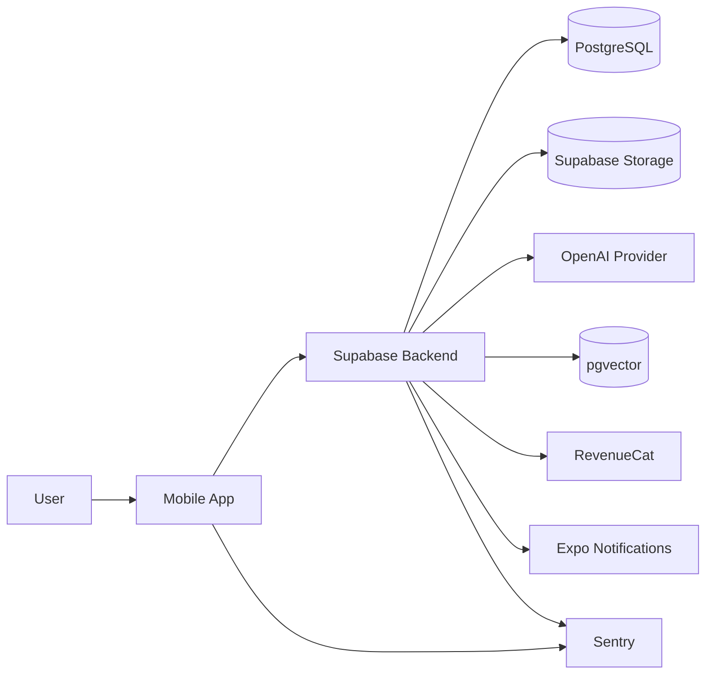
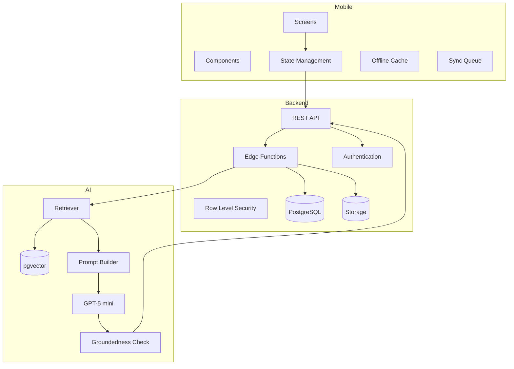
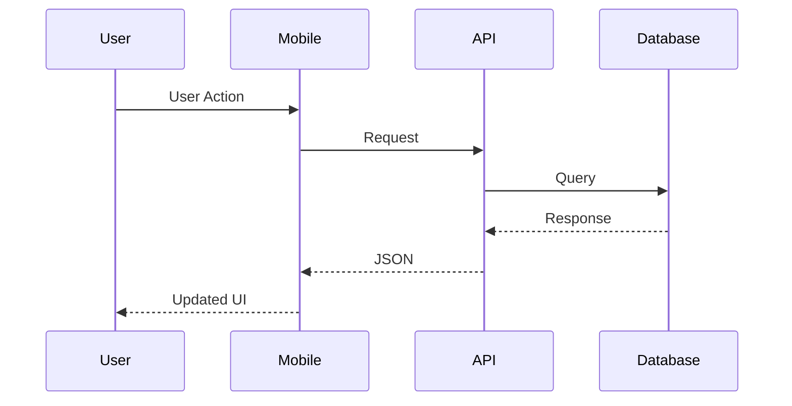
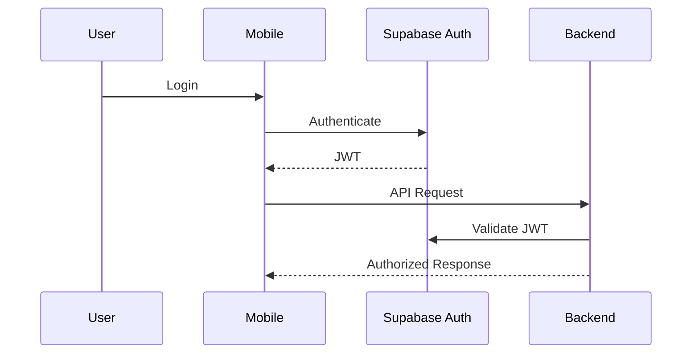

# SYSTEM_MAP.md

# PanchangPal — System Architecture Maps

Version: 1.0.0

Status: Living Document

Owner: Engineering

---

# Purpose

This document provides a visual representation of the PanchangPal architecture.

It complements the Technical Design Document (TDD) by providing high-level diagrams that help engineers and AI coding agents quickly understand:

* System boundaries
* Data flow
* Service interactions
* AI pipeline
* Authentication
* Notifications
* Offline synchronization
* Deployment architecture

This document contains diagrams only.

Implementation details belong in the TDD.

---

# 1. System Context Diagram (C4 Level 1)



---

# 2. Container Diagram (C4 Level 2)



---

# 3. Component Architecture

```mermaid
flowchart TD

Screen

↓

Feature

↓

Reusable Component

↓

Primitive Component

↓

Design Tokens

↓

Theme
```

---

# 4. Request Lifecycle



---

# 5. AI Request Flow

```mermaid
flowchart TD

Question

↓

Scope Classifier

↓

Retriever

↓

Vector Search

↓

Prompt Builder

↓

GPT-5 mini

↓

Groundedness Validation

↓

Streaming Response

↓

Sources

↓

User
```

---

# 6. Content Pipeline

```mermaid
flowchart LR

Research

↓

Scholar Review

↓

QA Review

↓

Publishing

↓

Chunking

↓

Embeddings

↓

pgvector

↓

Production
```

---

# 7. Offline Synchronization

```mermaid
flowchart TD

User Action

↓

Local Database

↓

Offline Queue

↓

Network Available

↓

Sync Engine

↓

Conflict Detection

↓

Conflict Resolution

↓

Backend

↓

Confirmation
```

---

# 8. Authentication Flow



---

# 9. Notification Flow

```mermaid
flowchart TD

Scheduler

↓

Eligibility Engine

↓

Quiet Hours Check

↓

Frequency Cap

↓

Personalization

↓

Expo Notifications

↓

Mobile Device

↓

User Interaction

↓

Analytics
```

---

# 10. Ask Guru Processing

```mermaid
flowchart TD

Question

↓

Safety Validation

↓

Intent Classification

↓

Vector Retrieval

↓

Context Assembly

↓

Prompt Construction

↓

GPT-5 mini

↓

Groundedness Check

↓

Streaming

↓

Source Attribution

↓

Conversation History

↓

Analytics
```

---

# 11. Analytics Flow

```mermaid
flowchart LR

Mobile

↓

Analytics Adapter

↓

Backend

↓

analytics_event

↓

Dashboards

↓

Product KPIs
```

---

# 12. Payment Flow

```mermaid
flowchart TD

Subscription Screen

↓

RevenueCat SDK

↓

App Store / Play Store

↓

RevenueCat

↓

Webhook

↓

Supabase

↓

Entitlement Update

↓

Mobile App
```

---

# 13. Error Handling Flow

```mermaid
flowchart TD

Error

↓

ERR_* Classification

↓

Logging

↓

Recovery Strategy

↓

User-Friendly Message

↓

Retry (if applicable)

↓

Analytics

↓

Sentry
```

---

# 14. Deployment Architecture

```mermaid
flowchart LR

Developer

↓

GitHub

↓

GitHub Actions

↓

Expo EAS Build

↓

App Store

Google Play

Developer

↓

GitHub

↓

GitHub Actions

↓

Supabase Deployment

↓

Production Backend
```

---

# 15. AI Governance Overview

```mermaid
flowchart TD

Model Registry

↓

Prompt Registry

↓

Configuration Registry

↓

Evaluation Suite

↓

Release Checklist

↓

Production

↓

Monitoring

↓

Continuous Improvement
```

---

# 16. Architecture Dependency Map

```mermaid
flowchart TD

MRD

↓

PRD

↓

PDD

↓

TDD

↓

Repository

↓

Implementation

↓

Testing

↓

Release
```

---

# Diagram Governance

All diagrams in this document must:

* Remain synchronized with the TDD.
* Use Mermaid syntax.
* Reflect approved architecture only.
* Avoid implementation-specific details.
* Be updated whenever architectural changes are approved through an ADR.

This document is intended to provide a fast architectural overview. Detailed behavior, contracts, and implementation rules remain in the Technical Design Document.
