# PanchangPal — PDD / UXS · Part 3 — Component Library + Design System

**Version:** 3.1 (Working Draft — Enterprise Design System Review)
**Status:** Part 3 of 5 — for sign-off
**v3.1 changes (additive → MINOR bump):** Added per-component **engineering governance metadata** — Component Version + Change History, Design Source, Implementation Owner, Required Test Coverage, Dependencies, and State Machines (where interaction logic warrants) — and a new **§5.13A Component Governance Framework**. No component behavior, UX, visual design, IDs, or token references were changed; existing content is preserved verbatim and only extended.
**Depends on:** Part 1 v1.2 (§3.0 Registries · §3.0A Governance · §3.17 Template) · Part 2 v2.0 (Screen Inventory — the source of the `CMP_*` backlog)
**Owner:** Design (per §3.0A.5) · **Reviewers:** Engineering (frontend), Product, Accessibility

---

## How Part 3 works

Part 3 has two sections:

- **Section 5 — Component Library:** every `CMP_*` referenced in Part 2, specified with the five governance-mandated attributes (**Variants · Spacing · Behavior · States · Accessibility**) plus a **Tokens** line binding each to Section 6.
- **Section 6 — Design System:** the concrete **values** for every token namespace referenced across Parts 1–3 (`color.*`, `typography.*`, `spacing.*`, `radius.*`, `elevation.*`, `motion.*`, `duration.*`, `haptic.*`), plus grid, icons, illustrations, dark/light mode, and accessibility standards.

**Reading order.** Components (§5) reference tokens by name; **§6 defines their values**. Implementers building tokens-first may read §6 first — the two are consistent by construction.

**Governance ties.** Per §3.0A.8: every screen composes components from this library (no one-off UI), no duplicate components/interactions/animations, and only token values (no hard-coded hex/px/durations). Per §3.0A.6: no component exists without a Design System entry (this section) and at least one consuming screen (the "Used by" line). Motion specs here are summaries; the **frame-level microinteraction choreography is Part 4 §7** — where they overlap, Part 4 governs timing curves and Part 3 governs the component's structure.

**Component entry format (v3.1 — with governance metadata).** Governance fields are compact single-line encodings of the schemas defined in **§5.13A**; every field is present on every reusable component (defaults are uniform in v3.1 and evolve via the versioning policy).
```
CMP_NAME — Human Name
Used by: SCR_* screens
Purpose: one line
Version: semver + Change History          ← §5.13A.2
Design Source: Figma ID/URL/Owner/Status   ← §5.13A.8 (Not Linked in v3.1)
Impl Owner: Primary/Secondary/Team         ← §5.13A.3
Variants: enumerated
Anatomy & Spacing: structure + spacing tokens
Behavior: interaction logic
States: default/pressed/focused/disabled/loading/error as applicable
State Machine: Mermaid + trigger/transition/exit/recovery  ← where interaction logic warrants (§5.13A)
Required Test Coverage: unit/integration/snapshot/a11y/visual-regression/performance/interaction  ← §5.13A.6
Accessibility: role, label, target, contrast, motion, SR notes
Tokens: color/typography/spacing/radius/elevation/motion refs
Dependencies: Depends On / Used By / Shared Utilities  ← §5.13A.4
```

**[ASSUMPTION P3-A0]** Base grid unit = **4pt**; all spacing tokens are multiples (Section 6). Platform note: components are React Native (Expo); iOS/Android parity is assumed with platform-native pickers where noted.

---

# SECTION 5 — Component Library

## 5.1 Component taxonomy (Atomic structure)

Components are organized atomic-design style. Every Part 2 `CMP_*` maps to exactly one entry below.

| Tier | Family | §5.x |
|---|---|---|
| Atoms | Buttons & Actions | 5.2 |
| Atoms | Inputs & Selection Controls | 5.3 |
| Molecules | Cards & Containers | 5.4 |
| Molecules | Headers & Chips | 5.5 |
| Molecules | Lists & Rows | 5.6 |
| Organisms | Navigation | 5.7 |
| Organisms | Calendar | 5.8 |
| Organisms | Ritual & Panchang | 5.9 |
| Organisms | AI (Ask Guru) | 5.10 |
| Molecules | Streak & Achievements | 5.11 |
| Organisms | Overlays & Feedback | 5.12 |
| Utility | States & Brand | 5.13 |

**Global component rules:** (1) minimum touch target **44×44pt / 48×48dp** even when the visual is smaller (extend hit-slop). (2) Every interactive component has `default / pressed / focused / disabled` at minimum; data components add `loading / skeleton / empty / error`. (3) Pressed feedback ≤ `duration.fast` with `haptic.selection` where a tap commits an action. (4) Focus ring = `color.border.focus` at `spacing.borderFocus` for keyboard/switch-control. (5) All text respects Dynamic Type; no fixed-height text containers.

---

## 5.2 Buttons & Actions

### CMP_PRIMARY_BUTTON — Primary Button
**Used by:** most screens (Continue, Save, Subscribe, Begin, etc.).
**Purpose:** The single highest-emphasis action on a screen.
**Version:** 1.0.0 — Change History: [1.0.0 · Initial · First implementation]
**Design Source:** Figma ID: TBD · URL: TBD · Owner: Design Team · Status: Not Linked
**Impl Owner:** Primary: Frontend · Secondary: None · Team: Mobile
**Variants:** `size` = {large (default, full-width), medium}; `tone` = {brand (default), onImmersive (for ritual/dark backdrops)}; `iconLeading?`.
**Anatomy & Spacing:** label centered; height 52pt (large) / 44pt (medium); horizontal padding `spacing.lg`; corner `radius.md`; full-width uses screen `spacing.gutter` margins.
**Behavior:** single tap commits; debounced (ignores double-tap within `duration.fast`); shows inline spinner in loading (label → CMP-internal spinner, width preserved to avoid jump).
**States:** default `color.brand.primary`; pressed `color.brand.primaryPressed` + scale 0.98 (`motion.press`); focused focus-ring; disabled `color.state.disabledBg`/`color.state.disabledText`; loading spinner + `aria-busy`.
**State Machine:**
```mermaid
stateDiagram-v2
[*] --> Default
Default --> Pressed: pressIn
Pressed --> Default: pressOut (no commit)
Pressed --> Loading: onPress (async action)
Loading --> Success: resolve
Loading --> Error: reject
Success --> Default: reset
Error --> Default: retry/reset
Default --> Disabled: prerequisites unmet
Disabled --> Default: prerequisites met
```
*Trigger:* pressIn/onPress. *Transition:* Default→Pressed on touch; →Loading if the action is async (debounced against double-tap). *Exit:* Success/Error return to Default. *Failure recovery:* Error surfaces the caller's `ERR_*` and returns to Default for retry; width is preserved through Loading to avoid layout shift.
**Required Test Coverage:** Unit: Yes · Integration: No · Snapshot: Yes · A11y: Yes · Visual Regression: Yes · Performance: No · Interaction: Yes — Notes: assert debounce, loading width-lock, Reduced-Motion press-scale removal, AA contrast.
**Accessibility:** role=button; label = visible text; ≥44/48; contrast AA (brand vs. white ≥ 4.5:1 — see §6.2 checks); Reduced-Motion removes press-scale; loading announces "…in progress."
**Tokens:** color.brand.primary, color.brand.primaryPressed, color.text.onBrand, typography.label.large, spacing.lg, radius.md, motion.press, haptic.selection.
**Dependencies:** Depends On: none (atom) · Used By: most CMP_* + screens · Shared Utilities: HapticService, AnalyticsService.

### CMP_SECONDARY_BUTTON — Secondary Button
**Used by:** SCR_AUTH_001 (email), SCR_GURU_CHAT (Ask), etc.
**Purpose:** Medium-emphasis alternative to primary.
**Version:** 1.0.0 — Change History: [1.0.0 · Initial · First implementation]
**Design Source:** Figma ID: TBD · URL: TBD · Owner: Design Team · Status: Not Linked
**Impl Owner:** Primary: Frontend · Secondary: None · Team: Mobile
**Variants:** `style` = {outline (default), tonal}; sizes as primary.
**Anatomy & Spacing:** same metrics as primary; outline uses `color.border.default` 1.5pt; tonal uses `color.brand.tonalBg`.
**Behavior:** as primary minus visual dominance.
**States:** pressed → tonal fill deepens; disabled reduces border/label opacity; focus-ring.
**Required Test Coverage:** Unit: Yes · Integration: No · Snapshot: Yes · A11y: Yes · Visual Regression: Yes · Performance: No · Interaction: Yes — Notes: assert outline border ≥3:1.
**Accessibility:** role=button; outline variant maintains ≥3:1 non-text contrast for the border; ≥44/48.
**Tokens:** color.border.default, color.brand.tonalBg, color.text.brand, typography.label.large, radius.md, spacing.lg.
**Dependencies:** Depends On: none (atom) · Used By: SCR_AUTH_001, SCR_GURU_* · Shared Utilities: HapticService, AnalyticsService.

### CMP_TEXT_BUTTON — Text / Link Button
**Used by:** Skip, Not now, Resend, View history, Cancel, Contact support.
**Purpose:** Low-emphasis inline action.
**Version:** 1.0.0 — Change History: [1.0.0 · Initial · First implementation]
**Design Source:** Figma ID: TBD · URL: TBD · Owner: Design Team · Status: Not Linked
**Impl Owner:** Primary: Frontend · Secondary: None · Team: Mobile
**Variants:** `tone` = {neutral, brand, danger (Cancel-of-destructive uses neutral; danger reserved for destructive text actions)}.
**Anatomy & Spacing:** label only; min hit-slop to 44/48; underline optional on link tone.
**Behavior:** tap commits; no elevation.
**States:** pressed opacity 0.6; disabled 0.38; focus-ring.
**Required Test Coverage:** Unit: Yes · Integration: No · Snapshot: Yes · A11y: Yes · Visual Regression: No · Performance: No · Interaction: Yes — Notes: assert hit-slop expands to ≥44/48; not color-only.
**Accessibility:** role=button (or link where it navigates externally); not conveyed by color alone (weight/underline); ≥44/48 via hit-slop.
**Tokens:** color.text.brand, color.text.secondary, typography.label.large, motion.press.
**Dependencies:** Depends On: none (atom) · Used By: many screens · Shared Utilities: AnalyticsService.

### CMP_ICON_BUTTON — Icon Button
**Used by:** ritual pause/close, header actions.
**Purpose:** Compact icon-only action.
**Version:** 1.0.0 — Change History: [1.0.0 · Initial · First implementation]
**Design Source:** Figma ID: TBD · URL: TBD · Owner: Design Team · Status: Not Linked
**Impl Owner:** Primary: Frontend · Secondary: None · Team: Mobile
**Variants:** `size` = {40, 44}; `emphasis` = {ghost (default), filled}.
**Anatomy & Spacing:** icon 24pt centered in ≥44/48 target; circular hit area.
**Behavior:** tap commits; long-press optional tooltip.
**States:** pressed background `color.state.pressOverlay`; disabled 0.38; focus-ring.
**Required Test Coverage:** Unit: Yes · Integration: No · Snapshot: Yes · A11y: Yes · Visual Regression: Yes · Performance: No · Interaction: Yes — Notes: assert `accessibilityLabel` present (icon-only); ≥44/48 target.
**Accessibility:** **must** have `accessibilityLabel` (icon-only); role=button; ≥44/48; tooltip mirrors label.
**Tokens:** color.icon.default, color.state.pressOverlay, radius.pill, motion.press, haptic.selection.
**Dependencies:** Depends On: none (atom) · Used By: CMP_APP_HEADER, CMP_RITUAL_STEP, CMP_CHAT_INPUT · Shared Utilities: HapticService.

### CMP_DESTRUCTIVE_BUTTON / CMP_DESTRUCTIVE_ROW / CMP_DESTRUCTIVE_ACTION — Destructive Actions
**Used by:** SCR_DELETE_ACCOUNT_001, SCR_HOUSEHOLD_001 (remove), SCR_PERSONAL_DATE_EDIT_001 (delete).
**Purpose:** High-consequence actions requiring extra clarity/confirmation.
**Version:** 1.0.0 — Change History: [1.0.0 · Initial · First implementation]
**Design Source:** Figma ID: TBD · URL: TBD · Owner: Design Team · Status: Not Linked
**Impl Owner:** Primary: Frontend · Secondary: None · Team: Mobile
**Variants:** `form` = {button, list-row, swipe-action}; always paired with a confirm (CMP_DIALOG).
**Anatomy & Spacing:** danger color for label/icon; button uses `color.text.danger` on subtle danger bg; row uses danger label with chevron/trash icon.
**Behavior:** never single-tap irreversible — always routes through a confirm dialog or typed/explicit confirmation (Delete Account).
**States:** pressed deepens danger tone; disabled until prerequisites met (e.g., ownership transferred).
**Required Test Coverage:** Unit: Yes · Integration: No · Snapshot: Yes · A11y: Yes · Visual Regression: Yes · Performance: No · Interaction: Yes — Notes: assert confirm-dialog gate before any irreversible action; danger not color-only.
**Accessibility:** role=button; label states the consequence ("Delete account"); danger conveyed by icon+label, not color alone; confirm dialog focus-trapped.
**Tokens:** color.text.danger, color.surface.dangerSubtle, color.border.danger, typography.label.large, radius.md.
**Dependencies:** Depends On: CMP_DIALOG · Used By: SCR_DELETE_ACCOUNT_001, SCR_HOUSEHOLD_001, SCR_PERSONAL_DATE_EDIT_001 · Shared Utilities: AnalyticsService.

### CMP_AUTH_BUTTON — Provider Auth Button
**Used by:** SCR_AUTH_001.
**Purpose:** Apple / Google branded sign-in.
**Version:** 1.0.0 — Change History: [1.0.0 · Initial · First implementation]
**Design Source:** Figma ID: TBD · URL: TBD · Owner: Design Team · Status: Not Linked
**Impl Owner:** Primary: Frontend · Secondary: Backend · Team: Mobile
**Variants:** `provider` = {apple, google}; follows each provider's brand + HIG/Material button guidelines.
**Anatomy & Spacing:** provider logo leading + "Continue with {Provider}"; height 48pt; `radius.md`.
**Behavior:** launches native OAuth; loading spinner inline.
**States:** provider-specified default/pressed; disabled offline.
**Required Test Coverage:** Unit: Yes · Integration: Yes · Snapshot: Yes · A11y: Yes · Visual Regression: Yes · Performance: No · Interaction: Yes — Notes: integration test for OAuth launch + disabled-offline; provider brand AA.
**Accessibility:** label includes provider + "sign in"; contrast per provider spec meets AA; ≥48.
**Tokens:** provider-brand colors (documented as `color.provider.apple*`, `color.provider.google*` in §6.2 with AA-verified fallbacks), typography.label.large, radius.md.
**Dependencies:** Depends On: none · Used By: SCR_AUTH_001 · Shared Utilities: AuthService, AnalyticsService.

### CMP_SHARE_BUTTON — Share Action
**Used by:** SCR_HOUSEHOLD_INVITE_001, SCR_FESTIVAL_DETAIL_001 (flagged).
**Purpose:** Invoke the native share sheet.
**Version:** 1.0.0 — Change History: [1.0.0 · Initial · First implementation]
**Design Source:** Figma ID: TBD · URL: TBD · Owner: Design Team · Status: Not Linked
**Impl Owner:** Primary: Frontend · Secondary: None · Team: Mobile
**Variants:** {button, icon}.
**Behavior:** opens OS share sheet with payload (invite link / greeting card).
**States:** default/pressed/disabled(offline).
**Required Test Coverage:** Unit: Yes · Integration: Yes · Snapshot: Yes · A11y: Yes · Visual Regression: No · Performance: No · Interaction: Yes — Notes: integration test for native share invocation + payload.
**Accessibility:** label "Share invite"/"Share"; OS sheet inherits platform a11y.
**Tokens:** color.brand.primary or color.icon.default, radius.md.
**Dependencies:** Depends On: none · Used By: SCR_HOUSEHOLD_INVITE_001, SCR_FESTIVAL_DETAIL_001 · Shared Utilities: ShareService, AnalyticsService.

### CMP_FAB — Floating Action Button
**Used by:** SCR_PERSONAL_DATES_001 (Add a date) *(alternative to inline primary; one or the other per screen, not both — §3.0A.8 no-duplicate rule)*.
**Purpose:** Persistent add affordance on a list.
**Version:** 1.0.0 — Change History: [1.0.0 · Initial · First implementation]
**Design Source:** Figma ID: TBD · URL: TBD · Owner: Design Team · Status: Not Linked
**Impl Owner:** Primary: Frontend · Secondary: None · Team: Mobile
**Variants:** {regular 56pt, extended with label}.
**Anatomy & Spacing:** bottom-end, `spacing.lg` inset above tab bar; `elevation.fab`.
**Behavior:** tap → add flow; hides on scroll-down, reveals on scroll-up (Reduced-Motion: no hide).
**States:** default/pressed/disabled.
**Required Test Coverage:** Unit: Yes · Integration: No · Snapshot: Yes · A11y: Yes · Visual Regression: Yes · Performance: No · Interaction: Yes — Notes: assert scroll hide/reveal disabled under Reduced-Motion; bottom padding reserved.
**Accessibility:** label "Add a date"; ≥56; contrast AA; does not obscure last list row (list gets bottom padding).
**Tokens:** color.brand.primary, color.text.onBrand, elevation.fab, radius.pill, motion.fab.
**Dependencies:** Depends On: none · Used By: SCR_PERSONAL_DATES_001 · Shared Utilities: AnalyticsService.

---

## 5.3 Inputs & Selection Controls

### CMP_TEXT_INPUT — Text Field
**Used by:** household name, member name, email, personal-date name.
**Purpose:** Single-line text entry.
**Version:** 1.0.0 — Change History: [1.0.0 · Initial · First implementation]
**Design Source:** Figma ID: TBD · URL: TBD · Owner: Design Team · Status: Not Linked
**Impl Owner:** Primary: Frontend · Secondary: None · Team: Mobile
**Variants:** `type` = {text, email, name}; `state` = {default, focused, error, disabled}; optional leading icon, helper text, char counter.
**Anatomy & Spacing:** label above; field height 48pt; padding `spacing.md`; `radius.md`; helper/error below at `typography.body.small`.
**Behavior:** live validation on blur (and on submit); error clears on valid edit; appropriate keyboard per type.
**States:** default border `color.border.default`; focused `color.border.focus` + 2pt; error `color.border.danger` + error text; disabled muted.
**State Machine:**
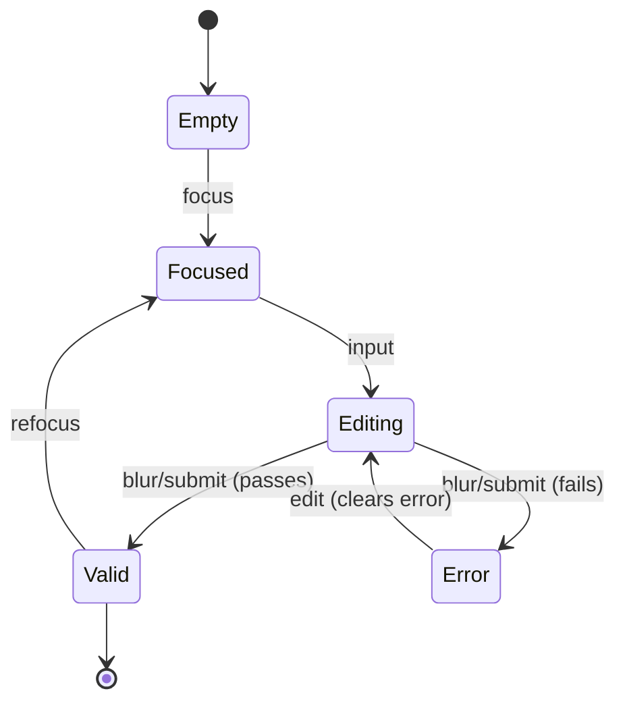
*Trigger:* focus/input/blur. *Transition:* validation runs on blur/submit; Error→Editing clears on valid edit. *Exit:* Valid on passing validation. *Failure recovery:* Error maps to a field `ERR_*` (e.g., ERR_AUTH_FAILED for email), tied to the field via live region; input is never lost.
**Required Test Coverage:** Unit: Yes · Integration: No · Snapshot: Yes · A11y: Yes · Visual Regression: Yes · Performance: No · Interaction: Yes — Notes: assert label-not-placeholder-only, error live-region, keyboard type per variant.
**Accessibility:** programmatic label (not placeholder-only); error tied via `accessibilityLabel`+live region; keyboard type set; ≥48; AA contrast for text/placeholder (placeholder ≥ 4.5:1 or noted as decorative with real label).
**Tokens:** color.surface.input, color.border.default/focus/danger, color.text.primary, color.text.placeholder, typography.body.large, radius.md, spacing.md.
**Dependencies:** Depends On: none (atom) · Used By: CMP_CITY_SEARCH, forms across onboarding/auth/household/personal-dates · Shared Utilities: ValidationService.

### CMP_OTP_INPUT — One-Time-Code Input
**Used by:** SCR_AUTH_EMAIL_001.
**Purpose:** 6-digit code entry.
**Version:** 1.0.0 — Change History: [1.0.0 · Initial · First implementation]
**Design Source:** Figma ID: TBD · URL: TBD · Owner: Design Team · Status: Not Linked
**Impl Owner:** Primary: Frontend · Secondary: Backend · Team: Mobile
**Variants:** length {6}; masked? no.
**Anatomy & Spacing:** 6 boxes, `spacing.sm` gap; auto-advance; paste-fill supported.
**Behavior:** auto-advance/backspace; auto-submit on complete; resend countdown adjacent.
**States:** per-box default/focused/filled/error; whole-field error on invalid/expired.
**Required Test Coverage:** Unit: Yes · Integration: Yes · Snapshot: Yes · A11y: Yes · Visual Regression: No · Performance: No · Interaction: Yes — Notes: assert autofill, auto-advance/backspace, expiry error (ERR_AUTH_FAILED).
**Accessibility:** single logical field announced ("code, 6 digits"); each entry announced; supports code autofill; countdown in live region; ≥44 per box.
**Tokens:** color.surface.input, color.border.focus/danger, typography.title.medium, radius.md, spacing.sm.
**Dependencies:** Depends On: none · Used By: SCR_AUTH_EMAIL_001 · Shared Utilities: AuthService.

### CMP_SEARCH_FIELD / CMP_CITY_SEARCH — Search Field (+ City search composite)
**Used by:** SCR_ONBOARDING_LOCATION_001 (CITY_SEARCH = SEARCH_FIELD + CMP_LIST results), SCR_GURU_HISTORY_001.
**Purpose:** Query entry with results.
**Version:** 1.0.0 — Change History: [1.0.0 · Initial · First implementation]
**Design Source:** Figma ID: TBD · URL: TBD · Owner: Design Team · Status: Not Linked
**Impl Owner:** Primary: Frontend · Secondary: None · Team: Mobile
**Variants:** {plain, with clear button, with leading search icon}.
**Behavior:** debounced query (`duration.debounce`); shows CMP_SKELETON list while searching; empty-results state; select commits.
**States:** default/focused/loading/empty/error(offline).
**Required Test Coverage:** Unit: Yes · Integration: Yes · Snapshot: Yes · A11y: Yes · Visual Regression: No · Performance: No · Interaction: Yes — Notes: assert debounce, results-list SR count, empty/offline states.
**Accessibility:** role=searchbox; results as an SR list with count; selection announced; clear button labeled.
**Tokens:** color.surface.input, color.border.focus, typography.body.large, radius.md, spacing.md.
**Dependencies:** Depends On: CMP_SEARCH_FIELD, CMP_LIST, CMP_SKELETON · Used By: SCR_ONBOARDING_LOCATION_001, SCR_GURU_HISTORY_001 · Shared Utilities: GeoService.

### CMP_CHAT_INPUT — Chat Composer
**Used by:** SCR_GURU_HOME_001, SCR_GURU_CHAT_001.
**Purpose:** Multiline question entry with send.
**Version:** 1.0.0 — Change History: [1.0.0 · Initial · First implementation]
**Design Source:** Figma ID: TBD · URL: TBD · Owner: Design Team · Status: Not Linked
**Impl Owner:** Primary: Frontend · Secondary: AI · Team: Mobile + AI
**Variants:** {default, disabled(offline)}.
**Anatomy & Spacing:** growing textarea (max ~4 lines then scroll) + send CMP_ICON_BUTTON; char soft-cap hint (P2-A4 ~500).
**Behavior:** send on button (not Enter, to allow multiline) — **[ASSUMPTION P3-A1]**; disabled offline with note; clears on send.
**States:** default/focused/disabled/sending.
**State Machine:**
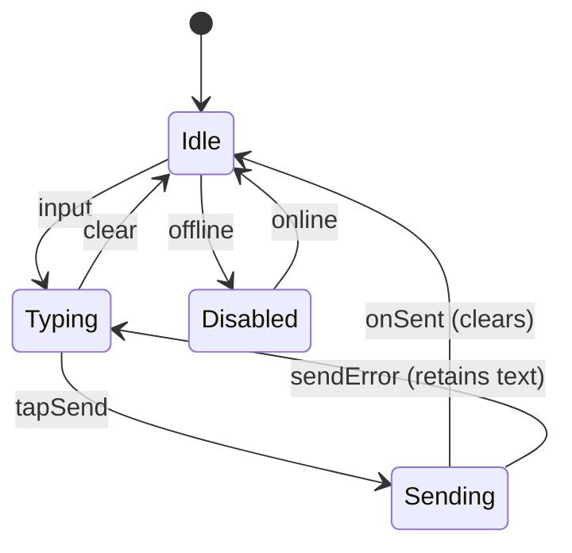
*Trigger:* input/tapSend/connectivity. *Transition:* Typing→Sending on send; clears on success. *Exit:* Idle after send. *Failure recovery:* on send error the text is retained (returns to Typing); offline disables send with an announced reason (ERR_OFFLINE).
**Required Test Coverage:** Unit: Yes · Integration: Yes · Snapshot: Yes · A11y: Yes · Visual Regression: Yes · Performance: No · Interaction: Yes — Notes: assert send-on-button (not Enter), offline-disable, text retained on send error.
**Accessibility:** label "Ask Guru a question"; send labeled; disabled reason announced; ≥44 send target.
**Tokens:** color.surface.input, color.border.focus, typography.body.large, radius.lg, spacing.md.
**Dependencies:** Depends On: CMP_ICON_BUTTON · Used By: SCR_GURU_HOME_001, SCR_GURU_CHAT_001 · Shared Utilities: AskGuruService, AnalyticsService.

### CMP_TOGGLE — Switch
**Used by:** SCR_SETTINGS_001 (notification/appearance toggles).
**Purpose:** Binary on/off.
**Version:** 1.0.0 — Change History: [1.0.0 · Initial · First implementation]
**Design Source:** Figma ID: TBD · URL: TBD · Owner: Design Team · Status: Not Linked
**Impl Owner:** Primary: Frontend · Secondary: None · Team: Mobile
**Variants:** {default}; platform-native switch styling.
**Behavior:** immediate optimistic apply; reverts on save error.
**States:** on `color.brand.primary`; off `color.state.trackOff`; disabled.
**State Machine:**
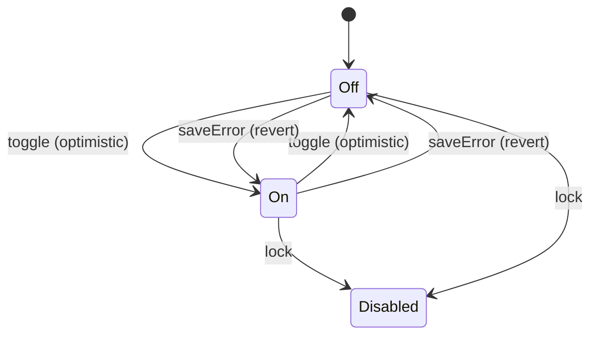
*Trigger:* toggle/save result. *Transition:* optimistic flip on tap; persists via PATCH. *Exit:* stable On/Off. *Failure recovery:* on save error, revert to the prior state and surface ERR_NETWORK_TIMEOUT (snackbar); no silent divergence.
**Required Test Coverage:** Unit: Yes · Integration: Yes · Snapshot: Yes · A11y: Yes · Visual Regression: Yes · Performance: No · Interaction: Yes — Notes: assert optimistic apply + revert-on-error; role=switch state announced.
**Accessibility:** role=switch; state announced ("on"/"off"); label = setting; ≥44 row target; not color-only (thumb position + label).
**Tokens:** color.brand.primary, color.state.trackOff, motion.toggle.
**Dependencies:** Depends On: none (atom) · Used By: SCR_SETTINGS_001 · Shared Utilities: PreferencesService.

### CMP_SEGMENTED — Segmented Control
**Used by:** SCR_PERSONAL_DATE_EDIT_001 (Tithi/Gregorian), Settings (Appearance/Depth/Language).
**Purpose:** Single-select among 2–3 short options.
**Version:** 1.0.0 — Change History: [1.0.0 · Initial · First implementation]
**Design Source:** Figma ID: TBD · URL: TBD · Owner: Design Team · Status: Not Linked
**Impl Owner:** Primary: Frontend · Secondary: None · Team: Mobile
**Variants:** {2-seg, 3-seg}.
**Behavior:** instant switch; selection persists.
**States:** selected `color.brand.tonalBg`/`color.text.brand`; unselected neutral; disabled.
**Required Test Coverage:** Unit: Yes · Integration: No · Snapshot: Yes · A11y: Yes · Visual Regression: Yes · Performance: No · Interaction: Yes — Notes: assert single-select semantics; not color-only.
**Accessibility:** role=tablist/radiogroup; selected announced; not color-only (weight + fill); ≥44 height.
**Tokens:** color.brand.tonalBg, color.text.brand, color.surface.raised, typography.label.medium, radius.md.
**Dependencies:** Depends On: none (atom) · Used By: CMP_DEPTH_TOGGLE, CMP_REMINDER_LEAD_PICKER, SCR_SETTINGS_001, SCR_PERSONAL_DATE_EDIT_001 · Shared Utilities: none.

### CMP_DEPTH_TOGGLE — Content Depth Toggle (Quick / Deep-dive)
**Used by:** household setup/members, festival detail, settings.
**Purpose:** Choose content depth per member (persistent).
**Version:** 1.0.0 — Change History: [1.0.0 · Initial · First implementation]
**Design Source:** Figma ID: TBD · URL: TBD · Owner: Design Team · Status: Not Linked
**Impl Owner:** Primary: Frontend · Secondary: None · Team: Mobile
**Variants:** specialization of CMP_SEGMENTED with 2 values {Quick, Deep-dive}.
**Behavior:** persists per member (Part 1 A3); affects content across app.
**States/Accessibility/Tokens:** inherit CMP_SEGMENTED; label announces "Content depth, Quick/Deep-dive."
**Required Test Coverage:** Unit: Yes · Integration: Yes · Snapshot: Yes · A11y: Yes · Visual Regression: No · Performance: No · Interaction: Yes — Notes: assert per-member persistence + app-wide effect.
**Dependencies:** Depends On: CMP_SEGMENTED · Used By: SCR_ONBOARDING_HOUSEHOLD_001, SCR_HOUSEHOLD_001, SCR_FESTIVAL_DETAIL_001, SCR_SETTINGS_001 · Shared Utilities: PreferencesService.

### CMP_ROLE_PICKER — Role Picker
**Used by:** household setup/members, invite.
**Purpose:** Select member role {Anchor, Parent, Elder, Youth, Other}.
**Version:** 1.0.0 — Change History: [1.0.0 · Initial · First implementation]
**Design Source:** Figma ID: TBD · URL: TBD · Owner: Design Team · Status: Not Linked
**Impl Owner:** Primary: Frontend · Secondary: None · Team: Mobile
**Variants:** {inline menu, bottom-sheet list}.
**Behavior:** single-select; default per context (self=Anchor).
**States:** default/selected/disabled.
**Required Test Coverage:** Unit: Yes · Integration: No · Snapshot: Yes · A11y: Yes · Visual Regression: No · Performance: No · Interaction: Yes — Notes: assert enum values + default Anchor.
**Accessibility:** role=menu/list; current value announced; ≥44 rows.
**Tokens:** color.surface.raised, typography.body.large, radius.md, spacing.md.
**Dependencies:** Depends On: CMP_BOTTOM_SHEET (sheet variant) · Used By: SCR_ONBOARDING_HOUSEHOLD_001, SCR_HOUSEHOLD_001, SCR_HOUSEHOLD_INVITE_001 · Shared Utilities: none.

### CMP_TIME_PICKER / CMP_DATE_PICKER — Time & Date Pickers
**Used by:** ritual time, notification timing, personal-date Gregorian.
**Purpose:** Native platform time/date selection.
**Version:** 1.0.0 — Change History: [1.0.0 · Initial · First implementation]
**Design Source:** Figma ID: TBD · URL: TBD · Owner: Design Team · Status: Not Linked
**Impl Owner:** Primary: Frontend · Secondary: None · Team: Mobile
**Variants:** {time, date}; platform-native wheel/dialog.
**Behavior:** returns local value; presets (CMP_PRESET_CHIP) may set it.
**States:** default/disabled.
**Required Test Coverage:** Unit: Yes · Integration: No · Snapshot: Yes · A11y: Yes · Visual Regression: No · Performance: No · Interaction: Yes — Notes: rely on native picker a11y; assert value round-trip + preset wiring.
**Accessibility:** native picker a11y; selected value announced; label present.
**Tokens:** platform-native; container uses color.surface.raised, radius.md.
**Dependencies:** Depends On: none (native) · Used By: SCR_ONBOARDING_RITUALTIME_001, SCR_SETTINGS_001, SCR_PERSONAL_DATE_EDIT_001 · Shared Utilities: none.

### CMP_TITHI_PICKER — Tithi Picker
**Used by:** SCR_PERSONAL_DATE_EDIT_001.
**Purpose:** Select paksha + lunar month + tithi (with optional "compute from a known Gregorian date").
**Version:** 1.0.0 — Change History: [1.0.0 · Initial · First implementation]
**Design Source:** Figma ID: TBD · URL: TBD · Owner: Design Team · Status: Not Linked
**Impl Owner:** Primary: Frontend · Secondary: Backend · Team: Mobile + Backend
**Variants:** {tithi-mode fields, helper compute-from-date}.
**Anatomy & Spacing:** three linked selectors (paksha, month, tithi); helper link below.
**Behavior:** on selection, previews computed next Gregorian occurrence; surfaces `ERR_TITHI_AMBIGUOUS` dual-candidate note if applicable.
**States:** default/selected/loading(compute)/ambiguous.
**Required Test Coverage:** Unit: Yes · Integration: Yes · Snapshot: Yes · A11y: Yes · Visual Regression: No · Performance: No · Interaction: Yes — Notes: integration test for next-occurrence compute + ERR_TITHI_AMBIGUOUS dual-candidate.
**Accessibility:** each selector labeled and announced; ambiguity explanation in live region; ≥44 targets; respectful tone (grief-aware surface).
**Tokens:** color.surface.muted, typography.body.large, radius.md, spacing.md.
**Dependencies:** Depends On: none · Used By: SCR_PERSONAL_DATE_EDIT_001 · Shared Utilities: TithiEngineService.

### CMP_REMINDER_LEAD_PICKER — Reminder Lead Time
**Used by:** SCR_PERSONAL_DATE_EDIT_001 (and reused for festival reminders).
**Purpose:** Choose reminder lead {same day, 1 day before, custom}.
**Version:** 1.0.0 — Change History: [1.0.0 · Initial · First implementation]
**Design Source:** Figma ID: TBD · URL: TBD · Owner: Design Team · Status: Not Linked
**Impl Owner:** Primary: Frontend · Secondary: None · Team: Mobile
**Variants:** CMP_SEGMENTED + optional custom time.
**Behavior/States/Accessibility/Tokens:** inherit CMP_SEGMENTED + CMP_TIME_PICKER.
**Required Test Coverage:** Unit: Yes · Integration: No · Snapshot: Yes · A11y: Yes · Visual Regression: No · Performance: No · Interaction: Yes — Notes: assert custom-time reveal + scheduling value.
**Dependencies:** Depends On: CMP_SEGMENTED, CMP_TIME_PICKER · Used By: SCR_PERSONAL_DATE_EDIT_001, SCR_FESTIVAL_DETAIL_001 · Shared Utilities: NotificationScheduler.

### CMP_PRESET_CHIP / CMP_SUGGESTED_QUESTION_CHIP / CMP_SUGGESTED_FOLLOWUP — Chips
**Used by:** ritual-time presets; Ask Guru suggestions/follow-ups.
**Purpose:** Tappable shortcut values/prompts.
**Version:** 1.0.0 — Change History: [1.0.0 · Initial · First implementation]
**Design Source:** Figma ID: TBD · URL: TBD · Owner: Design Team · Status: Not Linked
**Impl Owner:** Primary: Frontend · Secondary: AI (suggestion/followup) · Team: Mobile
**Variants:** `role` = {input-preset, suggestion, followup}; `state` = {default, selected(preset)}.
**Anatomy & Spacing:** pill; height 36–40 (hit-slop to 44); `spacing.sm` internal, `spacing.xs` between chips; horizontal scroll row.
**Behavior:** tap sets value / seeds a question; suggestion chips route into chat.
**States:** default `color.surface.chip`; pressed; selected (preset) `color.brand.tonalBg`.
**Required Test Coverage:** Unit: Yes · Integration: No · Snapshot: Yes · A11y: Yes · Visual Regression: Yes · Performance: No · Interaction: Yes — Notes: assert full-text SR label, ≥44 hit-slop, scroll-row SR exposure.
**Accessibility:** role=button; label = full text; scroll row exposes all chips to SR; ≥44 hit; not color-only selection (border/check).
**Tokens:** color.surface.chip, color.brand.tonalBg, color.text.primary, typography.label.medium, radius.pill, spacing.sm.
**Dependencies:** Depends On: none (atom) · Used By: SCR_ONBOARDING_RITUALTIME_001, SCR_GURU_HOME_001, SCR_GURU_CHAT_001 · Shared Utilities: AskGuruService (suggestions).

---

## 5.4 Cards & Containers

### CMP_PANCHANG_CARD — Panchang Card
**Used by:** SCR_HOME_001 (summary), SCR_ONBOARDING_PANCHANG_001 (reveal), SCR_CALENDAR_DAY_001.
**Purpose:** Show today's/selected-day panchang summary with location trust chip.
**Version:** 1.0.0 — Change History: [1.0.0 · Initial · First implementation]
**Design Source:** Figma ID: TBD · URL: TBD · Owner: Design Team · Status: Not Linked
**Impl Owner:** Primary: Frontend · Secondary: Backend · Team: Mobile
**Variants:** `mode` = {summary (Home), reveal (onboarding, animated), compact (day detail)}.
**Anatomy & Spacing:** header row (date + CMP_LOCATION_CHIP), primary tithi/nakshatra, festival hint; padding `spacing.lg`; `radius.lg`; `elevation.card`.
**Behavior:** tap → SCR_PANCHANG_DETAIL_001; reveal mode plays `motion.reveal.panchang` (Reduced-Motion → static).
**States:** default/loading(skeleton)/offline(cached + chip)/error(micro error + retry, isolated to card).
**Required Test Coverage:** Unit: Yes · Integration: Yes · Snapshot: Yes · A11y: Yes · Visual Regression: Yes · Performance: No · Interaction: Yes — Notes: assert isolated card-level error (screen still usable), Reduced-Motion static reveal.
**Accessibility:** SR reads date→location→tithi→nakshatra→festival; auspicious cues text-labeled; tap target whole card labeled "Today's panchang, open details."
**Tokens:** color.surface.raised, color.accent.auspicious, color.accent.caution, typography.display.small/title.medium, spacing.lg, radius.lg, elevation.card, motion.reveal.panchang.
**Dependencies:** Depends On: CMP_LOCATION_CHIP, CMP_SKELETON · Used By: SCR_HOME_001, SCR_ONBOARDING_PANCHANG_001, SCR_CALENDAR_DAY_001 · Shared Utilities: PanchangService, AnalyticsService.

### CMP_RITUAL_CARD — Ritual Card
**Used by:** SCR_HOME_001.
**Purpose:** Present today's ritual + primary "Begin"/"Continue"/"Done" state.
**Version:** 1.0.0 — Change History: [1.0.0 · Initial · First implementation]
**Design Source:** Figma ID: TBD · URL: TBD · Owner: Design Team · Status: Not Linked
**Impl Owner:** Primary: Frontend · Secondary: None · Team: Mobile
**Variants:** `state` = {not-started (Begin), in-progress (Continue at step N), completed (Done for today)}.
**Anatomy & Spacing:** title, short descriptor, duration estimate, CMP_PRIMARY_BUTTON; `radius.lg`, `elevation.card`.
**Behavior:** Begin → SCR_RITUAL_001; completed state is calm (no confetti; P1).
**States:** the three variants + loading/offline(text-only if audio uncached).
**Required Test Coverage:** Unit: Yes · Integration: Yes · Snapshot: Yes · A11y: Yes · Visual Regression: Yes · Performance: No · Interaction: Yes — Notes: assert 3 state variants + resume ("Continue at step N").
**Accessibility:** state announced ("today's ritual, not started/continue/completed"); button labeled per state; ≥44.
**Tokens:** color.surface.raised, color.brand.primary, typography.title.medium, spacing.lg, radius.lg, elevation.card.
**Dependencies:** Depends On: CMP_PRIMARY_BUTTON · Used By: SCR_HOME_001 · Shared Utilities: RitualProgressService, AnalyticsService.

### CMP_FESTIVAL_CARD — Festival Card
**Used by:** SCR_HOME_001 (today's festival, conditional).
**Purpose:** Surface today's festival with a route to detail.
**Version:** 1.0.0 — Change History: [1.0.0 · Initial · First implementation]
**Design Source:** Figma ID: TBD · URL: TBD · Owner: Design Team · Status: Not Linked
**Impl Owner:** Primary: Frontend · Secondary: None · Team: Mobile
**Variants:** {default, none(hidden if no festival)}.
**Anatomy & Spacing:** festival name (regional), one-line significance, thumbnail/illustration; `radius.lg`.
**Behavior:** tap → SCR_FESTIVAL_DETAIL_001.
**States:** default/loading/offline(cached).
**Required Test Coverage:** Unit: Yes · Integration: No · Snapshot: Yes · A11y: Yes · Visual Regression: Yes · Performance: No · Interaction: Yes — Notes: assert hidden when no festival; illustration decorative.
**Accessibility:** labeled "Festival today, {name}, open details"; illustration decorative (empty alt).
**Tokens:** color.surface.raised, typography.title.small, radius.lg, elevation.card.
**Dependencies:** Depends On: none · Used By: SCR_HOME_001 · Shared Utilities: CalendarService.

### CMP_SELECTABLE_CARD — Selectable Card
**Used by:** SCR_ONBOARDING_TRADITION_001.
**Purpose:** Single-select option card (tradition).
**Version:** 1.0.0 — Change History: [1.0.0 · Initial · First implementation]
**Design Source:** Figma ID: TBD · URL: TBD · Owner: Design Team · Status: Not Linked
**Impl Owner:** Primary: Frontend · Secondary: None · Team: Mobile
**Variants:** {unselected, selected}.
**Behavior:** radio-group semantics; one active.
**States:** selected `color.border.selected` + check; pressed; disabled.
**Required Test Coverage:** Unit: Yes · Integration: No · Snapshot: Yes · A11y: Yes · Visual Regression: Yes · Performance: No · Interaction: Yes — Notes: assert radio-group single-active + not color-only.
**Accessibility:** role=radio; selected announced; not color-only (check + border); ≥44.
**Tokens:** color.surface.raised, color.border.selected, typography.title.small, radius.lg, spacing.md.
**Dependencies:** Depends On: none (atom) · Used By: SCR_ONBOARDING_TRADITION_001 · Shared Utilities: none.

### CMP_PLAN_CARD — Subscription Plan Card
**Used by:** SCR_SUBSCRIPTION_001.
**Purpose:** Present a plan (Individual/Family) with price + value.
**Version:** 1.0.0 — Change History: [1.0.0 · Initial · First implementation]
**Design Source:** Figma ID: TBD · URL: TBD · Owner: Design Team · Status: Not Linked
**Impl Owner:** Primary: Frontend · Secondary: Backend · Team: Mobile + Backend
**Variants:** {individual, family}; `highlight` = {none, best-value}.
**Anatomy & Spacing:** plan name, price + cadence, CMP_VALUE_LIST, select control; best-value badge is text-labeled.
**Behavior:** select → native IAP; toggling plans updates CTA.
**States:** default/selected/loading/unavailable.
**State Machine:**
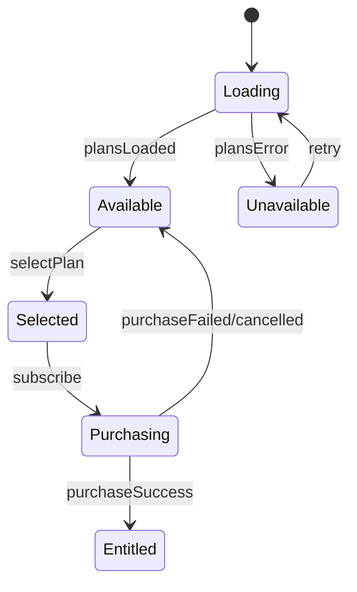
*Trigger:* plan load / select / subscribe / IAP result. *Transition:* Selected→Purchasing on subscribe (native IAP); success grants entitlement (family → members). *Exit:* Entitled. *Failure recovery:* ERR_PAYMENT_FAILED/ERR_SUBSCRIPTION_INVALID return to Available with a clear reason + Restore; never grants entitlement without server-validated receipt.
**Required Test Coverage:** Unit: Yes · Integration: Yes · Snapshot: Yes · A11y: Yes · Visual Regression: Yes · Performance: No · Interaction: Yes — Notes: integration for IAP + server receipt validation; "best value" not color-only.
**Accessibility:** SR reads name→price→terms→inclusions; "best value" as text not color; ≥44.
**Tokens:** color.surface.raised, color.brand.primary, typography.title.large, spacing.lg, radius.lg, elevation.card.
**Dependencies:** Depends On: CMP_VALUE_LIST · Used By: SCR_SUBSCRIPTION_001 · Shared Utilities: SubscriptionService, AnalyticsService.

### CMP_INVITE_LINK_CARD / CMP_INVITE_ACCEPT_CARD — Invite Cards
**Used by:** SCR_HOUSEHOLD_INVITE_001.
**Purpose:** Show a shareable invite (inviter) / accept prompt with household + inviter (invitee).
**Version:** 1.0.0 — Change History: [1.0.0 · Initial · First implementation]
**Design Source:** Figma ID: TBD · URL: TBD · Owner: Design Team · Status: Not Linked
**Impl Owner:** Primary: Frontend · Secondary: Backend · Team: Mobile
**Variants:** {link (inviter), accept (invitee)}.
**Behavior:** link → CMP_SHARE_BUTTON / copy; accept → join CTA.
**States:** default/loading/expired(error)/offline.
**Required Test Coverage:** Unit: Yes · Integration: Yes · Snapshot: Yes · A11y: Yes · Visual Regression: No · Performance: No · Interaction: Yes — Notes: integration for token validity/expiry (ERR_INVITE_EXPIRED) + deferred-deep-link join.
**Accessibility:** accept card clearly states household + inviter; CTAs labeled.
**Tokens:** color.surface.raised, color.brand.primary, typography.title.medium, radius.lg, spacing.lg.
**Dependencies:** Depends On: CMP_SHARE_BUTTON, CMP_PRIMARY_BUTTON · Used By: SCR_HOUSEHOLD_INVITE_001 · Shared Utilities: HouseholdService.

### CMP_HOUSEHOLD_SUMMARY — Household Summary
**Used by:** SCR_PROFILE_001.
**Purpose:** Compact household overview (name, member avatars/initials, count).
**Version:** 1.0.0 — Change History: [1.0.0 · Initial · First implementation]
**Design Source:** Figma ID: TBD · URL: TBD · Owner: Design Team · Status: Not Linked
**Impl Owner:** Primary: Frontend · Secondary: None · Team: Mobile
**Variants:** {solo (invite prompt), multi}.
**Behavior:** tap → SCR_HOUSEHOLD_001.
**States:** default/loading/empty(solo).
**Required Test Coverage:** Unit: Yes · Integration: No · Snapshot: Yes · A11y: Yes · Visual Regression: No · Performance: No · Interaction: Yes — Notes: assert solo→invite-prompt variant; names in SR label.
**Accessibility:** labeled "{household}, {n} members, manage"; avatars decorative with names in label.
**Tokens:** color.surface.raised, typography.title.small, radius.lg, spacing.md.
**Dependencies:** Depends On: none · Used By: SCR_PROFILE_001 · Shared Utilities: HouseholdService.

### CMP_CONSEQUENCES_PANEL — Consequences Panel
**Used by:** SCR_DELETE_ACCOUNT_001.
**Purpose:** Clearly enumerate deletion consequences before confirm.
**Version:** 1.0.0 — Change History: [1.0.0 · Initial · First implementation]
**Design Source:** Figma ID: TBD · URL: TBD · Owner: Design Team · Status: Not Linked
**Impl Owner:** Primary: Frontend · Secondary: None · Team: Mobile
**Variants:** {owner-with-members, standard}.
**Behavior:** static informational; gates the destructive CTA.
**States:** default.
**Required Test Coverage:** Unit: No · Integration: No · Snapshot: Yes · A11y: Yes · Visual Regression: No · Performance: No · Interaction: No — Notes: static; assert readable at max Dynamic Type + owner-variant copy.
**Accessibility:** readable at max Dynamic Type; each consequence a list item; danger tone conveyed by text.
**Tokens:** color.surface.dangerSubtle, color.text.primary, typography.body.large, radius.md, spacing.lg.
**Dependencies:** Depends On: none · Used By: SCR_DELETE_ACCOUNT_001 · Shared Utilities: none.

---

## 5.5 Headers & Chips

### CMP_APP_HEADER — App/Screen Header
**Used by:** SCR_HOME_001 and most stack screens.
**Purpose:** Screen title + contextual actions; hosts CMP_LOCATION_CHIP on Home.
**Version:** 1.0.0 — Change History: [1.0.0 · Initial · First implementation]
**Design Source:** Figma ID: TBD · URL: TBD · Owner: Design Team · Status: Not Linked
**Impl Owner:** Primary: Frontend · Secondary: None · Team: Mobile
**Variants:** {home (greeting + location chip), stack (back + title), large-title, immersive(hidden)}.
**Anatomy & Spacing:** height 56pt; leading back/none; title `typography.title.large`; trailing icon actions.
**Behavior:** back pops stack; collapses to compact on scroll (Reduced-Motion: no collapse).
**States:** default/scrolled.
**Required Test Coverage:** Unit: Yes · Integration: No · Snapshot: Yes · A11y: Yes · Visual Regression: Yes · Performance: No · Interaction: Yes — Notes: assert title as SR heading; scroll-collapse off under Reduced-Motion.
**Accessibility:** back labeled "Back"; title is the SR screen heading; actions labeled.
**Tokens:** color.surface.primary, typography.title.large, spacing.md, elevation.header(scrolled).
**Dependencies:** Depends On: CMP_ICON_BUTTON, CMP_LOCATION_CHIP (home) · Used By: most screens · Shared Utilities: NavigationService.

### CMP_PROFILE_HEADER / CMP_FESTIVAL_HEADER / CMP_GURU_HEADER — Contextual Headers
**Used by:** SCR_PROFILE_001 / SCR_FESTIVAL_DETAIL_001 / SCR_GURU_HOME_001.
**Purpose:** Rich, context-specific headers (profile identity; festival hero; Guru trust line).
**Version:** 1.0.0 — Change History: [1.0.0 · Initial · First implementation]
**Design Source:** Figma ID: TBD · URL: TBD · Owner: Design Team · Status: Not Linked
**Impl Owner:** Primary: Frontend · Secondary: None (GURU_HEADER: AI) · Team: Mobile
**Variants:** per context; GURU_HEADER always carries the trust line ("Guru answers from verified sources").
**Behavior:** static/scroll-collapse; festival header may show illustration.
**States:** default/scrolled/loading.
**Required Test Coverage:** Unit: Yes · Integration: No · Snapshot: Yes · A11y: Yes · Visual Regression: Yes · Performance: No · Interaction: No — Notes: assert GURU trust line read first; festival illustration decorative.
**Accessibility:** trust line read first on Guru; festival illustration decorative; heading semantics.
**Tokens:** color.surface.primary/brandSubtle, typography.display.small/title.medium, spacing.lg, radius.lg.
**Dependencies:** Depends On: none · Used By: SCR_PROFILE_001, SCR_FESTIVAL_DETAIL_001, SCR_GURU_HOME_001 · Shared Utilities: none.

### CMP_LOCATION_CHIP — Location/Accuracy Chip
**Used by:** SCR_HOME_001, SCR_ONBOARDING_PANCHANG_001, SCR_PANCHANG_DETAIL_001.
**Purpose:** Visible trust signal — "Panchang for {city}, {tz}" (UX-5).
**Version:** 1.0.0 — Change History: [1.0.0 · Initial · First implementation]
**Design Source:** Figma ID: TBD · URL: TBD · Owner: Design Team · Status: Not Linked
**Impl Owner:** Primary: Frontend · Secondary: None · Team: Mobile
**Variants:** {default, warning(location fallback/needs-fix)}.
**Behavior:** tap → change location (Settings/Location).
**States:** default/warning(device-tz fallback).
**Required Test Coverage:** Unit: Yes · Integration: No · Snapshot: Yes · A11y: Yes · Visual Regression: Yes · Performance: No · Interaction: Yes — Notes: assert warning variant conveyed by icon+text (not color-only).
**Accessibility:** labeled "Panchang calculated for {city}, {timezone}, change"; warning conveyed by icon+text.
**Tokens:** color.surface.chip, color.text.secondary, color.accent.caution(warning), typography.label.small, radius.pill.
**Dependencies:** Depends On: none · Used By: SCR_HOME_001, SCR_ONBOARDING_PANCHANG_001, SCR_PANCHANG_DETAIL_001 · Shared Utilities: LocationService.

---

## 5.6 Lists & Rows

### CMP_LIST — List Container
**Used by:** personal dates, history, household, settings, events.
**Purpose:** Virtualized scrollable list container.
**Version:** 1.0.0 — Change History: [1.0.0 · Initial · First implementation]
**Design Source:** Figma ID: TBD · URL: TBD · Owner: Design Team · Status: Not Linked
**Impl Owner:** Primary: Frontend · Secondary: None · Team: Mobile
**Variants:** {plain, grouped/sectioned, inset}.
**Behavior:** virtualization; pull-to-refresh where applicable; bottom padding for FAB/tab-bar.
**States:** default/loading(skeleton rows)/empty(CMP_EMPTY_STATE)/offline/error.
**Required Test Coverage:** Unit: Yes · Integration: No · Snapshot: Yes · A11y: Yes · Visual Regression: No · Performance: Yes · Interaction: Yes — Notes: performance test for virtualization; assert empty/offline/error states + bottom padding for FAB/tab-bar.
**Accessibility:** section headers as SR headings; item count exposed; scroll not motion-gated.
**Tokens:** color.surface.primary, spacing.md, divider color.border.subtle.
**Dependencies:** Depends On: CMP_SKELETON, CMP_EMPTY_STATE · Used By: SCR_PERSONAL_DATES_001, SCR_GURU_HISTORY_001, SCR_HOUSEHOLD_001, SCR_SETTINGS_001 · Shared Utilities: none.

### CMP_LIST_ROW / CMP_SETTINGS_ROW — Generic & Settings Rows
**Used by:** profile hub, settings hub/subpages.
**Purpose:** Navigable or value-bearing row.
**Version:** 1.0.0 — Change History: [1.0.0 · Initial · First implementation]
**Design Source:** Figma ID: TBD · URL: TBD · Owner: Design Team · Status: Not Linked
**Impl Owner:** Primary: Frontend · Secondary: None · Team: Mobile
**Variants:** `type` = {nav (chevron), value (right-aligned value), toggle (hosts CMP_TOGGLE), destructive}.
**Anatomy & Spacing:** leading icon?, title, optional subtitle, trailing (chevron/value/toggle); height ≥48; padding `spacing.md`.
**Behavior:** nav → push; value → open editor; toggle inline.
**States:** default/pressed/disabled.
**Required Test Coverage:** Unit: Yes · Integration: No · Snapshot: Yes · A11y: Yes · Visual Regression: Yes · Performance: No · Interaction: Yes — Notes: assert whole-row target labeled with title+value; ≥48.
**Accessibility:** whole row is the target, labeled with title + current value; ≥48; chevron decorative.
**Tokens:** color.surface.primary, color.text.primary/secondary, typography.body.large, spacing.md, divider color.border.subtle.
**Dependencies:** Depends On: CMP_TOGGLE (toggle variant) · Used By: SCR_PROFILE_001, SCR_SETTINGS_001 · Shared Utilities: none.

### CMP_MEMBER_ROW — Household Member Row
**Used by:** household setup/members.
**Purpose:** Show/edit a member (name, role, depth).
**Version:** 1.0.0 — Change History: [1.0.0 · Initial · First implementation]
**Design Source:** Figma ID: TBD · URL: TBD · Owner: Design Team · Status: Not Linked
**Impl Owner:** Primary: Frontend · Secondary: None · Team: Mobile
**Variants:** {display, editable}.
**Behavior:** tap → edit role/depth (inline or sheet); remove via destructive action.
**States:** default/editing/removing.
**Required Test Coverage:** Unit: Yes · Integration: No · Snapshot: Yes · A11y: Yes · Visual Regression: No · Performance: No · Interaction: Yes — Notes: assert edit emits EVT_055; remove is confirmed.
**Accessibility:** labeled "{name}, {role}, {depth}"; edit/remove labeled.
**Tokens:** color.surface.primary, typography.body.large, spacing.md.
**Dependencies:** Depends On: CMP_ROLE_PICKER, CMP_DEPTH_TOGGLE, CMP_DESTRUCTIVE_ACTION · Used By: SCR_ONBOARDING_HOUSEHOLD_001, SCR_HOUSEHOLD_001 · Shared Utilities: HouseholdService.

### CMP_PERSONAL_DATE_ROW — Personal Date Row
**Used by:** SCR_PERSONAL_DATES_001.
**Purpose:** Show a personal date + computed next occurrence (grief-aware styling).
**Version:** 1.0.0 — Change History: [1.0.0 · Initial · First implementation]
**Design Source:** Figma ID: TBD · URL: TBD · Owner: Design Team · Status: Not Linked
**Impl Owner:** Primary: Frontend · Secondary: None · Team: Mobile
**Variants:** {default}.
**Behavior:** tap → edit.
**States:** default.
**Required Test Coverage:** Unit: Yes · Integration: No · Snapshot: Yes · A11y: Yes · Visual Regression: No · Performance: No · Interaction: Yes — Notes: assert calm/grief-aware styling — no streak/gamified adornment.
**Accessibility:** labeled "{name}, {relation}, next {date}"; calm tone; no gamified adornment.
**Tokens:** color.surface.muted, color.text.secondary, typography.body.medium, spacing.md.
**Dependencies:** Depends On: none · Used By: SCR_PERSONAL_DATES_001 · Shared Utilities: TithiEngineService.

### CMP_CONVERSATION_ROW — Conversation Row
**Used by:** SCR_GURU_HISTORY_001.
**Purpose:** Past conversation entry.
**Version:** 1.0.0 — Change History: [1.0.0 · Initial · First implementation]
**Design Source:** Figma ID: TBD · URL: TBD · Owner: Design Team · Status: Not Linked
**Impl Owner:** Primary: Frontend · Secondary: None · Team: Mobile
**Variants:** {default}; swipe-to-delete.
**Behavior:** tap → open thread; swipe → delete (confirm).
**States:** default/pressed.
**Required Test Coverage:** Unit: Yes · Integration: No · Snapshot: Yes · A11y: Yes · Visual Regression: No · Performance: No · Interaction: Yes — Notes: assert swipe-delete confirm; label title+date.
**Accessibility:** labeled "{title}, {date}"; delete labeled/confirmed.
**Tokens:** color.surface.primary, typography.body.medium, spacing.md.
**Dependencies:** Depends On: none · Used By: SCR_GURU_HISTORY_001 · Shared Utilities: AskGuruService.

### CMP_EVENT_LIST — Day Event List
**Used by:** SCR_CALENDAR_DAY_001.
**Purpose:** List a day's festivals/vrats/personal dates.
**Version:** 1.0.0 — Change History: [1.0.0 · Initial · First implementation]
**Design Source:** Figma ID: TBD · URL: TBD · Owner: Design Team · Status: Not Linked
**Impl Owner:** Primary: Frontend · Secondary: None · Team: Mobile
**Variants:** grouped by type.
**Behavior:** item tap → festival/personal detail.
**States:** default/empty("no observances")/loading.
**Required Test Coverage:** Unit: Yes · Integration: No · Snapshot: Yes · A11y: Yes · Visual Regression: No · Performance: No · Interaction: Yes — Notes: assert type-grouping + empty state.
**Accessibility:** items labeled with type + name; ≥44.
**Tokens:** color.surface.primary, typography.body.medium, spacing.sm.
**Dependencies:** Depends On: none · Used By: SCR_CALENDAR_DAY_001 · Shared Utilities: CalendarService.

### CMP_PROMPT_STARTER_LIST — Prompt Starter List
**Used by:** SCR_GURU_HOME_001.
**Purpose:** Evergreen/contextual question starters.
**Version:** 1.0.0 — Change History: [1.0.0 · Initial · First implementation]
**Design Source:** Figma ID: TBD · URL: TBD · Owner: Design Team · Status: Not Linked
**Impl Owner:** Primary: Frontend · Secondary: AI · Team: Mobile + AI
**Variants:** {contextual, evergreen(fallback)}.
**Behavior:** tap → seed chat.
**States:** default/loading(skeleton)/empty(evergreen).
**Required Test Coverage:** Unit: Yes · Integration: Yes · Snapshot: Yes · A11y: Yes · Visual Regression: No · Performance: No · Interaction: Yes — Notes: assert evergreen fallback when contextual suggestions absent.
**Accessibility:** each starter a labeled button.
**Tokens:** color.surface.chip, typography.body.medium, radius.md, spacing.sm.
**Dependencies:** Depends On: CMP_SUGGESTED_QUESTION_CHIP · Used By: SCR_GURU_HOME_001 · Shared Utilities: AskGuruService.

### CMP_VALUE_LIST — Value/Benefit List
**Used by:** SCR_SUBSCRIPTION_001 (plan inclusions).
**Purpose:** Checkmark list of included benefits.
**Version:** 1.0.0 — Change History: [1.0.0 · Initial · First implementation]
**Design Source:** Figma ID: TBD · URL: TBD · Owner: Design Team · Status: Not Linked
**Impl Owner:** Primary: Frontend · Secondary: None · Team: Mobile
**Variants:** {included, excluded(muted)}.
**Behavior:** static.
**States:** default.
**Required Test Coverage:** Unit: No · Integration: No · Snapshot: Yes · A11y: Yes · Visual Regression: No · Performance: No · Interaction: No — Notes: static; assert check icon has "included" text equivalent.
**Accessibility:** each item labeled; check icon has text equivalent ("included").
**Tokens:** color.text.primary, color.accent.positive, typography.body.medium, spacing.sm.
**Dependencies:** Depends On: none · Used By: CMP_PLAN_CARD, SCR_SUBSCRIPTION_001 · Shared Utilities: none.

### CMP_CHECKLIST (+ CMP_CHECKLIST_ITEM) — Daily Checklist
**Used by:** SCR_HOME_001.
**Purpose:** 3–5 curated micro-actions with inline completion.
**Version:** 1.0.0 — Change History: [1.0.0 · Initial · First implementation]
**Design Source:** Figma ID: TBD · URL: TBD · Owner: Design Team · Status: Not Linked
**Impl Owner:** Primary: Frontend · Secondary: None · Team: Mobile
**Variants:** item `state` = {incomplete, complete}; item `type` = {inline-toggle, routes-to-flow}.
**Anatomy & Spacing:** checkbox + label; `spacing.sm` between; subtle progress affordance (not a dominant score).
**Behavior:** toggle inline (optimistic, `haptic.selection`); routing items open their flow; all-done = calm acknowledgment (no confetti).
**States:** incomplete/complete/offline(optimistic)/error(revert).
**Required Test Coverage:** Unit: Yes · Integration: Yes · Snapshot: Yes · A11y: Yes · Visual Regression: Yes · Performance: No · Interaction: Yes — Notes: assert optimistic toggle + offline queue/revert; role=checkbox state announced; no confetti on all-done.
**Accessibility:** each item role=checkbox with `checked` state announced; not color-only (check icon + strikethrough-optional + label); ≥44.
**Tokens:** color.surface.primary, color.accent.positive, typography.body.large, spacing.sm, motion.check, haptic.selection.
**Dependencies:** Depends On: none · Used By: SCR_HOME_001 · Shared Utilities: ChecklistService, HapticService, AnalyticsService.

---

## 5.7 Navigation

### CMP_BOTTOM_TAB_BAR — Bottom Tab Bar
**Used by:** all primary tab roots (Today / Calendar / Ask Guru / You).
**Purpose:** Persistent primary navigation (4 tabs, UX-1).
**Version:** 1.0.0 — Change History: [1.0.0 · Initial · First implementation]
**Design Source:** Figma ID: TBD · URL: TBD · Owner: Design Team · Status: Not Linked
**Impl Owner:** Primary: Frontend · Secondary: None · Team: Mobile
**Variants:** {4-tab}; per-tab {active, inactive, with-badge?}.
**Anatomy & Spacing:** 4 equal items, icon + label; height 56pt + safe-area inset; hairline top divider.
**Behavior:** tap switches tab (preserves each tab's stack); re-tap active tab scrolls-to-top/pops-to-root; hidden in Splash/Onboarding/immersive ritual/full-screen modals (A1).
**States:** active `color.brand.primary` icon+label; inactive `color.icon.muted`; pressed.
**Required Test Coverage:** Unit: Yes · Integration: Yes · Snapshot: Yes · A11y: Yes · Visual Regression: Yes · Performance: No · Interaction: Yes — Notes: assert per-tab stack preservation, re-tap pop-to-root, hidden contexts; not color-only (filled/outline icon).
**Accessibility:** role=tablist; each tab labeled with name + selected state ("Today, tab, selected"); ≥48 targets; labels always visible (not icon-only) for clarity across ages; not color-only (filled vs. outline icon).
**Tokens:** color.surface.elevated, color.brand.primary, color.icon.muted, typography.label.small, elevation.tabbar.
**Dependencies:** Depends On: none · Used By: app shell (all tab roots) · Shared Utilities: NavigationService.

### CMP_MONTH_NAV — Month Navigator
**Used by:** SCR_CALENDAR_001.
**Purpose:** Move between months + jump to today.
**Version:** 1.0.0 — Change History: [1.0.0 · Initial · First implementation]
**Design Source:** Figma ID: TBD · URL: TBD · Owner: Design Team · Status: Not Linked
**Impl Owner:** Primary: Frontend · Secondary: None · Team: Mobile
**Variants:** {arrows + label, with Today button}.
**Behavior:** prev/next month; swipe equivalent on grid; Today jumps to current month.
**States:** default/disabled(range bounds).
**Required Test Coverage:** Unit: Yes · Integration: No · Snapshot: Yes · A11y: Yes · Visual Regression: No · Performance: No · Interaction: Yes — Notes: assert prev/next labels name target month; swipe has button equivalents.
**Accessibility:** prev/next labeled with target month; Today labeled; swipe has these button equivalents.
**Tokens:** color.icon.default, typography.title.small, spacing.md.
**Dependencies:** Depends On: CMP_ICON_BUTTON, CMP_TEXT_BUTTON · Used By: SCR_CALENDAR_001 · Shared Utilities: none.

### CMP_PAGE_DOTS — Page Indicator
**Used by:** SCR_ONBOARDING_WELCOME_001.
**Purpose:** Show position in a paged flow.
**Version:** 1.0.0 — Change History: [1.0.0 · Initial · First implementation]
**Design Source:** Figma ID: TBD · URL: TBD · Owner: Design Team · Status: Not Linked
**Impl Owner:** Primary: Frontend · Secondary: None · Team: Mobile
**Variants:** {n dots}.
**Behavior:** reflects current slide; tap optional.
**States:** active/inactive dot.
**Required Test Coverage:** Unit: Yes · Integration: No · Snapshot: Yes · A11y: Yes · Visual Regression: No · Performance: No · Interaction: No — Notes: assert "page X of N" SR exposure (not decorative-only).
**Accessibility:** exposes "page X of N" (not decorative-only); Reduced-Motion static.
**Tokens:** color.brand.primary(active), color.state.dotInactive, spacing.xs.
**Dependencies:** Depends On: none · Used By: SCR_ONBOARDING_WELCOME_001 · Shared Utilities: none.

### CMP_ONBOARDING_SLIDE — Onboarding Slide
**Used by:** SCR_ONBOARDING_WELCOME_001.
**Purpose:** A single value slide (illustration + headline + subcopy).
**Version:** 1.0.0 — Change History: [1.0.0 · Initial · First implementation]
**Design Source:** Figma ID: TBD · URL: TBD · Owner: Design Team · Status: Not Linked
**Impl Owner:** Primary: Frontend · Secondary: None · Team: Mobile
**Variants:** {value-1, value-2, value-3}.
**Behavior:** horizontal paging; Reduced-Motion → cross-fade.
**States:** default/loading(skeleton on illustration).
**Required Test Coverage:** Unit: Yes · Integration: No · Snapshot: Yes · A11y: Yes · Visual Regression: Yes · Performance: No · Interaction: Yes — Notes: assert Reduced-Motion cross-fade; illustration decorative.
**Accessibility:** each slide a labeled region; SR reads headline→subcopy; illustration decorative.
**Tokens:** color.surface.primary, typography.heading.large, typography.body.medium, spacing.lg, motion.reduced.crossfade.
**Dependencies:** Depends On: CMP_SKELETON · Used By: SCR_ONBOARDING_WELCOME_001 · Shared Utilities: none.

---

## 5.8 Calendar

### CMP_MONTH_GRID — Month Grid
**Used by:** SCR_CALENDAR_001.
**Purpose:** 7-column month grid hosting CMP_DAY_CELL.
**Version:** 1.0.0 — Change History: [1.0.0 · Initial · First implementation]
**Design Source:** Figma ID: TBD · URL: TBD · Owner: Design Team · Status: Not Linked
**Impl Owner:** Primary: Frontend · Secondary: None · Team: Mobile
**Variants:** {6-week, 5-week}.
**Behavior:** swipe between months (with CMP_MONTH_NAV equivalents); today highlighted; selection routes to day detail.
**States:** default/loading(skeleton grid)/empty(no events)/offline(cached)/error(month retry).
**Required Test Coverage:** Unit: Yes · Integration: Yes · Snapshot: Yes · A11y: Yes · Visual Regression: Yes · Performance: Yes · Interaction: Yes — Notes: perf test for month paging; assert per-month error isolation.
**Accessibility:** grid semantics (row/col); weekday headers; each cell labeled (below); month change announced.
**Tokens:** color.surface.primary, spacing.sm, divider color.border.subtle.
**Dependencies:** Depends On: CMP_DAY_CELL, CMP_MONTH_NAV, CMP_SKELETON · Used By: SCR_CALENDAR_001 · Shared Utilities: CalendarService.

### CMP_DAY_CELL — Day Cell
**Used by:** CMP_MONTH_GRID.
**Purpose:** A single day with event markers.
**Version:** 1.0.0 — Change History: [1.0.0 · Initial · First implementation]
**Design Source:** Figma ID: TBD · URL: TBD · Owner: Design Team · Status: Not Linked
**Impl Owner:** Primary: Frontend · Secondary: None · Team: Mobile
**Variants:** {default, today, selected, other-month, has-festival ●, has-vrat ○, has-personal ◆} (markers combine).
**Behavior:** tap → SCR_CALENDAR_DAY_001.
**States:** default/today/selected/pressed/disabled(out-of-range).
**Required Test Coverage:** Unit: Yes · Integration: No · Snapshot: Yes · A11y: Yes · Visual Regression: Yes · Performance: No · Interaction: Yes — Notes: assert marker types conveyed in SR label (not color/shape-only); ≥44 tap.
**Accessibility:** labeled "{weekday} {date}, {festival/vrat/personal names}"; markers conveyed by text in label (not color/shape only); ≥44 tap.
**Tokens:** color.text.primary, color.marker.festival/vrat/personal, color.brand.primary(today ring), typography.body.small, radius.sm.
**Dependencies:** Depends On: none (atom) · Used By: CMP_MONTH_GRID · Shared Utilities: none.

### CMP_TRADITION_SWITCHER — Tradition Switcher
**Used by:** SCR_CALENDAR_001 (and Settings).
**Purpose:** Change active regional tradition in context.
**Version:** 1.0.0 — Change History: [1.0.0 · Initial · First implementation]
**Design Source:** Figma ID: TBD · URL: TBD · Owner: Design Team · Status: Not Linked
**Impl Owner:** Primary: Frontend · Secondary: Backend · Team: Mobile
**Variants:** {inline dropdown, bottom-sheet}.
**Behavior:** select → re-render calendar/festival naming (EVT_024); confirm on change.
**States:** default/open/loading(re-render).
**Required Test Coverage:** Unit: Yes · Integration: Yes · Snapshot: Yes · A11y: Yes · Visual Regression: No · Performance: No · Interaction: Yes — Notes: assert re-render + EVT_024 on change; change announced.
**Accessibility:** current tradition announced; options as a list; change announced.
**Tokens:** color.surface.raised, typography.label.medium, radius.md.
**Dependencies:** Depends On: CMP_BOTTOM_SHEET (sheet variant) · Used By: SCR_CALENDAR_001, SCR_SETTINGS_001 · Shared Utilities: PreferencesService, CalendarService.

### CMP_STREAK_CALENDAR — Streak/Completion Heatmap
**Used by:** SCR_ACHIEVEMENTS_001.
**Purpose:** Visualize completion history over time.
**Version:** 1.0.0 — Change History: [1.0.0 · Initial · First implementation]
**Design Source:** Figma ID: TBD · URL: TBD · Owner: Design Team · Status: Not Linked
**Impl Owner:** Primary: Frontend · Secondary: None · Team: Mobile
**Variants:** {30-day, full-history}.
**Behavior:** static/scroll; reflects grace days honestly.
**States:** default/empty(new user)/loading.
**Required Test Coverage:** Unit: Yes · Integration: No · Snapshot: Yes · A11y: Yes · Visual Regression: Yes · Performance: No · Interaction: No — Notes: assert text alternative present; honest grace-day reflection; not color-only.
**Accessibility:** **text alternative required** (e.g., "18 of last 30 days completed"); cells not color-only (intensity + label on focus); Reduced-Motion static.
**Tokens:** color.accent.warmScale (5-step ramp §6.2), typography.body.small, spacing.xs, radius.sm.
**Dependencies:** Depends On: none · Used By: SCR_ACHIEVEMENTS_001 · Shared Utilities: StreakService.

---

## 5.9 Ritual & Panchang

### CMP_RITUAL_INTRO — Ritual Intro
**Used by:** SCR_RITUAL_001.
**Purpose:** What/why of today's ritual (regional, depth-aware) + Begin.
**Version:** 1.0.0 — Change History: [1.0.0 · Initial · First implementation]
**Design Source:** Figma ID: TBD · URL: TBD · Owner: Design Team · Status: Not Linked
**Impl Owner:** Primary: Frontend · Secondary: None · Team: Mobile
**Variants:** {quick, deep} (depth), {festival-linked}.
**Behavior:** Begin → first step.
**States:** default/loading.
**Required Test Coverage:** Unit: Yes · Integration: No · Snapshot: Yes · A11y: Yes · Visual Regression: Yes · Performance: No · Interaction: Yes — Notes: assert depth-aware content + Begin routing.
**Accessibility:** heading + body in order; Begin labeled; depth reflected.
**Tokens:** color.surface.immersive, typography.title.large, typography.body.large, spacing.lg.
**Dependencies:** Depends On: CMP_PRIMARY_BUTTON · Used By: SCR_RITUAL_001 · Shared Utilities: RitualProgressService.

### CMP_RITUAL_STEP — Ritual Step
**Used by:** SCR_RITUAL_001.
**Purpose:** A single guided step (text + optional audio) with progress.
**Version:** 1.0.0 — Change History: [1.0.0 · Initial · First implementation]
**Design Source:** Figma ID: TBD · URL: TBD · Owner: Design Team · Status: Not Linked
**Impl Owner:** Primary: Frontend · Secondary: None · Team: Mobile
**Variants:** {text-only, text+audio}.
**Anatomy & Spacing:** step text, CMP_AUDIO_CONTROLS, CMP_PROGRESS_RING, Next/Complete.
**Behavior:** advance on Next; pause/resume; leaving saves progress.
**States:** default/audio-loading/audio-unavailable(text-only)/last-step(Complete).
**State Machine:**
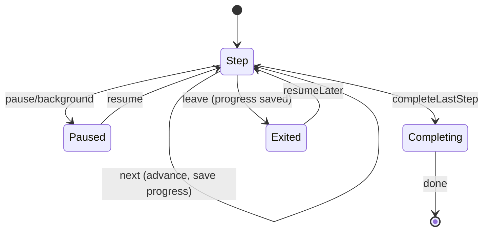
*Trigger:* next/pause/leave/complete. *Transition:* each Next advances + persists progress; last step → Completing → CMP_COMPLETION_MOMENT. *Exit:* done (completion) or Exited (saved, resumable from Home). *Failure recovery:* audio load failure (ERR_AUDIO_UNAVAILABLE) degrades to text-only without blocking; app-kill mid-step resumes at the saved step.
**Required Test Coverage:** Unit: Yes · Integration: Yes · Snapshot: Yes · A11y: Yes · Visual Regression: Yes · Performance: Yes · Interaction: Yes — Notes: assert resume-at-step, audio→text fallback, text/audio parity, audio-focus vs SR.
**Accessibility:** full text parity with audio; audio-focus mgmt vs. SR; step position announced.
**Tokens:** color.surface.immersive, typography.body.large, spacing.lg, motion.ritual.step.
**Dependencies:** Depends On: CMP_AUDIO_CONTROLS, CMP_PROGRESS_RING, CMP_PRIMARY_BUTTON · Used By: SCR_RITUAL_001 · Shared Utilities: RitualProgressService, AudioService.

### CMP_PROGRESS_RING — Progress Ring
**Used by:** CMP_RITUAL_STEP.
**Purpose:** Circular step/completion progress.
**Version:** 1.0.0 — Change History: [1.0.0 · Initial · First implementation]
**Design Source:** Figma ID: TBD · URL: TBD · Owner: Design Team · Status: Not Linked
**Impl Owner:** Primary: Frontend · Secondary: None · Team: Mobile
**Variants:** {determinate}.
**Behavior:** animates between steps (Reduced-Motion → instant).
**States:** default.
**State Machine:**
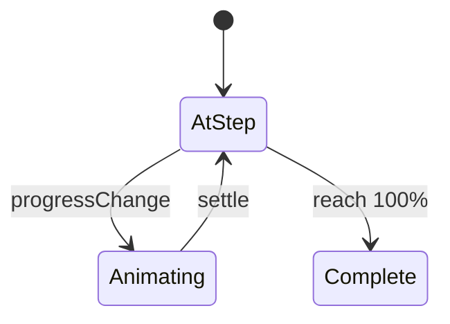
*Trigger:* progress value change. *Transition:* animates from prior to new fraction over `duration.progress`. *Exit:* Complete at 100%. *Failure recovery:* N/A (pure presentation); under Reduced-Motion it jumps instantly to the new value with no animation.
**Required Test Coverage:** Unit: Yes · Integration: No · Snapshot: Yes · A11y: Yes · Visual Regression: Yes · Performance: Yes · Interaction: No — Notes: assert `accessibilityValue` text + instant update under Reduced-Motion.
**Accessibility:** `accessibilityValue` ("step 2 of 4"); not the sole progress signal (text too).
**Tokens:** color.brand.primary, color.state.trackOff, motion.progress, duration.progress.
**Dependencies:** Depends On: none (atom) · Used By: CMP_RITUAL_STEP · Shared Utilities: none.

### CMP_AUDIO_CONTROLS — Audio Controls
**Used by:** CMP_RITUAL_STEP.
**Purpose:** Play/pause narration + scrubber.
**Version:** 1.0.0 — Change History: [1.0.0 · Initial · First implementation]
**Design Source:** Figma ID: TBD · URL: TBD · Owner: Design Team · Status: Not Linked
**Impl Owner:** Primary: Frontend · Secondary: None · Team: Mobile
**Variants:** {compact, full}.
**Behavior:** play/pause; auto-pause when SR speaks; remembers mute preference.
**States:** playing/paused/loading/unavailable(offline).
**State Machine:**
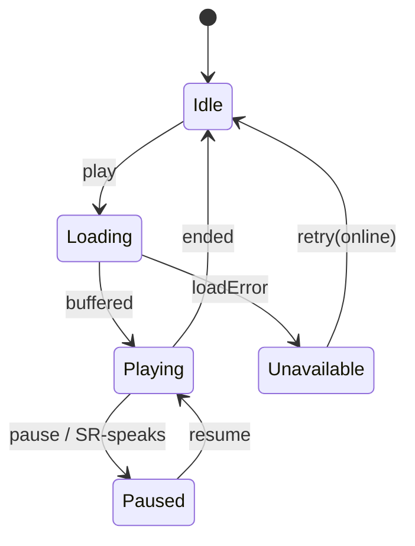
*Trigger:* play/pause/SR-focus/load result. *Transition:* auto-pause when the screen reader speaks (audio-focus coordination); resume after. *Exit:* Idle on end. *Failure recovery:* ERR_AUDIO_UNAVAILABLE → Unavailable state, parent falls back to text-only.
**Required Test Coverage:** Unit: Yes · Integration: Yes · Snapshot: Yes · A11y: Yes · Visual Regression: No · Performance: Yes · Interaction: Yes — Notes: assert SR auto-pause, mute-preference persistence, offline unavailable.
**Accessibility:** play/pause labeled with state; scrubber value announced; ≥44; audio-focus coordination.
**Tokens:** color.icon.default, color.brand.primary, radius.pill, spacing.sm.
**Dependencies:** Depends On: CMP_ICON_BUTTON · Used By: CMP_RITUAL_STEP · Shared Utilities: AudioService.

### CMP_COMPLETION_MOMENT — Completion Moment
**Used by:** SCR_RITUAL_001.
**Purpose:** Calm reward on ritual completion.
**Version:** 1.0.0 — Change History: [1.0.0 · Initial · First implementation]
**Design Source:** Figma ID: TBD · URL: TBD · Owner: Design Team · Status: Not Linked
**Impl Owner:** Primary: Frontend · Secondary: None · Team: Mobile
**Variants:** {default}; never confetti (P1).
**Behavior:** soft glow + optional mutable chime + `haptic.success`; ≤ `duration.completion`; skippable; Reduced-Motion → cross-fade.
**States:** default.
**Required Test Coverage:** Unit: Yes · Integration: No · Snapshot: Yes · A11y: Yes · Visual Regression: Yes · Performance: Yes · Interaction: Yes — Notes: assert ≤ duration.completion, skippable, chime off-by-default/mutable, Reduced-Motion cross-fade.
**Accessibility:** SR announces "Done for today" outcome regardless of animation; chime off by default/mutable; Reduced-Motion respected.
**Tokens:** color.brand.primary, color.accent.warm, motion.success.small, motion.reduced.crossfade, haptic.success, duration.completion.
**Dependencies:** Depends On: none · Used By: SCR_RITUAL_001 · Shared Utilities: HapticService.

### CMP_PANCHANG_DETAIL_LIST — Panchang Detail List
**Used by:** SCR_PANCHANG_DETAIL_001.
**Purpose:** Grouped full panchang elements with explainers.
**Version:** 1.0.0 — Change History: [1.0.0 · Initial · First implementation]
**Design Source:** Figma ID: TBD · URL: TBD · Owner: Design Team · Status: Not Linked
**Impl Owner:** Primary: Frontend · Secondary: Backend · Team: Mobile
**Variants:** {full}; groups: core tithi/nakshatra/yoga/karana, timings, muhurta/Rahu Kaal.
**Behavior:** info affordances open CMP_INFO_SHEET or seed Ask Guru; per-element degrade to "—".
**States:** default/loading(skeleton rows)/partial(element empty)/offline/error.
**Required Test Coverage:** Unit: Yes · Integration: Yes · Snapshot: Yes · A11y: Yes · Visual Regression: Yes · Performance: No · Interaction: Yes — Notes: assert per-element "—" degrade; muhurta color-independent; group SR headings.
**Accessibility:** group SR headings; muhurta states text-labeled (color-independent); Dynamic Type (no truncation).
**Tokens:** color.surface.primary, color.accent.auspicious/caution, typography.title.small/body.medium, spacing.md.
**Dependencies:** Depends On: CMP_INFO_AFFORDANCE, CMP_INFO_SHEET, CMP_SKELETON · Used By: SCR_PANCHANG_DETAIL_001 · Shared Utilities: PanchangService.

### CMP_CONTENT_BODY — Rich Content Body
**Used by:** SCR_FESTIVAL_DETAIL_001 (and any long-form content).
**Purpose:** Render festival stories / how-to (Quick/Deep).
**Version:** 1.0.0 — Change History: [1.0.0 · Initial · First implementation]
**Design Source:** Figma ID: TBD · URL: TBD · Owner: Design Team · Status: Not Linked
**Impl Owner:** Primary: Frontend · Secondary: None · Team: Mobile
**Variants:** {quick(summary), deep(full)}.
**Behavior:** expand/collapse quick→deep; supports headings, lists, images.
**States:** default/loading(skeleton)/offline(cached).
**Required Test Coverage:** Unit: Yes · Integration: No · Snapshot: Yes · A11y: Yes · Visual Regression: No · Performance: No · Interaction: Yes — Notes: assert semantic headings/lists + quick↔deep expand; images alt/decorative.
**Accessibility:** semantic headings/lists; images have alt or decorative; readable at max Dynamic Type.
**Tokens:** typography.title.small/body.medium, color.text.primary, spacing.md.
**Dependencies:** Depends On: CMP_SKELETON · Used By: SCR_FESTIVAL_DETAIL_001 · Shared Utilities: ContentService.

### CMP_ROTATING_ELEMENT — Rotating Daily Element
**Used by:** SCR_HOME_001.
**Purpose:** Variable-reward daily quote/fact (anti-habituation, Hook model).
**Version:** 1.0.0 — Change History: [1.0.0 · Initial · First implementation]
**Design Source:** Figma ID: TBD · URL: TBD · Owner: Design Team · Status: Not Linked
**Impl Owner:** Primary: Frontend · Secondary: None · Team: Mobile
**Variants:** {quote, festival-fact, on-this-day}.
**Behavior:** changes daily; gentle entrance (Reduced-Motion → none); never intrusive.
**States:** default/loading(skeleton)/offline(cached/last).
**Required Test Coverage:** Unit: Yes · Integration: No · Snapshot: Yes · A11y: Yes · Visual Regression: No · Performance: No · Interaction: No — Notes: assert daily rotation + decorative motion only.
**Accessibility:** labeled as "Today's reflection"; decorative motion only.
**Tokens:** color.surface.brandSubtle, typography.body.large(quote), spacing.md, radius.md, motion.reduced.crossfade.
**Dependencies:** Depends On: none · Used By: SCR_HOME_001 · Shared Utilities: ContentService.

### CMP_INFO_AFFORDANCE — Info Affordance
**Used by:** panchang detail, glossary points.
**Purpose:** "What is X?" inline helper.
**Version:** 1.0.0 — Change History: [1.0.0 · Initial · First implementation]
**Design Source:** Figma ID: TBD · URL: TBD · Owner: Design Team · Status: Not Linked
**Impl Owner:** Primary: Frontend · Secondary: None · Team: Mobile
**Variants:** {icon, text-link}.
**Behavior:** opens CMP_INFO_SHEET or seeds Ask Guru.
**States:** default/pressed.
**Required Test Coverage:** Unit: Yes · Integration: No · Snapshot: Yes · A11y: Yes · Visual Regression: No · Performance: No · Interaction: Yes — Notes: assert ≥44 hit-slop + "About {term}" label.
**Accessibility:** labeled "About {term}"; ≥44 hit-slop.
**Tokens:** color.icon.muted, typography.label.small.
**Dependencies:** Depends On: CMP_INFO_SHEET · Used By: CMP_PANCHANG_DETAIL_LIST, SCR_PANCHANG_DETAIL_001 · Shared Utilities: none.

---

## 5.10 AI (Ask Guru)

### CMP_AI_CHAT_BUBBLE — Chat Bubble
**Used by:** SCR_GURU_CHAT_001.
**Purpose:** Render user/assistant messages.
**Version:** 1.0.0 — Change History: [1.0.0 · Initial · First implementation]
**Design Source:** Figma ID: TBD · URL: TBD · Owner: Design Team · Status: Not Linked
**Impl Owner:** Primary: Frontend · Secondary: AI · Team: Mobile + AI
**Variants:** `author` = {user, assistant}; assistant sub-states {streaming, complete, declined, refused, error}.
**Anatomy & Spacing:** user right-aligned `color.bubble.user`; assistant left `color.bubble.assistant`; max-width ~85%; `radius.lg` (asymmetric tail optional).
**Behavior:** assistant streams tokens; sources attach on complete (CMP_SOURCE_CHIP); decline/refusal render as calm inline content, not error-red.
**States:** streaming/complete/declined/refused/error(retryable).
**State Machine:**
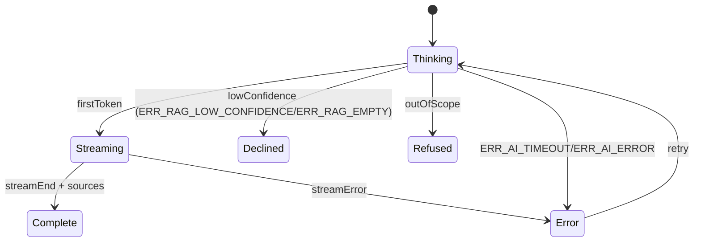
*Trigger:* orchestration result (retrieval + generation). *Transition:* Thinking→Streaming on first token; →Complete with ≥1 source. *Exit:* Complete/Declined/Refused. *Failure recovery:* low confidence → honest Declined (never fabricate); out-of-scope → scoped Refused; timeout/error → Error with retry, no fabricated content shown.
**Required Test Coverage:** Unit: Yes · Integration: Yes · Snapshot: Yes · A11y: Yes · Visual Regression: Yes · Performance: Yes · Interaction: Yes — Notes: assert grounded-answer-with-source vs. honest-decline vs. refusal vs. error; no fabrication on error; polite SR streaming.
**Accessibility:** author announced; streaming via polite live region (batched); decline/refusal read clearly.
**Tokens:** color.bubble.user, color.bubble.assistant, color.text.primary/onBrand, typography.body.large, radius.lg, spacing.md.
**Dependencies:** Depends On: CMP_SOURCE_CHIP, CMP_TYPING_INDICATOR, CMP_INLINE_NOTICE, CMP_HELPFUL_RATING · Used By: SCR_GURU_CHAT_001 · Shared Utilities: AskGuruService (RAG orchestration), AnalyticsService.

### CMP_TYPING_INDICATOR — Thinking Indicator
**Used by:** SCR_GURU_CHAT_001.
**Purpose:** Signal Guru is retrieving/generating.
**Version:** 1.0.0 — Change History: [1.0.0 · Initial · First implementation]
**Design Source:** Figma ID: TBD · URL: TBD · Owner: Design Team · Status: Not Linked
**Impl Owner:** Primary: Frontend · Secondary: AI · Team: Mobile + AI
**Variants:** {dots(default), static(Reduced-Motion)}.
**Behavior:** shows after send until first token (< 2 s budget).
**States:** active.
**Required Test Coverage:** Unit: Yes · Integration: No · Snapshot: Yes · A11y: Yes · Visual Regression: No · Performance: No · Interaction: No — Notes: assert SR text "Guru is thinking"; static under Reduced-Motion.
**Accessibility:** SR text "Guru is thinking"; Reduced-Motion → static text (no bouncing dots).
**Tokens:** color.icon.muted, motion.typing.dots, motion.reduced.crossfade.
**Dependencies:** Depends On: none · Used By: CMP_AI_CHAT_BUBBLE, SCR_GURU_CHAT_001 · Shared Utilities: none.

### CMP_SOURCE_CHIP — Source Citation Chip
**Used by:** SCR_GURU_CHAT_001.
**Purpose:** Show the retrieved source backing an answer (trust).
**Version:** 1.0.0 — Change History: [1.0.0 · Initial · First implementation]
**Design Source:** Figma ID: TBD · URL: TBD · Owner: Design Team · Status: Not Linked
**Impl Owner:** Primary: Frontend · Secondary: AI · Team: Mobile + AI
**Variants:** {single, multiple(count)}.
**Behavior:** tap → open source content (CMP_INFO_SHEET/detail).
**States:** default/pressed.
**Required Test Coverage:** Unit: Yes · Integration: Yes · Snapshot: Yes · A11y: Yes · Visual Regression: No · Performance: No · Interaction: Yes — Notes: assert source opens content; EVT_031 on render.
**Accessibility:** labeled "Source: {title}, open"; ≥44; not the only trust cue (header trust line too).
**Tokens:** color.surface.chip, color.text.secondary, typography.label.small, radius.pill.
**Dependencies:** Depends On: CMP_INFO_SHEET · Used By: CMP_AI_CHAT_BUBBLE, SCR_GURU_CHAT_001 · Shared Utilities: ContentService.

### CMP_HELPFUL_RATING — Helpful Rating
**Used by:** SCR_GURU_CHAT_001.
**Purpose:** Capture answer helpfulness (EVT_032).
**Version:** 1.0.0 — Change History: [1.0.0 · Initial · First implementation]
**Design Source:** Figma ID: TBD · URL: TBD · Owner: Design Team · Status: Not Linked
**Impl Owner:** Primary: Frontend · Secondary: AI · Team: Mobile + AI
**Variants:** {thumbs up/down}.
**Behavior:** tap records; optional follow-up reason on down.
**States:** default/selected/submitted.
**Required Test Coverage:** Unit: Yes · Integration: Yes · Snapshot: Yes · A11y: Yes · Visual Regression: No · Performance: No · Interaction: Yes — Notes: assert EVT_032 + optional reason on down.
**Accessibility:** each option labeled ("helpful"/"not helpful"); selection announced; ≥44.
**Tokens:** color.icon.default, color.accent.positive/caution, spacing.sm.
**Dependencies:** Depends On: none · Used By: CMP_AI_CHAT_BUBBLE, SCR_GURU_CHAT_001 · Shared Utilities: AskGuruService, AnalyticsService.

### CMP_INLINE_NOTICE — Inline Notice
**Used by:** SCR_GURU_CHAT_001 (decline/refusal/error), forms.
**Purpose:** Calm, in-context message (info/decline/refusal/error) with optional actions.
**Version:** 1.0.0 — Change History: [1.0.0 · Initial · First implementation]
**Design Source:** Figma ID: TBD · URL: TBD · Owner: Design Team · Status: Not Linked
**Impl Owner:** Primary: Frontend · Secondary: AI · Team: Mobile
**Variants:** `tone` = {info, decline, refusal, error}; decline/refusal use calm (not alarming) styling.
**Behavior:** may include actions (Rephrase / Related topic / Ask a temple / Retry).
**States:** default.
**Required Test Coverage:** Unit: Yes · Integration: No · Snapshot: Yes · A11y: Yes · Visual Regression: Yes · Performance: No · Interaction: Yes — Notes: assert decline/refusal use calm (non-red) styling; error not color-only.
**Accessibility:** announced with tone context; actions labeled; error tone not color-only (icon + text).
**Tokens:** color.notice.info/neutral/danger, color.text.primary, typography.body.medium, radius.md, spacing.md.
**Dependencies:** Depends On: CMP_TEXT_BUTTON (actions) · Used By: CMP_AI_CHAT_BUBBLE, SCR_GURU_CHAT_001, forms · Shared Utilities: none.

---

## 5.11 Streak & Achievements

### CMP_STREAK_COUNTER — Streak Counter (gentle)
**Used by:** SCR_HOME_001, SCR_PROFILE_001.
**Purpose:** Show current streak as gentle reinforcement (UX-3) — never the hero.
**Version:** 1.0.0 — Change History: [1.0.0 · Initial · First implementation]
**Design Source:** Figma ID: TBD · URL: TBD · Owner: Design Team · Status: Not Linked
**Impl Owner:** Primary: Frontend · Secondary: None · Team: Mobile
**Variants:** {compact(Home), summary(Profile)}.
**Behavior:** tap → SCR_ACHIEVEMENTS_001; advance animation subtle (Reduced-Motion → none); grace-day aware (no loss-framed states).
**States:** default/advanced(just incremented)/grace-used(supportive copy).
**Required Test Coverage:** Unit: Yes · Integration: No · Snapshot: Yes · A11y: Yes · Visual Regression: Yes · Performance: No · Interaction: Yes — Notes: assert secondary placement (not dominant on Home, AC-HOME-06); grace-day supportive copy (no loss-framing).
**Accessibility:** `accessibilityValue` "{n} day streak"; positioned/sized as secondary (not first/dominant on Home per AC-HOME-06).
**Tokens:** color.accent.warm, typography.label.medium, spacing.sm, motion.reduced.crossfade.
**Dependencies:** Depends On: none · Used By: SCR_HOME_001, SCR_PROFILE_001 · Shared Utilities: StreakService.

### CMP_STREAK_SUMMARY — Streak Summary
**Used by:** SCR_ACHIEVEMENTS_001.
**Purpose:** Current + best streak, honest grace-day framing.
**Version:** 1.0.0 — Change History: [1.0.0 · Initial · First implementation]
**Design Source:** Figma ID: TBD · URL: TBD · Owner: Design Team · Status: Not Linked
**Impl Owner:** Primary: Frontend · Secondary: None · Team: Mobile
**Variants:** {default}.
**Behavior:** static display of current + best streak.
**States:** default/loading.
**Required Test Coverage:** Unit: Yes · Integration: No · Snapshot: Yes · A11y: Yes · Visual Regression: No · Performance: No · Interaction: No — Notes: assert supportive, non-shaming copy; grace days reflected honestly.
**Accessibility:** values as text; supportive, non-shaming copy.
**Tokens:** color.accent.warm, typography.title.medium, spacing.md.
**Dependencies:** Depends On: none · Used By: SCR_ACHIEVEMENTS_001 · Shared Utilities: StreakService.

### CMP_MILESTONE_BADGE — Milestone Badge
**Used by:** SCR_ACHIEVEMENTS_001.
**Purpose:** Gentle milestone recognition (not competitive).
**Version:** 1.0.0 — Change History: [1.0.0 · Initial · First implementation]
**Design Source:** Figma ID: TBD · URL: TBD · Owner: Design Team · Status: Not Linked
**Impl Owner:** Primary: Frontend · Secondary: None · Team: Mobile
**Variants:** {earned, locked(muted)}.
**Behavior:** subtle reveal on earn (Reduced-Motion → fade).
**States:** earned/locked.
**Required Test Coverage:** Unit: Yes · Integration: No · Snapshot: Yes · A11y: Yes · Visual Regression: Yes · Performance: No · Interaction: No — Notes: assert earned/locked labeled (not color-only); Reduced-Motion fade.
**Accessibility:** labeled with milestone + earned/locked; not color-only.
**Tokens:** color.accent.warm, color.state.locked, radius.pill, motion.reduced.crossfade.
**Dependencies:** Depends On: none · Used By: SCR_ACHIEVEMENTS_001 · Shared Utilities: StreakService.

---

## 5.12 Overlays & Feedback

### CMP_BOTTOM_SHEET — Bottom Sheet
**Used by:** pickers, rationale, confirmations, contextual actions.
**Purpose:** Contextual modal surface anchored to bottom.
**Version:** 1.0.0 — Change History: [1.0.0 · Initial · First implementation]
**Design Source:** Figma ID: TBD · URL: TBD · Owner: Design Team · Status: Not Linked
**Impl Owner:** Primary: Frontend · Secondary: None · Team: Mobile
**Variants:** `height` = {auto, half, full}; `dismissible` = {true, required-decision(false)}.
**Anatomy & Spacing:** grabber, title, content, actions; `radius.lg` top corners; scrim behind.
**Behavior:** drag/scrim dismiss unless required; keyboard-aware.
**States:** default/expanding/dismissing.
**State Machine:**
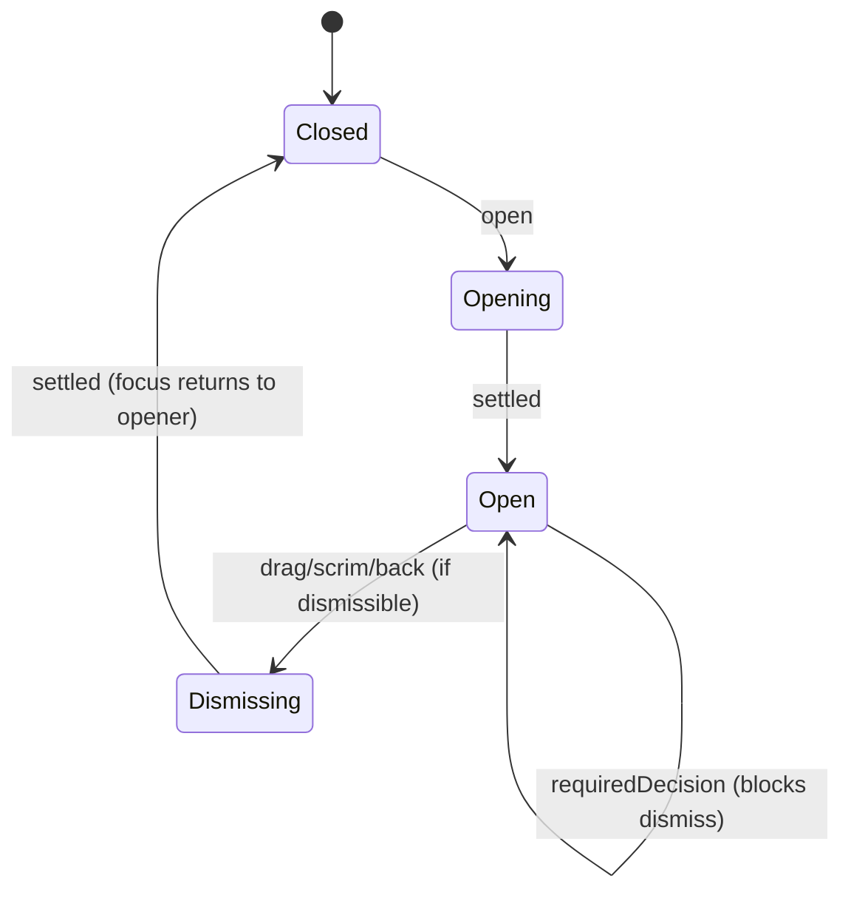
*Trigger:* open/dismiss gesture. *Transition:* drag/scrim/back dismiss unless `required-decision`. *Exit:* Closed, focus returned to opener. *Failure recovery:* required sheets ignore dismiss gestures until an action is taken.
**Required Test Coverage:** Unit: Yes · Integration: No · Snapshot: Yes · A11y: Yes · Visual Regression: Yes · Performance: No · Interaction: Yes — Notes: assert focus-trap, required-decision blocks dismiss, focus returns to opener, keyboard-aware.
**Accessibility:** focus-trapped; scrim tap dismiss (unless required); returns focus to opener; SR announces sheet title.
**Tokens:** color.surface.raised, color.scrim, radius.lg, elevation.sheet, motion.sheet.
**Dependencies:** Depends On: none · Used By: pickers, CMP_ROLE_PICKER, CMP_TRADITION_SWITCHER, paywall sheet, confirmations · Shared Utilities: NavigationService.

### CMP_DIALOG — Alert/Confirm Dialog
**Used by:** destructive confirms, leave-ritual, switch-household.
**Purpose:** Blocking decision with ≤2 actions.
**Version:** 1.0.0 — Change History: [1.0.0 · Initial · First implementation]
**Design Source:** Figma ID: TBD · URL: TBD · Owner: Design Team · Status: Not Linked
**Impl Owner:** Primary: Frontend · Secondary: None · Team: Mobile
**Variants:** {info, confirm, destructive-confirm}.
**Behavior:** must be dismissed via an action (or explicit cancel); destructive action visually distinct.
**States:** default.
**State Machine:**
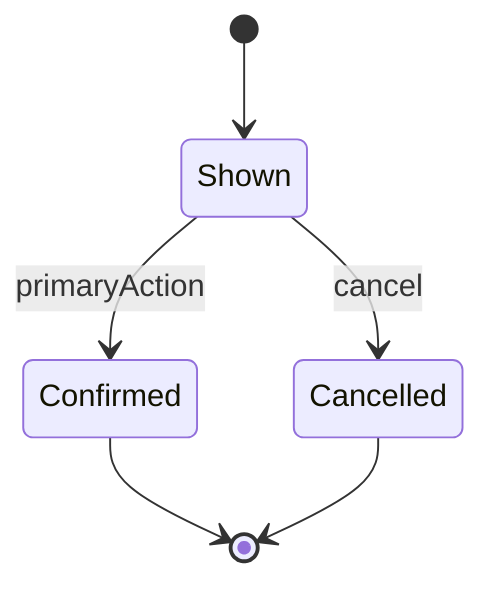
*Trigger:* primary/cancel. *Transition:* resolves only via an explicit action (no implicit scrim-dismiss for destructive). *Exit:* Confirmed or Cancelled. *Failure recovery:* the caller handles the confirmed action's own errors; the dialog itself always resolves deterministically.
**Required Test Coverage:** Unit: Yes · Integration: No · Snapshot: Yes · A11y: Yes · Visual Regression: Yes · Performance: No · Interaction: Yes — Notes: assert alertdialog role, focus-trap, destructive distinct (not color-only), explicit resolution.
**Accessibility:** role=alertdialog; focus-trapped; primary/cancel labeled; destructive not color-only.
**Tokens:** color.surface.raised, color.text.primary, color.text.danger, radius.lg, elevation.dialog, motion.dialog.
**Dependencies:** Depends On: CMP_PRIMARY_BUTTON, CMP_TEXT_BUTTON · Used By: CMP_DESTRUCTIVE_*, SCR_RITUAL_001, SCR_HOUSEHOLD_INVITE_001 · Shared Utilities: none.

### CMP_SNACKBAR — Snackbar / Toast
**Used by:** confirmations ("You're all set 🪔"), transient errors, undo.
**Purpose:** Brief, non-blocking feedback.
**Version:** 1.0.0 — Change History: [1.0.0 · Initial · First implementation]
**Design Source:** Figma ID: TBD · URL: TBD · Owner: Design Team · Status: Not Linked
**Impl Owner:** Primary: Frontend · Secondary: None · Team: Mobile
**Variants:** `tone` = {neutral, success, error}; optional single action (Undo/Retry).
**Behavior:** auto-dismiss ~4 s (longer if action); stacks singly; above tab bar.
**States:** enter/visible/exit.
**State Machine:**
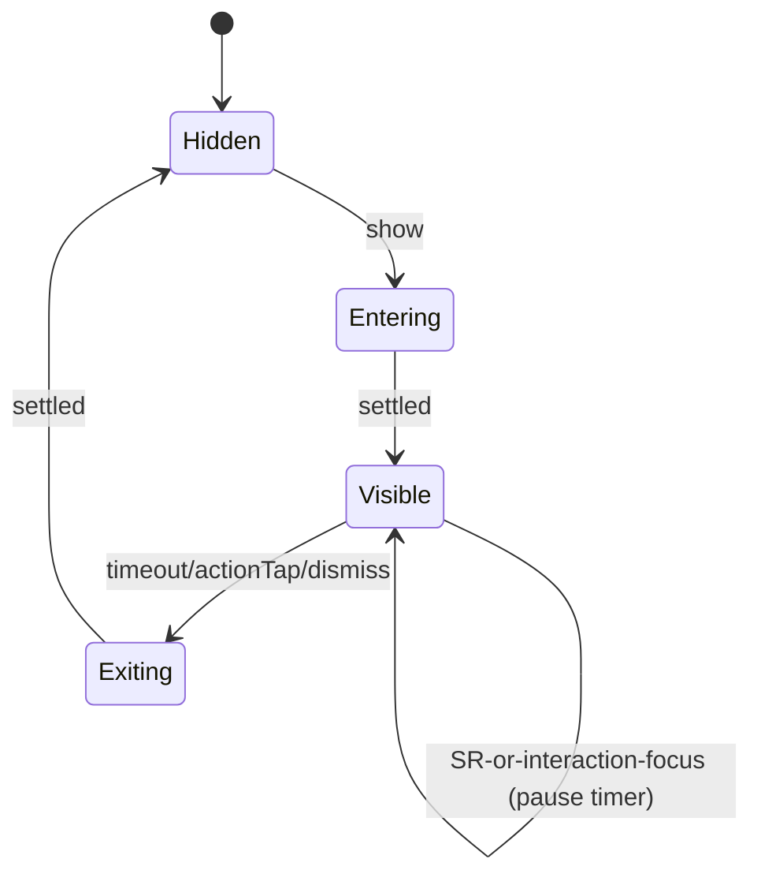
*Trigger:* show/timeout/action. *Transition:* auto-dismiss after ~4 s; timer pauses while SR-focused or interacting. *Exit:* Hidden. *Failure recovery:* only one visible at a time (queue singly); an action (Undo/Retry) delegates to the caller.
**Required Test Coverage:** Unit: Yes · Integration: No · Snapshot: Yes · A11y: Yes · Visual Regression: No · Performance: No · Interaction: Yes — Notes: assert polite live-region announce, timer pause on focus, single-stack, not color-only.
**Accessibility:** announced via polite live region; action labeled; auto-dismiss pauses if SR/interaction focused; not color-only.
**Tokens:** color.surface.inverse, color.text.onInverse, color.accent.positive/caution, radius.md, elevation.snackbar, motion.snackbar.
**Dependencies:** Depends On: CMP_TEXT_BUTTON (action) · Used By: global (all screens) · Shared Utilities: ToastService.

### CMP_INFO_SHEET — Info Sheet
**Used by:** "How we calculate this", glossary, source view.
**Purpose:** Explanatory content in a sheet.
**Version:** 1.0.0 — Change History: [1.0.0 · Initial · First implementation]
**Design Source:** Figma ID: TBD · URL: TBD · Owner: Design Team · Status: Not Linked
**Impl Owner:** Primary: Frontend · Secondary: None · Team: Mobile
**Variants:** {short, scrollable}.
**Behavior:** dismissible; may link onward (Ask Guru).
**States:** default/loading.
**Required Test Coverage:** Unit: Yes · Integration: No · Snapshot: Yes · A11y: Yes · Visual Regression: No · Performance: No · Interaction: Yes — Notes: assert title-as-heading, dismiss labeled, onward links.
**Accessibility:** title as heading; readable Dynamic Type; dismiss labeled.
**Tokens:** color.surface.raised, typography.title.small/body.medium, radius.lg, elevation.sheet.
**Dependencies:** Depends On: CMP_BOTTOM_SHEET · Used By: CMP_INFO_AFFORDANCE, CMP_SOURCE_CHIP, SCR_PANCHANG_DETAIL_001 · Shared Utilities: ContentService.

### CMP_INFO_BANNER — Inline Info Banner
**Used by:** recovery guidance, non-blocking notices, offline chip host.
**Purpose:** Persistent inline info/offline indication.
**Version:** 1.0.0 — Change History: [1.0.0 · Initial · First implementation]
**Design Source:** Figma ID: TBD · URL: TBD · Owner: Design Team · Status: Not Linked
**Impl Owner:** Primary: Frontend · Secondary: None · Team: Mobile
**Variants:** `tone` = {info, offline, warning}.
**Behavior:** static/dismissible; offline variant persists while offline.
**States:** default.
**Required Test Coverage:** Unit: Yes · Integration: No · Snapshot: Yes · A11y: Yes · Visual Regression: No · Performance: No · Interaction: No — Notes: assert offline conveyed by icon+text (not color-only) and persists while offline.
**Accessibility:** announced; offline conveyed by icon+text (not color-only).
**Tokens:** color.notice.info/neutral, color.text.primary, radius.md, spacing.md.
**Dependencies:** Depends On: none · Used By: SCR_AUTH_RECOVERY_001, global offline indication · Shared Utilities: ConnectivityService.

### CMP_PERMISSION_RATIONALE_SHEET / CMP_PERMISSION_PRIMING — Permission Priming
**Used by:** SCR_ONBOARDING_LOCATION_001, SCR_ONBOARDING_NOTIF_001 (and Settings re-asks).
**Purpose:** Explain value before the OS permission dialog (UX-4).
**Version:** 1.0.0 — Change History: [1.0.0 · Initial · First implementation]
**Design Source:** Figma ID: TBD · URL: TBD · Owner: Design Team · Status: Not Linked
**Impl Owner:** Primary: Frontend · Secondary: None · Team: Mobile
**Variants:** {location, notification}.
**Behavior:** primary triggers OS dialog; "Not now" never triggers OS prompt.
**States:** default.
**Required Test Coverage:** Unit: Yes · Integration: Yes · Snapshot: Yes · A11y: Yes · Visual Regression: No · Performance: No · Interaction: Yes — Notes: integration asserts OS dialog only after primary; "Not now" never fires OS prompt (UX-4).
**Accessibility:** fully SR-readable before OS dialog; CTAs labeled; ≥44/48.
**Tokens:** color.surface.raised, typography.title.large/body.large, spacing.lg, radius.lg.
**Dependencies:** Depends On: CMP_BOTTOM_SHEET, CMP_PRIMARY_BUTTON, CMP_TEXT_BUTTON · Used By: SCR_ONBOARDING_LOCATION_001, SCR_ONBOARDING_NOTIF_001, SCR_SETTINGS_001 · Shared Utilities: PermissionsService.

### CMP_REAUTH_PROMPT — Re-authentication Prompt
**Used by:** SCR_DELETE_ACCOUNT_001.
**Purpose:** Confirm identity before a high-consequence action.
**Version:** 1.0.0 — Change History: [1.0.0 · Initial · First implementation]
**Design Source:** Figma ID: TBD · URL: TBD · Owner: Design Team · Status: Not Linked
**Impl Owner:** Primary: Frontend · Secondary: Backend · Team: Mobile
**Variants:** {provider, email-otp}.
**Behavior:** verifies then unlocks the destructive step.
**States:** default/verifying/error(ERR_AUTH_EXPIRED).
**Required Test Coverage:** Unit: Yes · Integration: Yes · Snapshot: Yes · A11y: Yes · Visual Regression: No · Performance: No · Interaction: Yes — Notes: integration asserts re-auth gates the destructive step; ERR_AUTH_EXPIRED handling.
**Accessibility:** clearly explains why; fields labeled.
**Tokens:** color.surface.raised, typography.body.large, radius.lg.
**Dependencies:** Depends On: CMP_AUTH_BUTTON, CMP_OTP_INPUT · Used By: SCR_DELETE_ACCOUNT_001 · Shared Utilities: AuthService.

### CMP_SIGN_IN_PROMPT — Sign-in Nudge
**Used by:** SCR_PROFILE_001 (anonymous), household gates.
**Purpose:** Non-blocking "sign in to save across devices" (UX-2).
**Version:** 1.0.0 — Change History: [1.0.0 · Initial · First implementation]
**Design Source:** Figma ID: TBD · URL: TBD · Owner: Design Team · Status: Not Linked
**Impl Owner:** Primary: Frontend · Secondary: None · Team: Mobile
**Variants:** {inline card, sheet}.
**Behavior:** routes to SCR_AUTH_001; dismissible; app remains usable without it.
**States:** default/dismissed.
**Required Test Coverage:** Unit: Yes · Integration: No · Snapshot: Yes · A11y: Yes · Visual Regression: No · Performance: No · Interaction: Yes — Notes: assert non-blocking (dismissible, app usable without it).
**Accessibility:** labeled; not a wall; ≥44.
**Tokens:** color.surface.brandSubtle, typography.body.medium, radius.md.
**Dependencies:** Depends On: CMP_PRIMARY_BUTTON, CMP_TEXT_BUTTON · Used By: SCR_PROFILE_001, household gates · Shared Utilities: AuthService.

### CMP_OWNERSHIP_TRANSFER — Ownership Transfer
**Used by:** SCR_DELETE_ACCOUNT_001 (owner-with-members).
**Purpose:** Reassign household ownership before deletion.
**Version:** 1.0.0 — Change History: [1.0.0 · Initial · First implementation]
**Design Source:** Figma ID: TBD · URL: TBD · Owner: Design Team · Status: Not Linked
**Impl Owner:** Primary: Frontend · Secondary: Backend · Team: Mobile
**Variants:** {member-picker}.
**Behavior:** select new owner → confirm → enables deletion.
**States:** default/selected/confirming.
**Required Test Coverage:** Unit: Yes · Integration: Yes · Snapshot: Yes · A11y: Yes · Visual Regression: No · Performance: No · Interaction: Yes — Notes: integration asserts transfer required before deletion (no orphaned household).
**Accessibility:** picker SR-operable; consequence explained.
**Tokens:** color.surface.raised, typography.body.large, radius.md.
**Dependencies:** Depends On: CMP_LIST, CMP_PRIMARY_BUTTON · Used By: SCR_DELETE_ACCOUNT_001 · Shared Utilities: HouseholdService.

---

## 5.13 States & Brand Utilities

### CMP_SKELETON — Skeleton Loader
**Used by:** every data screen's skeleton state.
**Purpose:** Structural placeholder matching final layout.
**Version:** 1.0.0 — Change History: [1.0.0 · Initial · First implementation]
**Design Source:** Figma ID: TBD · URL: TBD · Owner: Design Team · Status: Not Linked
**Impl Owner:** Primary: Frontend · Secondary: None · Team: Mobile
**Variants:** {card, row, grid, text-line, chip}.
**Behavior:** subtle shimmer (Reduced-Motion → static muted blocks); replaced by content on load.
**States:** active.
**Required Test Coverage:** Unit: Yes · Integration: No · Snapshot: Yes · A11y: Yes · Visual Regression: Yes · Performance: Yes · Interaction: No — Notes: assert "loading" SR announce, non-focusable, static under Reduced-Motion.
**Accessibility:** SR announces "loading"; not focusable content; shimmer decorative.
**Tokens:** color.surface.skeleton, motion.skeleton, radius.md.
**Dependencies:** Depends On: none · Used By: all data components/screens · Shared Utilities: none.

### CMP_EMPTY_STATE — Empty State
**Used by:** personal dates, history, calendar month, home fallback.
**Purpose:** Calm, guiding empty view with a single next action.
**Version:** 1.0.0 — Change History: [1.0.0 · Initial · First implementation]
**Design Source:** Figma ID: TBD · URL: TBD · Owner: Design Team · Status: Not Linked
**Impl Owner:** Primary: Frontend · Secondary: None · Team: Mobile
**Variants:** `tone` = {neutral, grief-aware(personal dates — no gamification)}.
**Anatomy & Spacing:** illustration (optional/decorative), headline, subcopy, single CTA.
**Behavior:** CTA routes to the relevant add/first action.
**States:** default.
**Required Test Coverage:** Unit: Yes · Integration: No · Snapshot: Yes · A11y: Yes · Visual Regression: Yes · Performance: No · Interaction: Yes — Notes: assert grief-aware variant avoids upbeat tone/gamification; single CTA routing.
**Accessibility:** heading + body order; CTA labeled; illustration decorative; grief-aware variant avoids upbeat tone.
**Tokens:** color.text.secondary, typography.title.small/body.medium, spacing.lg.
**Dependencies:** Depends On: CMP_PRIMARY_BUTTON (CTA) · Used By: SCR_PERSONAL_DATES_001, SCR_GURU_HISTORY_001, SCR_CALENDAR_001, SCR_HOME_001 · Shared Utilities: none.

### CMP_LEGAL_FOOTNOTE — Legal Footnote
**Used by:** SCR_AUTH_001, SCR_SUBSCRIPTION_001.
**Purpose:** Terms/privacy/renewal disclosure.
**Version:** 1.0.0 — Change History: [1.0.0 · Initial · First implementation]
**Design Source:** Figma ID: TBD · URL: TBD · Owner: Design Team · Status: Not Linked
**Impl Owner:** Primary: Frontend · Secondary: None · Team: Mobile
**Variants:** {auth, subscription(renewal terms)}.
**Behavior:** links open legal docs.
**States:** default.
**Required Test Coverage:** Unit: No · Integration: No · Snapshot: Yes · A11y: Yes · Visual Regression: No · Performance: No · Interaction: Yes — Notes: assert links labeled + AA contrast (min color.text.tertiary meets AA).
**Accessibility:** links labeled; readable Dynamic Type; AA contrast (not too faint — min `color.text.tertiary` meets AA).
**Tokens:** color.text.tertiary, typography.body.small.
**Dependencies:** Depends On: none · Used By: SCR_AUTH_001, SCR_SUBSCRIPTION_001 · Shared Utilities: none.

### CMP_BRAND_LOGO / CMP_SPLASH_BACKDROP — Brand Assets
**Used by:** SCR_SPLASH_001, headers.
**Purpose:** Brand mark + calm launch backdrop (dawn/diya motif).
**Version:** 1.0.0 — Change History: [1.0.0 · Initial · First implementation]
**Design Source:** Figma ID: TBD · URL: TBD · Owner: Design Team · Status: Not Linked
**Impl Owner:** Primary: Frontend · Secondary: None · Team: Mobile
**Variants:** {full logo, mark-only}; backdrop {light, dark}.
**Behavior:** splash pulse (Reduced-Motion → static).
**States:** default.
**Required Test Coverage:** Unit: No · Integration: No · Snapshot: Yes · A11y: Yes · Visual Regression: Yes · Performance: No · Interaction: No — Notes: assert logo labeled "PanchangPal"; backdrop decorative; static under Reduced-Motion.
**Accessibility:** logo labeled "PanchangPal"; backdrop decorative.
**Tokens:** color.surface.brand, color.brand.primary, motion.brand.pulse.
**Dependencies:** Depends On: none · Used By: SCR_SPLASH_001, CMP_APP_HEADER · Shared Utilities: none.

---

## 5.13A Component Governance Framework

The operating rules for how components in this library are versioned, owned, tested, documented, and evolved. It complements the document-level governance in Part 1 §3.0A and is the source of truth for the per-component metadata blocks above.

### 5.13A.1 Component Lifecycle
`Draft → In Review → Approved → Deprecated → Retired`. A component is **Approved** only when it meets the Definition of Done (§5.13A.10). **Deprecated** components remain functional but must not be used in new screens (a replacement is named). **Retired** components are removed from code; their `CMP_*` ID is never reused (§3.0A.3). All components in v3.1 are **Approved** at **1.0.0** unless noted.

### 5.13A.2 Versioning Policy (Semantic Versioning)
Each component carries its own `MAJOR.MINOR.PATCH`, independent of the document version:
- **MAJOR** — a breaking change to the component's public API (renamed/removed prop, changed default behavior, removed variant/state) or its accessibility/interaction contract.
- **MINOR** — additive, backward-compatible (new variant, new optional prop, new state that defaults off).
- **PATCH** — non-structural (token value tweak, copy, bug fix with no API change).
Every change appends a **Change History** row and bumps the version. v3.1 initializes all components at **1.0.0 — Initial**; no historical versions are invented.

### 5.13A.3 Component Ownership Rules
Each component names a **Primary Owner** (accountable discipline), an optional **Secondary Owner**, and an **Engineering Team**. Owners approve changes to that component (aligned with §3.0A.5). Default in v3.1: most presentational components are **Primary Frontend / Team Mobile**; AI-bearing components add **Secondary AI**; billing/entitlement-bearing components add **Secondary Backend**.

### 5.13A.4 Dependency Management
Every component declares **Depends On** (child components it composes), **Used By** (parent components/screens), and **Shared Utilities** (hooks/services). This forms an explicit dependency graph for impact analysis. Rules: no circular composition; a MAJOR bump on a child triggers an impact review of every **Used By** parent; shared utilities (e.g., `AnalyticsService`, `RitualProgressService`) are versioned separately and referenced, not duplicated.

### 5.13A.5 Breaking Change Process
A MAJOR change follows: propose (Change Record `CHG_*`, §3.0A.13) → impact review across **Used By** → owner + reviewer approval → coordinated version bump + migration note → update consuming screens (Part 2) in the same change. Breaking changes never merge without the Definition of Done re-satisfied and consuming screens updated.

### 5.13A.6 Testing Requirements
Every reusable component declares coverage across seven axes: **Unit, Integration, Snapshot, Accessibility, Visual Regression, Performance, Interaction**. Baseline defaults (v3.1): interactive components require **Unit + Snapshot + Accessibility + Interaction + Visual Regression = Yes**; **Integration = Yes** where the component calls a service/API; **Performance = Yes** for streaming/animation-heavy components (AI bubble, ritual, progress, skeleton). Accessibility tests assert role/label/state, target size, and contrast. This is the component-level quality gate feeding the QA Test Plan.

### 5.13A.7 Documentation Requirements
A component is undocumented (and therefore not Approved) unless every Definition-of-Done field (§5.13A.10) is present in this library. Public props/variants must be enumerated; states must be exhaustive; state machines are required where interaction logic is non-trivial.

### 5.13A.8 Figma Synchronization Rules
Each component records **Design Source**: Figma Component ID, URL, Design Owner, and Status. v3.1 status is **Not Linked** (Figma build follows this spec). Once linked: the Figma component is the visual source of truth for appearance; this library is the source of truth for behavior/API/states; a variant-set change in Figma requires a matching component version bump here (and vice-versa). Drift between the two is a lint failure at design-review.

### 5.13A.9 AI Code Generation Rules
Binding for Claude Code, Cursor, Codex, and Copilot (extends §3.0A.7). AI coding agents must:
- **Never modify a reusable component without updating its Version** (bump + Change History row).
- **Never duplicate an existing component** — reuse or extend via variant/prop.
- **Always search the Component Library (§5) before creating a new component**; a genuinely new component requires owner approval and a new `CMP_*` ID first.
- **Preserve public APIs** (props/variants/states) unless the change is an intentional, versioned MAJOR.
- **Respect ownership and dependency rules** (§5.13A.3/§5.13A.4); do not introduce circular dependencies; do not inline shared utilities.
- **Use tokens only** (no hard-coded hex/px/durations; §3.0A.8) and preserve accessibility contracts.
- On ambiguity, **stop and ask** (§3.0A.7) rather than inventing props, states, or behavior.

### 5.13A.10 Definition of Done
A reusable component is production-ready only when it includes: ✓ Version · ✓ Purpose · ✓ Variants · ✓ Anatomy · ✓ Behaviour · ✓ States · ✓ State Machine (where applicable) · ✓ Accessibility · ✓ Tokens · ✓ Dependencies · ✓ Design Source · ✓ Ownership · ✓ Required Test Coverage · ✓ Documentation. Anything missing keeps the component in **Draft/In Review**, not **Approved**.

---

## 5.14 Component → Screen usage matrix (coverage)

Confirms every Part 2 `CMP_*` has a definition here and ≥1 consuming screen (§3.0A.6). Grouped families count each member.

| Family | Components defined | Primary consuming screens |
|---|---|---|
| Buttons & Actions (5.2) | PRIMARY_BUTTON, SECONDARY_BUTTON, TEXT_BUTTON, ICON_BUTTON, DESTRUCTIVE_BUTTON/ROW/ACTION, AUTH_BUTTON, SHARE_BUTTON, FAB | all |
| Inputs & Selection (5.3) | TEXT_INPUT, OTP_INPUT, SEARCH_FIELD, CITY_SEARCH, CHAT_INPUT, TOGGLE, SEGMENTED, DEPTH_TOGGLE, ROLE_PICKER, TIME_PICKER, DATE_PICKER, TITHI_PICKER, REMINDER_LEAD_PICKER, PRESET_CHIP, SUGGESTED_QUESTION_CHIP, SUGGESTED_FOLLOWUP | onboarding, auth, calendar, guru, settings |
| Cards & Containers (5.4) | PANCHANG_CARD, RITUAL_CARD, FESTIVAL_CARD, SELECTABLE_CARD, PLAN_CARD, INVITE_LINK_CARD, INVITE_ACCEPT_CARD, HOUSEHOLD_SUMMARY, CONSEQUENCES_PANEL | home, onboarding, calendar, subscription, household, delete |
| Headers & Chips (5.5) | APP_HEADER, PROFILE_HEADER, FESTIVAL_HEADER, GURU_HEADER, LOCATION_CHIP | most |
| Lists & Rows (5.6) | LIST, LIST_ROW, SETTINGS_ROW, MEMBER_ROW, PERSONAL_DATE_ROW, CONVERSATION_ROW, EVENT_LIST, PROMPT_STARTER_LIST, VALUE_LIST, CHECKLIST(+ITEM) | home, calendar, guru, household, settings, subscription |
| Navigation (5.7) | BOTTOM_TAB_BAR, MONTH_NAV, PAGE_DOTS, ONBOARDING_SLIDE | shell, calendar, onboarding |
| Calendar (5.8) | MONTH_GRID, DAY_CELL, TRADITION_SWITCHER, STREAK_CALENDAR | calendar, achievements |
| Ritual & Panchang (5.9) | RITUAL_INTRO, RITUAL_STEP, PROGRESS_RING, AUDIO_CONTROLS, COMPLETION_MOMENT, PANCHANG_DETAIL_LIST, CONTENT_BODY, ROTATING_ELEMENT, INFO_AFFORDANCE | home, ritual, panchang detail, festival |
| AI (5.10) | AI_CHAT_BUBBLE, TYPING_INDICATOR, SOURCE_CHIP, HELPFUL_RATING, INLINE_NOTICE | guru |
| Streak & Achievements (5.11) | STREAK_COUNTER, STREAK_SUMMARY, MILESTONE_BADGE | home, profile, achievements |
| Overlays & Feedback (5.12) | BOTTOM_SHEET, DIALOG, SNACKBAR, INFO_SHEET, INFO_BANNER, PERMISSION_RATIONALE_SHEET, PERMISSION_PRIMING, REAUTH_PROMPT, SIGN_IN_PROMPT, OWNERSHIP_TRANSFER | global |
| States & Brand (5.13) | SKELETON, EMPTY_STATE, LEGAL_FOOTNOTE, BRAND_LOGO, SPLASH_BACKDROP | global |

**No orphans:** every component maps to a consuming screen; no duplicate components (§3.0A.8). The contextual paywall/upgrade *sheet* is composed of CMP_BOTTOM_SHEET + CMP_PLAN_CARD (not a separate component).

---

# SECTION 6 — Design System

This section defines the **concrete values** for every token namespace referenced across Parts 1–3. It is the rank-5 source of truth for token values (§3.0A.1). Screens and components reference token *names*; engineering exports these as a single token file (JSON/TS) consumed by React Native (**[ASSUMPTION P3-A2]** a `tokens.ts` generated from a design-tool token export; naming = §3.0A.3 `namespace.group.variant`).

**Design intent (from Part 1 §1.6):** calm, warm, reverent — "dawn and temple" tones, generous whitespace, gentle motion; closer to a meditation app than a religious utility. The palette is warm-neutral with a saffron/marigold brand and restrained accents. All color pairs are chosen to meet **WCAG 2.1 AA** (text ≥ 4.5:1, large text/non-text ≥ 3:1); the audit in **Part 5 §10** is the ratification gate (`[PRD FOLLOW-UP] F-7` covers the measurement baseline).

## 6.1 Typography

**[ASSUMPTION P3-A3] Type families:** Headings/display = **"Fraunces"** (a warm humanist serif for reverence) with platform serif fallback; Body/UI = **system** (SF Pro on iOS, Roboto on Android) with "Inter" fallback. Rationale: a serif display evokes calm/tradition (Calm/Headspace-adjacent) while a system UI face keeps body text crisp and performant. Final family selection is a Design decision to confirm before Figma.

**Ramp** (token · size/line-height pt · weight · family · usage). All sizes scale with OS Dynamic Type; values are the base (100%) size.

| Token | Size/LH | Weight | Family | Usage |
|---|---|---|---|---|
| typography.display.large | 34/40 | 700 | Display | Splash/celebration, rare |
| typography.display.small | 28/34 | 700 | Display | Panchang reveal, festival hero |
| typography.heading.large | 24/30 | 700 | Display | Onboarding headlines |
| typography.title.large | 22/28 | 600 | Display | Screen titles (headers) |
| typography.title.medium | 18/24 | 600 | UI | Card titles |
| typography.title.small | 16/22 | 600 | UI | Row/section titles |
| typography.body.large | 16/24 | 400 | UI | Primary body, chat, ritual text |
| typography.body.medium | 14/20 | 400 | UI | Secondary body, list subtitles |
| typography.body.small | 13/18 | 400 | UI | Helper, captions, legal |
| typography.label.large | 16/20 | 600 | UI | Primary button labels |
| typography.label.medium | 14/18 | 600 | UI | Chips, segmented, toggles |
| typography.label.small | 12/16 | 600 | UI | Tab labels, chips, badges |

**Rules:** max line length ~66 chars on large screens; never truncate primary content on Dynamic Type increase (reflow, don't clip); minimum rendered body size respects OS setting (no hard caps below OS max). Numerals tabular for panchang/time data.

## 6.2 Color

Semantic tokens with **Light** and **Dark** values. Contrast targets noted; exact ratios verified in Part 5 §10.

### Brand & accent
| Token | Light | Dark | Notes / contrast |
|---|---|---|---|
| color.brand.primary | #9C4221 | #E08A4F | Primary actions. Light: white text ≥4.5:1. Dark: near-black text on fill. |
| color.brand.primaryPressed | #7E3319 | #C2701F | Pressed state. |
| color.brand.tonalBg | #F6E9DE | #2A2018 | Tonal button/segment bg. |
| color.brand.brandSubtle | #FBF0E6 | #221A13 | Subtle brand surfaces (rotating element, sign-in nudge). |
| color.text.onBrand | #FFFFFF | #1F1B16 | Text/icon on brand fill. |
| color.accent.auspicious | #2F7A4F | #57B37E | Auspicious muhurta (paired w/ text label). |
| color.accent.caution | #B4611A | #E0A45A | Inauspicious/caution (paired w/ text label). |
| color.accent.positive | #2F7A4F | #57B37E | Checks, success, helpful. |
| color.accent.warm | #C2701F | #E0A45A | Streak/warmth (gentle). |
| color.accent.warmScale | #F2E5D6·#E8C39A·#D99A5E·#C2701F·#9C4221 | #2A2018·#4A3320·#6E4A24·#9C5A29·#E08A4F | 5-step heatmap ramp (streak). |

### Surfaces & text
| Token | Light | Dark | Notes |
|---|---|---|---|
| color.surface.primary | #FFFDF9 | #16120E | App background (warm). |
| color.surface.raised | #FFFFFF | #211B15 | Cards/sheets. |
| color.surface.elevated | #FFFFFF | #241E17 | Tab bar/headers. |
| color.surface.muted | #F7F2EA | #1C1712 | Grief-aware/personal surfaces. |
| color.surface.input | #FFFFFF | #211B15 | Field backgrounds. |
| color.surface.chip | #F2ECE1 | #2A231C | Chips/skeleton base. |
| color.surface.immersive | #2A1E17 | #120D0A | Ritual immersive bg (light text). |
| color.surface.inverse | #26201A | #F3ECE1 | Snackbar bg. |
| color.surface.brand | #FBF0E6 | #16120E | Splash backdrop. |
| color.surface.dangerSubtle | #FBEAE8 | #2A1615 | Destructive panels. |
| color.surface.skeleton | #EFE7DA | #241E17 | Skeleton blocks. |
| color.scrim | rgba(20,14,8,0.45) | rgba(0,0,0,0.6) | Modal scrim. |
| color.text.primary | #1F1B16 | #F3ECE1 | Body/headings. ≥4.5:1 on primary/raised. |
| color.text.secondary | #5C5348 | #C3B8A8 | Secondary text. ≥4.5:1. |
| color.text.tertiary | #6E6456 | #9E9384 | Captions/legal (kept ≥4.5:1, not too faint). |
| color.text.placeholder | #8A8073 | #8A8073 | Placeholder only (real label always present). |
| color.text.onInverse | #FDF7EF | #1F1B16 | Text on snackbar. |
| color.text.brand | #9C4221 | #E08A4F | Brand text/links (≥4.5:1 on light surfaces). |
| color.text.danger | #B3261E | #F2B8B5 | Destructive labels. |

### Borders, states, markers, providers
| Token | Light | Dark | Notes |
|---|---|---|---|
| color.border.default | #E4DACB | #3A3128 | Inputs/outline buttons (≥3:1 non-text). |
| color.border.subtle | #EFE7DA | #2C251E | Dividers. |
| color.border.focus | #9C4221 | #E08A4F | Focus ring (≥3:1 against adjacent). |
| color.border.selected | #9C4221 | #E08A4F | Selected card/segment. |
| color.border.danger | #B3261E | #F2B8B5 | Destructive borders. |
| color.state.disabledBg | #EDE6DB | #2A231C | Disabled fills. |
| color.state.disabledText | #A79C8C | #6E6456 | Disabled labels (decorative; not required to meet AA). |
| color.state.pressOverlay | rgba(31,27,22,0.06) | rgba(255,255,255,0.08) | Press overlay. |
| color.state.trackOff | #D8CEBE | #4A4137 | Toggle/progress track. |
| color.state.dotInactive | #D8CEBE | #4A4137 | Page dots. |
| color.state.locked | #C9BEAE | #4A4137 | Locked milestone. |
| color.icon.default | #3A322A | #E3D9CB | Icons. |
| color.icon.muted | #7A7064 | #9E9384 | Inactive tab/muted icons (active tab uses brand). |
| color.notice.info | #EAF1EE | #1C2620 | Info notice bg. |
| color.notice.neutral | #F2ECE1 | #241E17 | Decline/neutral notice bg (calm, not alarming). |
| color.notice.danger | #FBEAE8 | #2A1615 | Error notice bg. |
| color.marker.festival | #9C4221 (●) | #E08A4F | + shape ● (color-independent). |
| color.marker.vrat | #2F7A4F (○) | #57B37E | + shape ○. |
| color.marker.personal | #5B6CB3 (◆) | #8C9AD6 | + shape ◆. |
| color.provider.apple | #000000/#FFFFFF | per Apple HIG | Follows Apple button guidelines. |
| color.provider.google | #FFFFFF/#1F1F1F | per Google | Follows Google button guidelines. |

**Color governance:** color is **never the only signal** (Part 1 P7) — auspicious/caution, markers, selection, and status always pair with text/icon/shape. Dark mode reduces shadow reliance in favor of `color.surface.elevated` + `color.border.subtle` separation.

## 6.3 Spacing & Grid

**Base unit = 4pt** (P3-A0). Spacing scale:

| Token | Value | Typical use |
|---|---|---|
| spacing.xs | 4 | Icon-label gaps, chip gaps |
| spacing.sm | 8 | Intra-component, list item gaps |
| spacing.md | 16 | Default padding, gutter |
| spacing.lg | 24 | Card padding, section spacing |
| spacing.xl | 32 | Major section breaks |
| spacing.xxl | 48 | Empty-state vertical rhythm |
| spacing.gutter | 16 | Screen horizontal margin |
| spacing.borderFocus | 2 | Focus ring width |

**Grid:** single-column mobile layout; content max-width for large devices/tablets ~ 640pt centered; 4-column soft grid for card layouts on wide screens. Safe-area insets always respected (notch, home indicator, tab bar). Tab-bar and FAB reserve bottom padding on scroll views.

## 6.4 Radius & Corner style

| Token | Value | Use |
|---|---|---|
| radius.sm | 8 | Day cells, small chips-square |
| radius.md | 12 | Buttons, inputs, rows, notices |
| radius.lg | 16 | Cards, sheets, bubbles |
| radius.xl | 24 | Hero/onboarding containers |
| radius.pill | 999 | Chips, tabs, FAB, toggles |

**Corner style:** consistently **rounded** (soft, calm); no sharp corners on interactive surfaces. Continuous/"squircle" corners preferred on iOS where available.

## 6.5 Elevation & Shadows

Light mode uses soft, warm-tinted shadows; **dark mode replaces shadows with surface/border separation** (shadows are near-invisible on dark).

| Token | Light shadow (y, blur, spread, color) | Dark treatment |
|---|---|---|
| elevation.card | 0, 2, 8, 0, rgba(31,27,22,0.06) | surface.raised + border.subtle |
| elevation.fab | 0, 4, 12, 0, rgba(31,27,22,0.16) | surface + border + slight glow |
| elevation.sheet | 0, -2, 16, 0, rgba(31,27,22,0.12) | surface.raised + top border |
| elevation.dialog | 0, 8, 24, 0, rgba(31,27,22,0.18) | surface.raised + border |
| elevation.tabbar | 0, -1, 0, 0, rgba(31,27,22,0.08) (hairline) | top border.subtle |
| elevation.header | 0, 1, 0, 0, rgba(31,27,22,0.06) (on scroll) | bottom border.subtle |
| elevation.snackbar | 0, 4, 16, 0, rgba(31,27,22,0.20) | surface.inverse + border |

## 6.6 Motion & Duration

**Principle (Part 1 §1.6 + P1):** motion is gentle, purposeful, and brief — it guides attention and confirms actions, never entertains. **All motion honors Reduced Motion** by degrading to a calm opacity cross-fade (`motion.reduced.crossfade`, 150ms). Frame-level choreography is **Part 4 §7**; this defines the tokens.

**Durations:**
| Token | Value | Use |
|---|---|---|
| duration.fast | 120ms | Press, toggle, small feedback |
| duration.base | 200ms | Standard transitions |
| duration.slow | 320ms | Sheets, page transitions |
| duration.debounce | 250ms | Search/query debounce |
| duration.progress | 300ms | Progress ring step |
| duration.completion | 1200ms | Ritual completion (bounded, skippable) |
| duration.splash | ≤1000ms | Splash |

**Easing curves:**
| Token | Curve | Use |
|---|---|---|
| motion.easing.standard | cubic-bezier(0.2, 0, 0, 1) | Most transitions |
| motion.easing.decelerate | cubic-bezier(0, 0, 0, 1) | Entrances |
| motion.easing.accelerate | cubic-bezier(0.3, 0, 1, 1) | Exits |
| motion.easing.emphasized | cubic-bezier(0.2, 0, 0, 1) | Reveal/completion |

**Named motions** (component references): motion.press (scale 0.98, fast), motion.toggle (thumb slide, fast), motion.check (checkmark draw, fast), motion.sheet (slide+fade, slow/decelerate), motion.dialog (fade+scale 0.96→1, base), motion.snackbar (slide-up+fade, base), motion.progress (ring, duration.progress), motion.ritual.step (cross-dissolve, base), motion.success.small (soft glow/scale, ≤completion), motion.reveal.panchang (staggered fade-in, emphasized), motion.typing.dots (3-dot loop; Reduced-Motion→static), motion.brand.pulse (splash glow; Reduced-Motion→static), motion.fab (hide/show on scroll; Reduced-Motion→none), motion.skeleton (shimmer; Reduced-Motion→static), motion.reduced.crossfade (150ms opacity — the universal Reduced-Motion fallback).

## 6.7 Haptics

| Token | iOS | Android | Use |
|---|---|---|---|
| haptic.selection | selectionChanged | tick/keyboard-tap | Toggle, chip, checklist, commit taps |
| haptic.success | notificationSuccess | confirm | Ritual completion |
| haptic.warning | notificationWarning | reject | Validation/attention |
| haptic.error | notificationError | error | Errors (used sparingly) |

**Rule:** haptics are subtle and optional (respect system settings); the sacred completion uses a single gentle `haptic.success`, never a burst. No haptic on passive/scroll events.

## 6.8 Iconography

**[ASSUMPTION P3-A4]** Icon set = a single consistent **outline** family at 24pt default / 20pt small, 1.75pt stroke; **active tab uses the filled variant** (color-independent active cue alongside brand color). Custom glyphs for diya (Ask Guru), tithi/panchang, and festival categories drawn to match. Icons are decorative when paired with a text label; standalone icons (CMP_ICON_BUTTON, tab icons) always carry an `accessibilityLabel`. Minimum icon touch area ≥44/48 via hit-slop.

## 6.9 Illustrations

Warm, minimal line-plus-soft-fill illustrations in the dawn/temple palette; inclusive and welcoming; **non-literal about deities** to avoid cultural/doctrinal missteps (aligns with the Vision-AI non-goal rationale and Risk §10). Used for onboarding slides, empty states, festival heroes, and the completion moment. All illustrations are **decorative** (empty alt / `accessibilityElementsHidden`) with meaning conveyed by adjacent text. Personal-date/grief-aware surfaces use the quietest, most restrained illustration treatment or none.

## 6.10 Dark Mode & Light Mode

Both modes are first-class; **Appearance = System / Light / Dark** (Settings). Dark mode is a true dark warm-neutral (not pure black) to preserve the calm tone and reduce halation. Rules: never hard-code a mode; all components read semantic tokens; imagery/illustration has dark variants; contrast targets hold in both modes; immersive ritual surface is dark in both modes by design (a deliberate "temple at dusk" feel), with light text tokens.

## 6.11 Accessibility Standards & Touch Targets (design-system level)

Baseline (full audit Part 5 §10): **WCAG 2.1 AA**; text contrast ≥ 4.5:1 (≥ 3:1 large/non-text); **touch targets ≥ 44×44pt iOS / 48×48dp Android** with ≥ `spacing.sm` between adjacent targets; Dynamic Type supported to OS max with reflow; Reduced Motion honored via `motion.reduced.crossfade`; color never the sole signal; every interactive component has a programmatic label and correct role/state; focus order = visual order; RTL-ready (logical start/end, mirrored layouts) even though v1 ships LTR English. These standards are **release gates** (§3.0A.10), enforced per screen via the Part 2 accessibility checklists.

## 6.12 Token reference integrity

Every token *name* used in Parts 1–3 resolves to a value here. Namespaces covered: `color.*`, `typography.*`, `spacing.*`, `radius.*`, `elevation.*`, `motion.*`, `duration.*`, `haptic.*` (§3.0.3, A15). Adding a new token requires adding it here first (a PATCH bump; §3.0A.4/§3.0A.13). Provider brand colors follow Apple/Google guidelines and are exempt from restyling but must still pass AA in their required configurations.

---

# Part 3 — UX Change Log

Part 3 introduces **no new UX-pattern deviations** — it realizes Part 1/Part 2 decisions as concrete components and tokens. Items below are design-system decisions (assumptions), not scope/rule/functional changes.

**v3.1 (Enterprise Design System Review) — additive governance only.** Added per-component metadata (Version + Change History, Design Source, Implementation Owner, Required Test Coverage, Dependencies) to every component; State Machines to the twelve components with non-trivial interaction logic (PRIMARY_BUTTON, TEXT_INPUT, CHAT_INPUT, TOGGLE, PLAN_CARD, RITUAL_STEP, PROGRESS_RING, AUDIO_CONTROLS, AI_CHAT_BUBBLE, BOTTOM_SHEET, DIALOG, SNACKBAR); and the **§5.13A Component Governance Framework** (lifecycle, versioning, ownership, dependency management, breaking-change process, testing, documentation, Figma sync, AI-agent rules, Definition of Done). No component behavior, UX, visual design, IDs, or tokens changed.

**Shared Utilities registry** (referenced by the component dependency graph; these are services/hooks, versioned separately, not duplicated): `AnalyticsService`, `HapticService`, `NavigationService`, `ValidationService`, `PreferencesService`, `AuthService`, `ShareService`, `GeoService`, `LocationService`, `PanchangService`, `CalendarService`, `ContentService`, `RitualProgressService`, `AudioService`, `TithiEngineService`, `NotificationScheduler`, `HouseholdService`, `SubscriptionService`, `StreakService`, `ChecklistService`, `AskGuruService`, `ConnectivityService`, `ToastService`, `PermissionsService`. **[ASSUMPTION P3-A5]** these service names are proposed for the TDD to ratify (`[PRD FOLLOW-UP] F-14`).

### `[PRD FOLLOW-UP]` — new items surfaced in Part 3
| # | Observation | Why it's the PRD's / owner's call |
|---|---|---|
| F-12 | **Final type families** (Fraunces + system, P3-A3) and brand hex values need Design sign-off + a licensing check for the display font | Brand/design + legal decision |
| F-13 | **WCAG AA contrast ratification** of the full palette (light+dark) via the Part 5 §10 audit before Figma lock | Accessibility gate |
| F-14 | **Shared Utilities/service names** (P3-A5) referenced by the component dependency graph need TDD ratification (naming, boundaries, versioning) | Architecture/engineering decision |

### Assumptions introduced in Part 3
| # | Item |
|---|---|
| P3-A0 | Base grid unit = 4pt; all spacing tokens are multiples. |
| P3-A1 | Ask Guru sends on the send button (not Enter) to allow multiline input. |
| P3-A2 | Tokens are exported as a generated `tokens.ts`/JSON consumed by RN. |
| P3-A3 | Type families = Fraunces (display/serif) + system/Inter (UI); pending F-12. |
| P3-A4 | Single outline icon family, 24/20pt, 1.75 stroke; filled variant for active tab. |
| P3-A5 | *(v3.1)* Shared Utility/service names in the dependency graph are proposed for TDD ratification (F-14). |

---

# Part 3 — Readiness Summary

- **Coverage:** every `CMP_*` referenced in Part 2 is defined (Section 5, ~60 components across 12 families) with Variants · Spacing · Behavior · States · Accessibility · Tokens; the §5.14 matrix confirms no orphans and no duplicates (§3.0A.8).
- **Design System (Section 6):** concrete values for all eight token namespaces (color light+dark, typography ramp, spacing/grid, radius, elevation/shadow, motion/duration, haptics), plus icons, illustrations, dark/light rules, and design-system-level accessibility standards & touch targets.
- **Governance:** components compose from tokens only (no hard-coded values); color is never the sole signal; motion degrades under Reduced Motion; every interactive component has role/label/target/contrast specified. Token integrity holds (§6.12).
- **v3.1 governance:** every reusable component now carries Version + Change History, Design Source, Implementation Owner, Required Test Coverage, and a Dependencies graph; twelve interaction-heavy components carry Mermaid State Machines; §5.13A defines the full Component Governance Framework and Definition of Done. Additive only — no behavior/UX/visual/ID/token changes.
- **New PRD follow-ups:** F-12 (type families/brand hex sign-off + font licensing), F-13 (WCAG AA palette ratification), F-14 (shared-utility/service naming for TDD). **New assumptions:** P3-A0…A5. **No new UX-pattern deviations.**
- **Forward dependencies:** Part 4 (§7 microinteractions) will specify the frame-level choreography for the named motions here; Part 4 (§8 notifications, §9 AI) will use these components/tokens; Part 5 (§10 a11y) ratifies contrast and finalizes the audit. Fully compatible with Parts 1–2; forward-compatible with Parts 4–5.

---

*End of Part 3. Awaiting sign-off before proceeding to **Part 4 — Microinteractions + Notifications + AI Experience**.*

