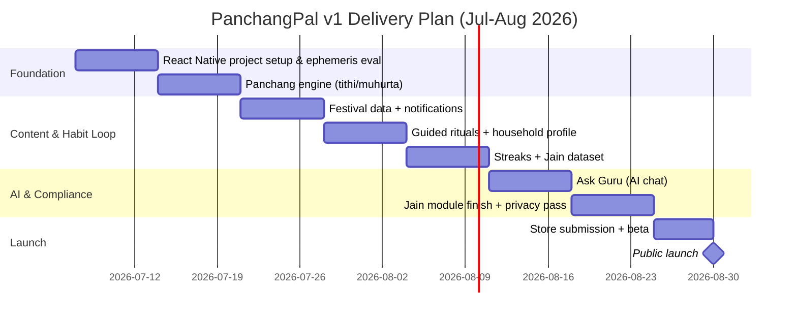

# PanchangPal — v1 MVP Product Requirements Document

**Status:** Draft for review
**Prepared:** 2026-07-05
**Scope:** Full v1 MVP, Hindu + Jain, iOS + Android
**Team:** Solo founder

---

## Problem Statement

The Hindu diaspora in the US, UK, and Australia (~4.7M people across the three markets, corrected for actual religious composition) maintains strong ritual habits but is underserved by existing apps. Popular Panchang/calendar apps (Drik Panchang, mPanchang) are static, ad-laden, India-timezone-default, and not personalized. Devotional platforms (Sri Mandir, Vama, DevDham) are transactional — built around temple bookings and e-commerce, not daily guidance — and diaspora users make up only a small share of their active base (Sri Mandir: ~2% of MAU). No competitor combines an accurate, localized daily Panchang with AI-assisted ritual guidance and habit-formation mechanics. The cost of not solving this: diaspora users either disengage from daily practice entirely or rely on fragmented, low-trust sources (family, generic search), while competitors capture festival-spike attention without building daily relevance.

## Goals

1. **Retention differentiation**: Reach D7 retention ≥30% and D30 retention ≥15% among installed users in the first 90 days — the report's own competitive scorecard identifies "daily engagement" as the category's biggest unsolved gap; this is the core bet.
2. **Habit formation**: 40%+ of daily active users complete at least one ritual/checklist item per day by month 2 post-launch.
3. **AI feature validation**: 25%+ of weekly active users engage with "Ask Guru" at least once per week, validating AI guidance as a genuine differentiator rather than a gimmick.
4. **Early adoption**: 12,000–19,000 installs across the US and Australia within 90 days of public launch, sourced primarily through temple/community partnerships and ASO (paid acquisition deprioritized given solo-founder budget). UK is a second-wave market — see Non-Goals and Open Questions.
5. **Jain module proof-of-concept**: Validate that a second faith module can be added at low incremental cost/time, informing whether a Sikh module is worth building as a future phase.

## Non-Goals

- **Sikh content or Nanakshahi calendar.** Sikhism is theologically distinct from Hinduism (no idol worship, different scripture and calendar) and diaspora Sikh communities are sensitive to being folded into Hindu-branded products. Deferred to a possible separate sub-brand, not a feature bolt-on, and only after this product proves retention.
- **Buddhist content.** Western Buddhist diaspora is overwhelmingly non-Indian-origin (Chinese, Vietnamese, Sri Lankan, Cambodian), with no overlap in language, community network, or GTM channel. This is a different business, not an extension — permanently out of scope for this product.
- **Temple booking, live-streamed puja, or e-commerce/prasad delivery.** This is the core model of Sri Mandir, Vama, and DevDham. Competing on transactions before proving daily engagement would dilute the differentiation thesis and add operational complexity (temple partnerships, payments, logistics) a solo founder can't absorb pre-launch.
- **Astrology/Kundli matching and horoscope generation.** Common in competitor apps (Aradhana, mPanchang) but doesn't serve the daily-habit thesis and adds significant scope.
- **UK, Canada, New Zealand, and EU markets at launch.** v1 rolls out in the US and Australia only, where no GDPR-equivalent compliance burden applies — validating the product before taking on the added legal and localization work of GDPR markets. UK entry is the natural second wave once the compliance pass is done (see Open Questions); Canada additionally needs a Sikh-inclusive product decision first (see prior market analysis).

## User Stories

### Primary persona: diaspora Hindu professional
- As a diaspora Hindu professional, I want today's Panchang localized to my exact city and timezone so that I know the correct tithi, nakshatra, and muhurta without manually adjusting from India time.
- As a diaspora Hindu professional, I want a short guided morning/evening prayer flow with audio so that I can maintain a daily ritual practice despite limited time or ritual knowledge.
- As a diaspora Hindu professional, I want to ask an AI "Ask Guru" simple questions about a ritual or festival so that I understand its meaning without relying on scattered family memory or generic search.
- As a diaspora Hindu professional, I want a daily streak and reminder so that I build a consistent habit instead of opening the app only during festivals.
- As a diaspora Hindu professional, I want to set up a household profile so that my family shares one calendar, region, and tradition setting.

### Secondary persona: Jain diaspora user
- As a Jain diaspora user, I want a Jain-specific calendar (Paryushan, Samvatsari, fasting days) so that I don't have to reinterpret a Hindu calendar for my own observances.
- As a Jain diaspora user, I want Jain content clearly and separately labeled from Hindu content so that I trust its accuracy and don't feel conflated with a different tradition.

### Edge persona: second-generation youth with limited ritual background
- As a second-generation Indian-American who didn't grow up with deep ritual knowledge, I want simple, non-judgmental explanations so that I don't feel embarrassed asking "basic" questions.
- As a new user, I want to choose quick vs. deep-dive content so that the app doesn't feel too heavy if I only want reminders.

### Edge cases
- As a user who travels or relocates, I want the Panchang to auto-update to my new location so timings stay accurate without manual reconfiguration.
- As a user with no data connection, I want the current day's Panchang and my streak to still display so a connectivity gap doesn't break my habit.
- As a first-time user with no household set up yet, I want a clear prompt (not a blank screen) guiding me to create one.

## Requirements

**Platform decision:** the app must ship on both iOS and Android. Given a solo founder building both platforms alone, this PRD specifies **React Native (via Expo)** rather than separate native (Swift/Kotlin) codebases: one codebase for both platforms, mature libraries for the three riskiest P0 pieces (push notifications, offline caching, and LLM API integration), and a larger hiring pool if the founder brings on engineering help later. This is treated as decided, not open, for the rest of this document.

### Must-Have (P0)

Each feature below is broken into build-sized sub-tasks (roughly 1–3 days each for a solo founder). These map directly to the week-by-week Gantt in **Timeline Considerations**.

1. **Location-aware daily Panchang engine** (tithi, nakshatra, sunrise/sunset, muhurta), accurate to the user's GPS/timezone, with offline caching of the current day.
   - *AC:* Given a user opens the app in a new city/timezone, when the Panchang loads, then sunrise/sunset/tithi reflect local astronomical calculation, not an India default.
   - Sub-tasks:
     - Evaluate and select an ephemeris/Panchang calculation library or API (build vs. license decision)
     - Implement tithi/nakshatra/muhurta calculation service keyed on lat/long + timezone
     - Implement sunrise/sunset calculation per coordinates
     - Build local offline cache for "today's" Panchang
     - Build Daily Panchang home screen UI
     - Cross-check calculated tithi/nakshatra/muhurta against reputed published sources (e.g., Drik Panchang, mPanchang) for a sample of dates and locations
2. **Festival and vrat calendar with push notifications** for upcoming events (Hindu + Jain).
   - *AC:* Given notifications are enabled, when a festival is within 24 hours, then a push notification fires with the correct local date/time.
   - Sub-tasks:
     - Compile Hindu festival/vrat dataset (dates, regional variants)
     - Compile Jain festival/fasting dataset (Paryushan, Samvatsari, etc.)
     - Build notification scheduling service (24-hour-ahead trigger logic)
     - Build notification permission request + settings toggle
     - Build calendar list/month view UI
3. **Guided ritual flows** (text + audio) for daily morning/evening prayer, in English.
   - *AC:* Given a user selects "morning ritual," when opened, then they see a step-by-step flow with audio playback and estimated duration.
   - Sub-tasks:
     - Write morning ritual script/content (English)
     - Write evening ritual script/content (English)
     - Source or record audio narration for both flows
     - Build step-by-step flow UI component
     - Integrate audio playback control
4. **AI "Ask Guru" chat**, scoped to ritual/festival meaning, built on an existing LLM API (no custom model training).
   - *AC:* Given a ritual/festival question, when submitted, then a response returns within ~5 seconds with a disclaimer that it's informational, not religious authority.
   - *AC:* Given an out-of-scope query (medical, legal, political), when submitted, then the system declines or redirects rather than fabricating an answer.
   - Sub-tasks:
     - Select LLM API vendor and set up billing/API keys
     - Write system prompt and scope guardrails (ritual/festival only; refusal behavior for out-of-scope topics)
     - Build chat UI (input, response stream, disclaimer element)
     - Add basic rate-limiting/cost controls per user
     - Build a QA test set of ritual/festival questions plus edge-case refusal prompts
5. **Streak and daily checklist gamification.**
   - *AC:* Given a user marks a ritual complete, when saved, then the streak counter increments and persists across sessions.
   - Sub-tasks:
     - Design data model for checklist items and streak counter
     - Build checklist UI (mark complete/incomplete)
     - Implement streak persistence and reset logic (missed-day handling)
     - Build streak/badge visual indicator
6. **Household/family profile** (region, tradition setting, shared calendar).
   - *AC:* Given a household is created, when a family member joins, then both see the same calendar and tradition settings.
   - Sub-tasks:
     - Design household/shared-account data model
     - Build invite/join flow for family members
     - Build tradition and region settings UI
     - Sync shared calendar and settings across household members
7. **Jain Panchang module**, selectable at onboarding, visually and structurally distinct from Hindu content.
   - *AC:* Given a user selects "Jain" tradition, when the calendar loads, then Jain-specific dates display instead of Hindu-only content, with separate labeling/branding.
   - Sub-tasks:
     - Build tradition selector (Hindu/Jain) into onboarding flow
     - Wire Jain calendar data (from item 2's dataset) into the Panchang engine
     - Design distinct visual labeling/branding for Jain content
     - Cross-check Jain festival/fasting dates against reputed published Jain calendar sources, then commission a paid freelance Jain-content reviewer for a final accuracy pass before launch
8. **iOS and Android apps live** on the App Store and Google Play.
   - Sub-tasks:
     - Set up React Native (Expo) project and dev environment
     - Create App Store and Google Play developer accounts
     - Produce app icons, screenshots, and store listing copy
     - Submit both apps and buffer for platform review turnaround
9. **Privacy baseline**: minimal data collection, clear privacy policy, opt-out of personalization, CCPA-compliant handling of location and religious-affiliation data for v1's US and Australia launch markets. A full GDPR compliance pass is a prerequisite for UK entry, not part of this version.
   - Sub-tasks:
     - Audit exact data collected (location, profile, chat logs) and retention periods
     - Draft privacy policy
     - Build opt-out/personalization toggle in settings
     - Run a CCPA compliance checklist pass for the US/Australia v1 launch; run the fuller GDPR checklist separately, later, as a gate before any UK users are onboarded

### Nice-to-Have (P1)

1. Multi-language UI (Hindi, plus one regional language such as Gujarati).
2. Referral/"invite family" flow with a reward (e.g., a free premium month).
3. Deeper AI Q&A (scripture references beyond basic festival/ritual meaning).
4. A/B-tested notification timing.
5. GPS-based temple finder/directory.
6. Paid subscription tier — sequenced after retention is proven, not at launch.

### Future Considerations (P2)

1. Sikh sub-brand / Nanakshahi calendar module, with a dedicated Sikh advisory board — a separate initiative, not a feature addition.
2. E-commerce (puja kits, prasad, affiliate sales).
3. Live-streamed puja or temple booking marketplace.
4. Astrology/Kundli matching.
5. Expansion to Canada, New Zealand, and the EU.
6. Broader community/social features beyond the household unit.

## Success Metrics

**Leading indicators**
- Onboarding completion rate (household/tradition setup): target 70%+.
- D7 retention: target ≥30%. D30 retention: target ≥15%.
- Daily checklist completion among DAU: target 40%+.
- "Ask Guru" weekly engagement among WAU: target 25%+.

**Lagging indicators**
- 90-day installs (US + Australia combined): target 12,000–19,000, given solo-founder acquisition capacity vs. funded competitors. UK adds further upside once it launches as a second-wave market.
- Free-to-paid conversion once monetization ships: target 3–5% within 6 months, ARPU $60–90/year (in line with diaspora comps cited in market research).
- App store rating: ≥4.5 stars with 50+ reviews by month 3.

## Open Questions

- **[Resolved]** Start date confirmed by founder as **July 7, 2026**. Note this is only 2 days after this document's prepared date (2026-07-05) — there's effectively no prep buffer before Week 1 begins (vendor/library evaluation, dev environment setup) starts live. The **Timeline Considerations** section below now targets a **public launch on August 29, 2026** on this basis.
- **[Resolved — approach set]** Panchang and Jain calendar correctness will be validated by cross-referencing calculations against reputed, established Indian sources (e.g., Drik Panchang, mPanchang, published Jain calendar authorities) for a sample of dates and locations, plus a paid freelance accuracy review before launch (a pandit for Hindu content, a Jain scholar or community-affiliated reviewer for Jain content) rather than relying on in-house theology expertise. Sourcing and budgeting the specific freelancer is a fast follow, not a blocker to starting Week 1.
- **[Resolved]** UK rollout is deferred to a later phase. v1 launches in the US and Australia only — both without a GDPR-equivalent compliance burden — so the product can be validated before the added legal work of a full GDPR pass (religious affiliation and precise location are sensitive data categories under GDPR) required for UK entry.
- **[Product, non-blocking]** Which LLM vendor for "Ask Guru," and what's the per-query cost at scale against a presumably limited solo-founder budget?
- **[Business, non-blocking]** No budget figure was provided. P0 scope (two platforms, AI integration, two faith calendars) should be checked against actual runway before the plan is finalized.

## Timeline Considerations

- **Conflict flagged above**: the originally stated 2026-07-31 launch date did not fit the stated P0 scope for a solo founder. The founder has since confirmed a **July 7, 2026 start**, which — keeping the same 8-week sequencing and scope used throughout this document — lands a **target public launch on August 29, 2026**. No external hard deadline (funding round, festival tie-in, contractual commitment) was mentioned, so this remains the working plan pending any harder constraint.

### Delivery plan — week by week (Jul–Aug 2026)

| Week | Dates | Focus | Sub-tasks delivered |
|---|---|---|---|
| 1 | Jul 7–13 | Project + Panchang foundation | React Native project setup; ephemeris/Panchang library evaluated and selected; sunrise/sunset calculation implemented |
| 2 | Jul 14–20 | Panchang engine complete | Tithi/nakshatra/muhurta calculation service; offline cache for today's Panchang; Daily Panchang home screen UI |
| 3 | Jul 21–27 | Festival data + notifications | Hindu festival/vrat dataset compiled; notification scheduling service; notification permission flow; calendar UI |
| 4 | Jul 28–Aug 3 | Rituals + household | Morning/evening ritual scripts written; audio sourced/recorded; ritual flow UI; household data model + invite/join flow |
| 5 | Aug 4–10 | Gamification + Jain data | Streak/checklist data model and UI; streak persistence logic; Jain festival/fasting dataset compiled; tradition selector added to onboarding |
| 6 | Aug 11–17 | AI "Ask Guru" | LLM vendor selected and billing set up; system prompt and guardrails written; chat UI built; QA test set (including refusal cases) run |
| 7 | Aug 18–24 | Jain module finish + privacy/compliance | Jain calendar wired into Panchang engine with distinct branding; cross-source accuracy check plus freelance reviewer pass (Hindu + Jain content); data audit, privacy policy, opt-out toggle, CCPA checklist (GDPR checklist deferred to UK launch) |
| 8 | Aug 25–29 | Store submission + beta | App icons/screenshots/listing copy; App Store + Google Play submissions; small beta with one diaspora temple community; bug fixes from beta feedback |
| — | Aug 29 | **Target public launch** | Buffer built in for platform review turnaround (iOS review typically 1–3 days, Android same-day to 1 day) |

- With only 2 days between this document's prepared date and the Week 1 start, there's no slack for the vendor/library evaluation in Week 1 to run long — a slip there is the most likely first domino.
- If July 7 turns out not to be achievable as a start date, the whole plan shifts right by the same number of days — the sequencing and week-by-week scope don't change, only the calendar dates.
- The tightest risk points in this plan are Week 6 (AI integration, dependent on vendor selection landing early) and Week 7 (accuracy review, dependent on sourcing a freelance reviewer in time). Delays here are the most likely to push the Aug 29 date.
