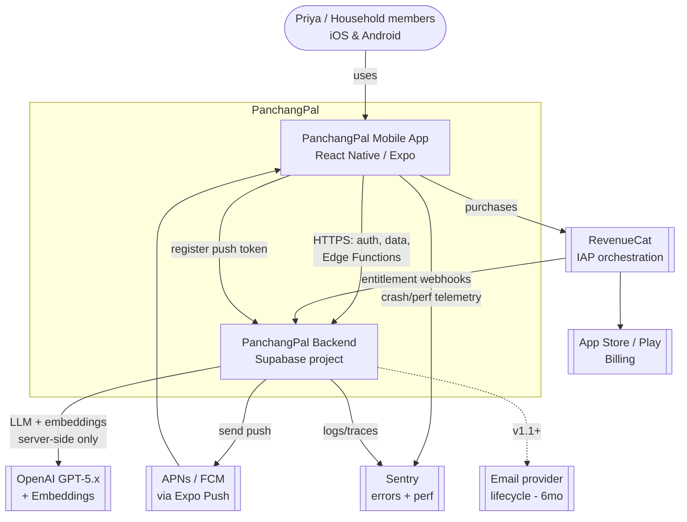
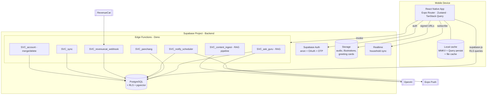
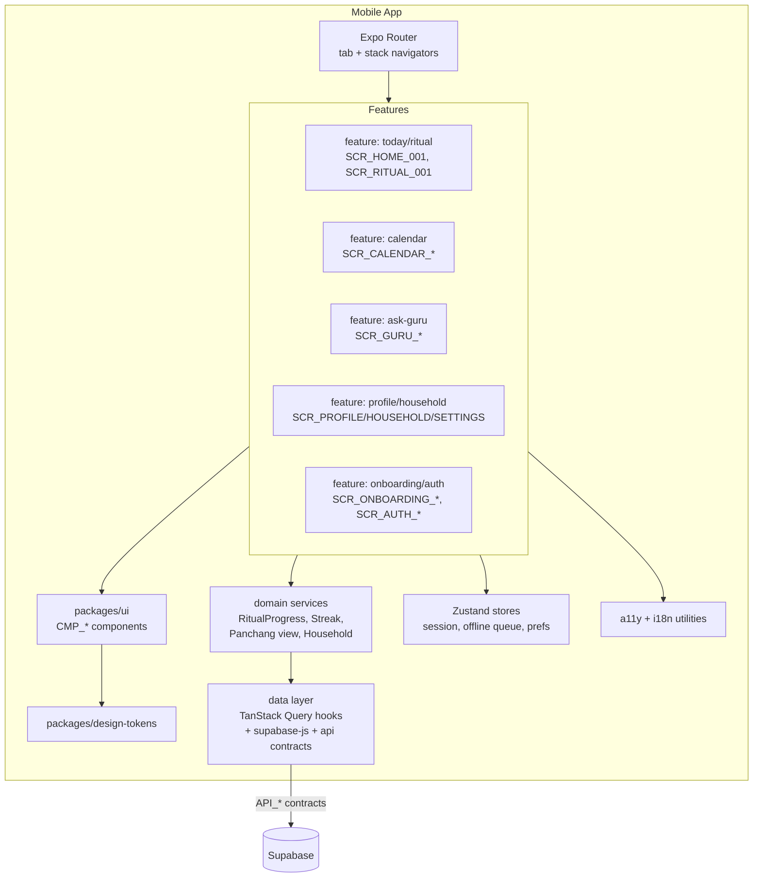
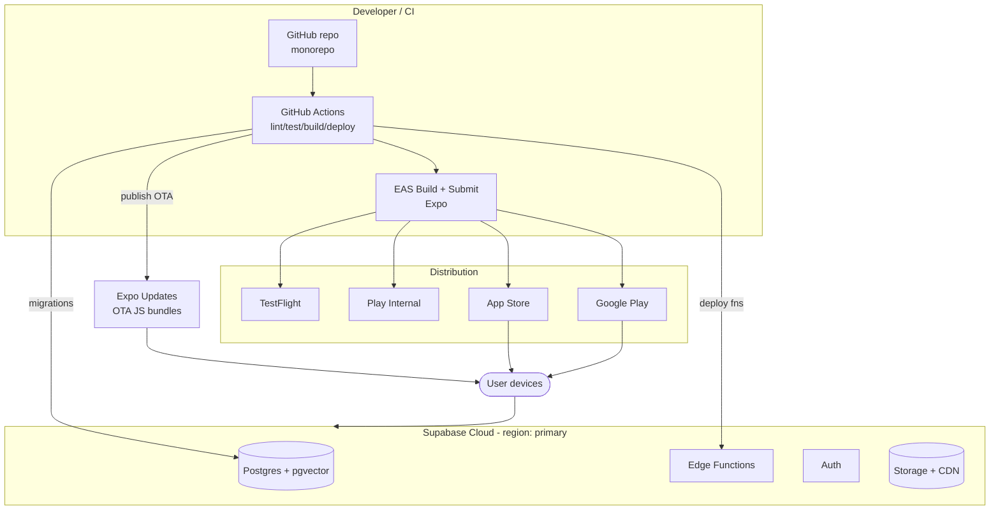
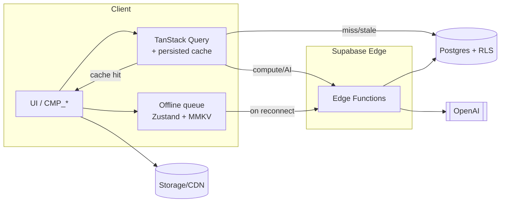
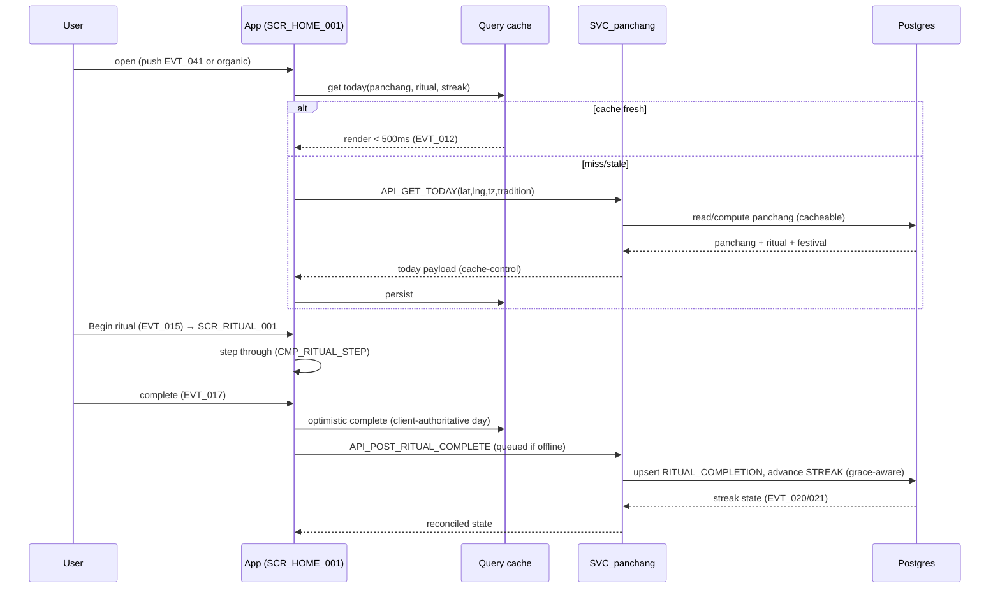
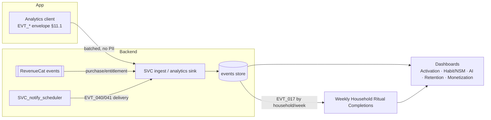
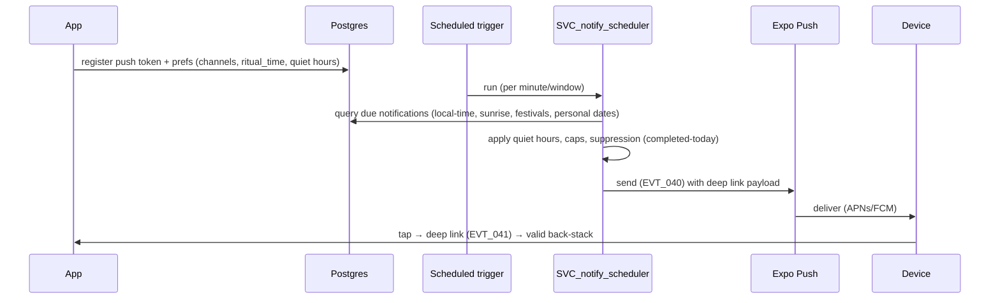
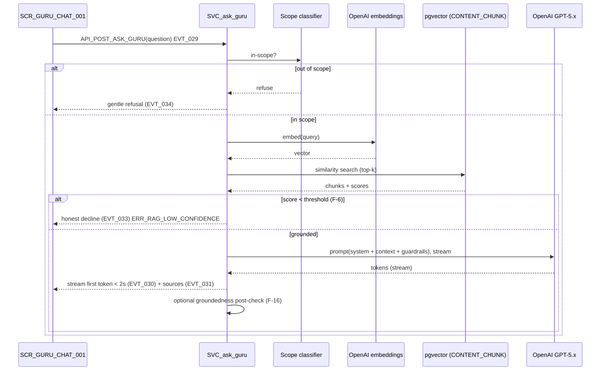

# PanchangPal — Technical Design Document (TDD)
# Part 1 — Architecture & System Design

**Version:** 1.0 (Working Draft)
**Status:** TDD Part 1 of N — for Architecture Review Board sign-off
**Date:** 2026-07-11
**Owner:** Architecture (per PDD §3.0A.5) · **Reviewers:** Backend, Mobile, AI, Platform, Security, QA
**Source-of-truth hierarchy (PDD §3.0A.1):** MRD v2 → PRD v2 → PDD/UXS Parts 1–5 → **this TDD**. The TDD never contradicts the above; where it improves on an implied technical approach it is marked `[TECHNICAL IMPROVEMENT]`; where it needs product clarification it raises `[PRD FOLLOW-UP]`.

---

## How to read this document

This is the definitive architecture reference for Backend, Mobile, AI, Platform, DevOps, QA, and Security engineers, and for AI coding agents (Claude Code, Cursor, Codex, Copilot). It is **implementation-ready**: no team should need to invent an architecture decision after reading it.

**Conventions.** `[MANDATORY]` = a binding requirement. `[RECOMMENDATION]` = a strong default, overridable only with a recorded ADR. `[TECHNICAL IMPROVEMENT]` = an improvement over what the PDD implied (with rationale). `[ASSUMPTION Tn]` = a decision made where sources are silent. `[PRD FOLLOW-UP Fn]` = needs a product owner. Cross-references use the PDD registries: **Screens** `SCR_*` (PDD Part 2), **Components** `CMP_*` (Part 3), **APIs** `API_*` (§3.0A.3 / Part 2 annexes), **Flows** `FLOW_*`/Annex letters (Part 1 §3), **Events** `EVT_*` (§3.0.1), **Errors** `ERR_*` (§3.0.2), **Tokens** (§6). New TDD identifiers use `SVC_*` (services/Edge Functions), `TBL_*` (tables), `ADR-*`, `NFR-*`, `TRISK-*`.

**Baseline stack (given):** React Native (Expo) · TypeScript · Expo Router · Zustand · TanStack Query · Supabase (Auth, Postgres, Storage, Edge Functions, Realtime) · PostgreSQL + pgvector · OpenAI GPT‑5.x · GitHub Actions · Sentry · RevenueCat · Expo Notifications. Where an alternative is materially better it is recommended with justification, not silently substituted.

**Scope of Part 1:** Sections 1–10 below (Vision, High-Level Architecture, Stack, Repo, Standards, ADRs, Cross-Cutting, NFRs, Risks, Readiness). **Parts 2–5 (data model & API contracts, AI/RAG subsystem, mobile app architecture, platform/DevOps/security) are NOT written here** — Part 1 ends with the prerequisites checklist for Part 2.

---

# SECTION 1 — Technical Vision

## 1.1 Engineering philosophy

PanchangPal is a **solo-founder, trust-first, offline-capable consumer mobile product** whose moat is *trust and household relationships*, not raw feature count (MRD §10). The engineering philosophy follows from that reality:

- **Managed-first, build-least.** With one engineer and a tight timeline (PRD Timeline; MRD Risk §12 solo-founder single-point-of-failure), we buy managed platforms (Supabase, RevenueCat, Sentry, Expo, OpenAI) and write only the differentiating logic (the Panchang/tithi engine, the RAG content pipeline, the household habit loop). Every line of infra we don't operate is a risk we don't carry.
- **Correctness is the product.** A wrong tithi or a hallucinated ritual detail costs disproportionate trust (MRD Risk §1, §3). Accuracy, groundedness, and honest failure are non-negotiable and are enforced in code, tests, and observability — not left to prose.
- **The daily loop must survive bad networks.** The habit forms only if `FLOW B1` works on a diaspora commuter's flaky connection; offline-first is architectural, not a feature (PDD Flow E5).
- **Boring, legible, replaceable.** Prefer well-understood tech and clear seams so an AI coding agent — or a second engineer hired later — can extend the system without re-deriving context (PDD §3.0A.7/§5.13A.9).

## 1.2 Architecture principles `[MANDATORY]`

1. **Client-thin, server-authoritative-for-truth.** The mobile app renders and caches; the server is authoritative for panchang computation, RAG answers, entitlements, and cross-device state. Exception: **daily-completion is client-authoritative for the day** and reconciled server-side (PDD A4) so the loop works offline.
2. **Clear seams / hexagonal boundaries.** Domain logic (panchang, streak, household, AI) sits behind interfaces; Supabase/OpenAI/RevenueCat are adapters, swappable without touching domain code (supports ADR review triggers, §6).
3. **Contracts before code.** Every `API_*` has a typed contract (shared package) generated/validated against the DB schema; the mobile app never hand-rolls request shapes (PDD `[PRD FOLLOW-UP] F-8`).
4. **Stateless edge, stateful database.** Edge Functions (`SVC_*`) are stateless and idempotent; all state lives in Postgres (+ Storage). Horizontal scale is a platform concern, not an app concern.
5. **Everything traceable.** Code maps to PDD IDs; the DB, API, and analytics carry the same identifiers so an incident can be traced screen → flow → API → table → event (PDD §3.0A.2).

## 1.3 Design principles

- **Single source of types.** One `packages/shared` defines domain types, `EVT_*`/`ERR_*` enums, and API contracts consumed by both app and Edge Functions (TypeScript end-to-end).
- **Feature-flag everything post-v1** (`FF_GREETING_CARD`, `FF_JAIN_MODE`, `FF_FAMILY_PLAN`, `FF_LIFECYCLE_EMAIL`) so scope can be cut without branching (PRD roadmap; MRD Risk §14 "cut scope, don't slip").
- **Tokens/components are the only UI vocabulary** — the app composes `CMP_*` from `packages/ui` bound to `packages/design-tokens` (PDD §3.0A.8).
- **Fail calm, never fake.** Errors degrade gracefully to a valid state (PDD §12); the AI declines rather than fabricates (PDD §9.5).

## 1.4 Scalability principles

- **Design for 12k–19k installs in 90 days, architect for 10× headroom** (PRD Goal 4; MRD SOM). Nothing in v1 should require re-platforming to reach ~200k MAU.
- **Read-heavy, cache-friendly.** Panchang and calendar data are deterministic functions of (date, location, tradition) — **compute-once, cache-everywhere** (CDN + client). This is the single biggest scalability lever.
- **Vertical-first, horizontal-ready.** Supabase Postgres scales vertically for v1; partitioning/read-replicas and pgvector index tuning are documented triggers (§9), not day-1 work.
- **Cost scales sub-linearly with users** because the expensive paths (panchang compute, RAG retrieval corpus) are shared, not per-user.

## 1.5 Security principles `[MANDATORY]`

- **Row-Level Security (RLS) on every table** — Postgres RLS is the primary authorization boundary; a user/household can only read/write their own rows. No table ships without an RLS policy (Security review gate).
- **Least privilege.** The mobile client uses the anon/authenticated key with RLS; privileged operations (entitlement writes, deletion, admin) run only in Edge Functions with the service role, never on the client.
- **Secrets never on device.** OpenAI keys, service-role keys, and webhook secrets live in Edge Function env/secret store; the app holds only public keys (PDD Trust §1.7; §7.2).
- **PII minimization + CCPA.** Collect the minimum; no PII in analytics/logs/prompts; support export/delete with a grace window (PRD P0 #9; PDD `F-3/F-10`).
- **Defense in depth for AI.** Scope guardrails + rate limits + cost caps + refusal test set (MRD Risk §4; PDD §9.6).

## 1.6 Performance principles

- **Cached-first rendering.** Returning users see cached Today < 500 ms before any network (PDD §3.0.4; `SCR_HOME_001` AC-HOME-01). The network is an enhancement, not a gate.
- **Budgets are code-enforced.** The §3.0.4 budgets (splash < 1 s, first AI token < 2 s, etc.) are tracked in Sentry Performance and asserted in CI where feasible (`NFR-*`, §8).
- **Native-driver motion.** Animations run on transform/opacity at 60fps (PDD §7.14); no JS-thread layout thrash.
- **Deterministic, cacheable compute.** Panchang is pure; identical inputs return byte-identical cached output (enables aggressive CDN caching).

## 1.7 Offline-first principles `[MANDATORY]`

- **The core loop is offline-complete** (PDD Flow E5): cached today's panchang, ritual text, checklist, and streak are fully usable with no network.
- **Optimistic writes + durable queue.** Offline actions (ritual complete, checklist, personal-date add) are applied optimistically and queued; reconciled on reconnect with documented conflict rules (`ERR_SYNC_CONFLICT`; client-authoritative daily completion).
- **Cache is layered:** TanStack Query cache (in-memory) + a persisted store (MMKV/AsyncStorage) for panchang/ritual/streak/prefs; assets (audio) via a file cache.
- **Graceful capability gating.** Network-only features (Ask Guru, invites, auth, uncached calendar months) show a clear "connect to use" state, never a dead end (PDD §12 #1).

## 1.8 Accessibility commitments `[MANDATORY]`

Engineering upholds the PDD's WCAG 2.1 AA gate (PDD §10): semantic roles/labels/values on every component, focus order = visual order, ≥44/48 targets, Dynamic Type reflow, Reduced-Motion fallbacks, color-independence, and audio-focus management (ritual narration vs. screen reader). Accessibility is **release-blocking** and enforced in the Part 3 per-component `Required Test Coverage` and the QA plan (PDD §15.4).

## 1.9 AI engineering principles `[MANDATORY]`

- **Grounded or silent (RAG-first).** Ask Guru answers only from the reviewed content library; below the confidence threshold it declines (PDD §9.0; PRD P0 #4 AC). No ungrounded specifics, ever.
- **Server-side only.** All LLM/embedding calls run in Edge Functions; the app never holds the OpenAI key or calls OpenAI directly.
- **Deterministic guardrails around a non-deterministic core.** Scope classifier + prompt guardrails + optional groundedness post-check + refusal test set bound the model (PDD §9.6; `F-16`).
- **Cost-aware by construction.** Retrieval caps, token limits, response caching for common questions, and per-user rate limits keep unit economics bounded (MRD Risk §2; §7.9).
- **No cross-session memory in v1** (AI Non-Goal) — a privacy and trust decision, enforced by not persisting conversational context beyond a thread.

## 1.10 Observability principles

- **Three pillars, one correlation ID.** Structured logs (Edge Functions), metrics (Supabase + custom), and traces (Sentry Performance) share a `request_id`/`correlation_id` so a `SCR_*` interaction can be followed to a DB query and back.
- **Every `ERR_*` is observable.** Errors emit `EVT_054` (client) and structured logs (server) with the `error_code`; dashboards per §11 (PDD Analytics).
- **AI is audited.** Refusal accuracy, groundedness, latency (first-token), and cost/query are first-class metrics (PDD §9.9), with a periodic hallucination audit.
- **SLOs, not vibes.** The `NFR-*` targets (§8) are dashboards + alerts, owned per §9.

## 1.11 Cost optimization principles

- **Cache the expensive, meter the variable.** Deterministic panchang/calendar cached at the edge (near-zero marginal cost); LLM/embeddings are the only truly variable cost and are capped, cached, and modeled per WAU **before** enabling unlimited free-tier AI (PRD open question; MRD Assumption §13).
- **Managed tiers sized to milestones.** Start on Supabase/OpenAI tiers matched to the 90-day SOM; scale on real usage, not speculation.
- **Observe unit economics from day one.** LTV:CAC and AI cost/query are tracked from launch (MRD §14) so cost regressions are caught early.

---

# SECTION 2 — High-Level Architecture

PanchangPal is a **mobile client + serverless backend** built on Supabase, with a RAG subsystem over OpenAI and pgvector, RevenueCat for billing, and Expo push for notifications. The diagrams below use the C4 model (Context → Container → Component) plus deployment, runtime, and the key runtime flows. Every diagram has an explanation.

## 2.1 System Context Diagram



**Explanation.** The user interacts only with the **mobile app** (`SCR_*` surfaces). The app talks to **one Supabase backend** for auth, data (RLS-guarded), and Edge Functions (`SVC_*`). **OpenAI is reached only server-side** (guardrails, secret protection, cost control — §1.9). **RevenueCat** wraps native store billing (reconciling with PDD A12 "native IAP only" — RevenueCat orchestrates native IAP; ADR-005) and notifies the backend of entitlement changes via webhook. **Expo Push** fans out to APNs/FCM for the notification system (PDD §8). **Sentry** receives client and server telemetry. Email is drawn dashed — a 6-month roadmap item (`FF_LIFECYCLE_EMAIL`), not v1.

## 2.2 Container Diagram



**Explanation.** The **app container** holds UI + state (Zustand for ephemeral/UI state, TanStack Query for server-cache) and a **layered local cache** enabling offline-first (§1.7). The **Supabase project** contains Auth, Postgres (with RLS + pgvector for RAG), Storage (audio narration, illustrations, future greeting cards), Realtime (household presence/completions), and **Edge Functions** — the only place with privileged secrets and third-party egress. Naming: `SVC_panchang` serves `API_GET_TODAY`/`API_GET_PANCHANG_DETAIL`; `SVC_ask_guru` serves `API_POST_ASK_GURU`; `SVC_notify_scheduler` drives `API_POST_NOTIF_SCHEDULE` + delivery; `SVC_revenuecat_webhook` handles entitlements (`API_POST_SUB_VALIDATE` reconciliation); `SVC_sync` handles `API_POST_SYNC`; `SVC_account` handles anon→auth merge + deletion; `SVC_content_ingest` runs the RAG ingestion pipeline.

## 2.3 Component Diagram (Mobile App internal)



**Explanation.** The app is **feature-sliced** (one slice per PDD tab/area), each composing `CMP_*` from `packages/ui` (bound to `packages/design-tokens`) and calling **domain services** that map to the PDD "Shared Utilities" (Part 3 v3.1: `RitualProgressService`, `StreakService`, `PanchangService`, `HouseholdService`, `AskGuruService`, etc. — `[PRD FOLLOW-UP] F-14` ratifies names). The **data layer** wraps `supabase-js` behind typed `API_*` contracts and TanStack Query hooks (caching, retries, offline). **Zustand** holds session, the offline mutation queue, and preferences. Routing is Expo Router; the 4-tab model (`CMP_BOTTOM_TAB_BAR`, UX-1) maps to a tab navigator with per-tab stacks (PDD §2.4 back-nav rules).

## 2.4 Deployment Diagram



**Explanation.** A **monorepo** on GitHub drives **GitHub Actions**: lint/typecheck/test → DB migrations to Supabase → Edge Function deploys → **EAS Build/Submit** for native binaries → store distribution, plus **Expo Updates (OTA)** for JS-only changes (fast fixes without a store review, within store policy). Supabase Cloud hosts Postgres+pgvector, Edge Functions, Auth, and Storage (CDN-fronted) in a **single US region** for launch — **DECIDED (ADR-012), resolving F-18:** one US primary region (e.g., `us-east`) unless a specific regulatory requirement dictates otherwise, with CDN caching serving AU/NZ latency. A region split/replica is a documented future trigger (§9 TRISK-07/12) if AU/NZ latency NFRs are missed or a residency obligation emerges.

## 2.5 Runtime Architecture



**Explanation.** At runtime the UI reads through **TanStack Query**: a cache hit renders instantly (offline-first, cached-first budgets §1.6), a miss/stale entry fetches from Postgres (RLS) or an Edge Function. Direct CRUD (household, personal dates, preferences) goes straight to Postgres via `supabase-js` under RLS; **computed or privileged operations** (panchang, Ask Guru, entitlements, sync, deletion) go through Edge Functions. Offline mutations enqueue and drain on reconnect via `SVC_sync`. Static assets (audio, illustrations) stream from Storage/CDN with client file caching.

## 2.6 Data Flow Diagram — Morning Ritual (FLOW B1)



**Explanation.** The hero flow. Today renders cached-first; completion is **optimistic and client-authoritative for the day** (PDD A4), queued when offline and reconciled by `SVC_panchang`/`SVC_sync`. Streak advancement applies grace-day logic server-side (single source of truth for streak length) while the client shows the calm completion moment immediately (`CMP_COMPLETION_MOMENT`). Events `EVT_012/015/017/020/021` fire per PDD §11.

## 2.7 Event Flow Diagram — Analytics & domain events



**Explanation.** Domain/analytics events use the **PDD §11.1 envelope** (pseudonymous IDs, `household_id`, no PII), are **batched** from the client through an **analytics adapter** (`AnalyticsService`), and land in an events store feeding dashboards. The **North Star (WHRC)** is computed by grouping `EVT_017` by `household_id` per ISO week. RevenueCat and the notification scheduler contribute monetization and delivery events. **DECIDED (ADR-013), resolving F-19:** launch with a **Postgres-backed events sink behind an analytics adapter interface**, so migrating to PostHog/Amplitude later requires swapping the adapter, not touching application code. A managed product-analytics tool is a documented upgrade trigger (§9) when event volume/query needs exceed Postgres comfort.

## 2.8 Authentication Flow (FLOW E1 — deferred auth + anon→auth merge)

```mermaid
sequenceDiagram
    participant App
    participant Auth as Supabase Auth
    participant Fn as SVC_account
    participant DB as Postgres
    App->>Auth: signInAnonymously() at first launch
    Auth-->>App: anon session (JWT)
    Note over App,DB: onboarding runs on anon user;<br/>data written under RLS (owner = anon uid)
    App->>App: user triggers auth (household/cross-device) EVT_044
    App->>Auth: signIn Apple/Google/email-OTP
    Auth-->>App: authenticated session
    App->>Fn: API_POST_AUTH_MERGE(anon_uid → auth_uid)
    Fn->>DB: reassign ownership; resolve conflicts (union/longer-streak)
    DB-->>Fn: merged (ERR_AUTH_MERGE_CONFLICT handled)
    Fn-->>App: merged session (EVT_045)
```

**Explanation.** Realizes UX-2 (deferred auth). Supabase **anonymous sign-in** gives every first-launch user a real `auth.uid` so RLS works from the start and onboarding needs no sign-in wall. On real sign-in, `SVC_account` performs the **identity merge** (`[PRD FOLLOW-UP F-1]`): reassign anon-owned rows to the authenticated user, resolving divergence by union / longer-streak and informing the user (`ERR_AUTH_MERGE_CONFLICT`, PDD AC-AUTH-02). Expired sessions render cached Today read-only with silent refresh (`ERR_AUTH_EXPIRED`, FLOW A2).

## 2.9 Notification Flow (PDD §8 / FLOW D4)



**Explanation.** Realizes the notification framework (PDD §8.0). A **scheduled trigger** (Supabase cron / `pg_cron`) invokes `SVC_notify_scheduler`, which computes due notifications from user-local time, sunrise, festivals, and personal-date tithi recurrences, then applies **quiet hours, frequency caps, and completion suppression** before sending via Expo Push with deep-link payloads (`panchangpal://…`). Delivery/open emit `EVT_040/041` with `notification_type`. Personal-date reminders are grief-aware and never carry streak/promo content (PDD §8.6, UX-7).

## 2.10 AI Request Flow (Ask Guru — Annex D1 / PDD §9)



**Explanation.** Realizes the grounded-or-silent contract (PDD §9.0–9.6). The Edge Function classifies scope, embeds the query, runs **pgvector similarity search** over the reviewed `CONTENT_CHUNK` corpus, and only generates when retrieval confidence ≥ the tunable threshold (`F-6`); otherwise it declines honestly. Generation is **streamed** (first token < 2 s) with visible sources; an optional groundedness post-check (`F-16`) can downgrade weak answers. Errors (`ERR_AI_TIMEOUT`/`ERR_AI_ERROR`) return a calm retry with **no fabricated content**. All OpenAI access is server-side (§1.9). `[TECHNICAL IMPROVEMENT]` cache embeddings for frequent/suggested questions and cache full answers for high-frequency evergreen prompts to cut cost and latency (keyed by normalized-question + content-version).

## 2.11 Offline Sync Flow (FLOW E5)

```mermaid
sequenceDiagram
    participant UI
    participant OQ as Offline queue (MMKV)
    participant Net as Connectivity
    participant Fn as SVC_sync
    participant DB as Postgres
    UI->>OQ: mutation (ritual complete / checklist / personal date) — optimistic
    Note over UI: UI reflects change immediately
    Net-->>OQ: reconnect
    OQ->>Fn: API_POST_SYNC(batch, client timestamps)
    Fn->>DB: apply with conflict rules
    Note over Fn,DB: daily completion = client-authoritative;<br/>union household/history; longer streak wins
    DB-->>Fn: reconciled state (ERR_SYNC_CONFLICT if any)
    Fn-->>OQ: ack + server truth
    OQ->>UI: reconcile (inform only if meaningful)
```

**Explanation.** Realizes Flow E5. Mutations apply **optimistically** to UI + local store and enqueue durably (MMKV survives app kill). On reconnect, `SVC_sync` applies the batch with documented conflict rules — **daily completion is client-authoritative for the day**, household/history is unioned, longer streak wins — and returns server truth; the client reconciles silently unless a conflict is user-meaningful (`ERR_SYNC_CONFLICT`). This guarantees the habit loop never loses a completion to a bad network.

---

# SECTION 3 — Technology Stack

Every choice is justified against the constraints: solo founder, tight timeline, trust/accuracy-critical, offline-first, cost-sensitive, US+AU+NZ launch. `[MANDATORY]` items are the baseline stack; deviations require an ADR (§6).

| # | Concern | Choice `[MANDATORY]` | Why (vs. alternatives) |
|---|---|---|---|
| 1 | **Frontend** | React Native + **Expo** (managed), TypeScript | One codebase for iOS+Android (PRD platform); Expo removes native-build/CI toil for a solo founder; OTA updates; huge ecosystem. Alt: bare RN (more control, more ops — rejected), Flutter (Dart, smaller diaspora-dev pool — rejected). ADR-001/002. |
| 2 | **Routing** | **Expo Router** (file-based) | Native to Expo; typed routes; deep-linking (`panchangpal://…`, FLOW D4) is first-class — essential for the notification/invite/referral flows. Alt: React Navigation (works, but Router wraps it with file-based DX). |
| 3 | **Server state** | **TanStack Query** | Caching, stale-while-revalidate, retries, offline persistence → directly powers cached-first budgets (§1.6) and offline-first (§1.7). Alt: RTK Query (fine; Query is lighter, less boilerplate for a solo dev). ADR-007. |
| 4 | **Client/UI state** | **Zustand** | Minimal, unopinionated store for session, offline queue, prefs, UI state; tiny API, no boilerplate. Alt: Redux Toolkit (heavier), Jotai/Recoil (atom model overkill here). ADR-008. |
| 5 | **Backend platform** | **Supabase** (Auth, Postgres, Storage, Edge Functions, Realtime) | One managed platform covers 80% of backend needs with Postgres+RLS at the core; **anonymous auth** enables deferred sign-in (UX-2); pgvector for RAG in the same DB (no separate vector vendor). Alt: Firebase (NoSQL, weaker relational/RLS fit for household/traceability; separate vector store needed — rejected), custom Node+managed PG (more ops — rejected). ADR-003. |
| 6 | **Auth** | **Supabase Auth** (anonymous, Apple, Google, email-OTP/magic-link) | Matches `SCR_AUTH_*`; anonymous→authenticated merge (FLOW E1); JWT drives RLS. |
| 7 | **Database** | **PostgreSQL** (Supabase) + **RLS** | Relational fit for household/members/entitlements/traceability; RLS is the authz boundary (§1.5). Deterministic panchang cached; strong consistency for entitlements. |
| 8 | **Vector DB** | **pgvector** (in Postgres) | RAG retrieval co-located with content → one datastore, transactional consistency between content and embeddings, lower ops/cost. Alt: Pinecone/Weaviate (managed, scales further, but adds a vendor + cost + sync complexity unjustified at v1 corpus size). Documented scale trigger (§9). ADR-004. |
| 9 | **AI / LLM** | **LLM provider adapter** — initial impl **OpenAI GPT‑5 mini** for generation + **OpenAI `text-embedding-3-small` (1536‑dim)** for embeddings | **DECIDED (ADR-011), resolving F-20:** all model access sits behind an `LLMProvider`/`EmbeddingProvider` adapter (`packages/ai`); GPT‑5 mini is the launch generation model (cost/latency-efficient for a small grounded corpus), embeddings via `text-embedding-3-small` (1536 dims → `content_chunk.embedding vector(1536)`). Server-side only. Vendor/model swappable without touching callers; upgrade to a larger model/embedding is a config + re-embed step. ADR-004/011. |
| 10 | **Storage** | **Supabase Storage** (+ CDN) | Ritual audio, illustrations, greeting cards; signed URLs; CDN caching for AU/NZ latency. |
| 11 | **Notifications** | **Expo Notifications** + Expo Push (APNs/FCM) | Native to Expo; single API over both stores; scheduled via `SVC_notify_scheduler` (PDD §8). |
| 12 | **Payments** | **RevenueCat** over native IAP (StoreKit/Play Billing) | Cross-platform entitlement source of truth, receipt validation, webhooks → reconciles PDD A12 "native IAP only" (RevenueCat *orchestrates* native IAP). Family-plan entitlement propagation via webhook→`SVC_revenuecat_webhook` (`F-4`). Alt: raw StoreKit/Play (more code, per-platform receipt logic — rejected for solo timeline). ADR-005. |
| 13 | **Analytics** | **Postgres events + rollups behind an analytics adapter** (migratable to PostHog/Amplitude) | **DECIDED (ADR-013):** launch on a Postgres sink behind the `AnalyticsService` adapter; PDD §11 taxonomy is vendor-agnostic, so switching platforms swaps the adapter only. |
| 14 | **Logging** | Structured JSON logs in Edge Functions → Sentry + Supabase logs | Correlation IDs (§1.10); no PII. |
| 15 | **Monitoring** | **Sentry** (errors + Performance) client + server; Supabase metrics; uptime check | Crash-free sessions, latency traces vs. `NFR-*` (§8). |
| 16 | **Feature flags** | Postgres-backed flag table + client cache (`FF_*`) | Simple, auditable, no extra vendor; `FF_GREETING_CARD/JAIN_MODE/FAMILY_PLAN/LIFECYCLE_EMAIL`. `[TECHNICAL IMPROVEMENT]` remote-config semantics via a `feature_flags` table read at launch + Realtime invalidation. Alt: LaunchDarkly (overkill/cost at v1). |
| 17 | **Testing** | Jest + React Native Testing Library (unit/snapshot/interaction), Detox or Maestro (E2E), custom a11y assertions, Vitest for Edge Functions | Maps to Part 3 `Required Test Coverage` + PDD §15.4 gates. `[ASSUMPTION T3]` Maestro for E2E (simpler than Detox for a solo dev). |
| 18 | **CI/CD** | **GitHub Actions** + **EAS Build/Submit** + Expo Updates (OTA) | Lint/typecheck/test → migrations → fn deploy → native build → store submit; OTA for JS fixes. ADR-006-adjacent. |
| 19 | **Deployment** | Supabase Cloud (managed) + EAS | No servers to run (§1.1). |
| 20 | **Secrets** | Supabase Edge secrets + GitHub Actions encrypted secrets + EAS secrets | Never on device (§1.5); OpenAI/service-role/webhook secrets server-only. |
| 21 | **Caching** | Client: TanStack Query + MMKV persist + file cache; Edge/CDN: HTTP cache-control on deterministic panchang/calendar/content | The central scalability + cost lever (§1.4/1.11). |
| 22 | **Search** | pgvector (semantic, RAG) + Postgres FTS/`pg_trgm` (city search, history) | `API_GET_CITY_SEARCH`, `API_GET_GURU_HISTORY`; no external search engine needed at v1. |
| 23 | **Queue / background jobs** | **`pg_cron`** (scheduled) + a **jobs table** worker pattern in Edge Functions | Notification scheduling, win-back segmentation, content ingestion, rollups. Alt: external queue (SQS) — unjustified at v1. |
| 24 | **State mgmt** | Zustand (client) + TanStack Query (server) — clear split | See #3/#4. |
| 25 | **Dependency injection** | Lightweight — module boundaries + a small service-locator/context for domain services; no heavy DI container | Keeps seams (§1.2) without framework weight; supports test doubles. `[ASSUMPTION T4]`. |
| 26 | **Localization** | `i18next` / `expo-localization`; externalized keys; RTL-ready | v1 English (PDD §10.10); locale-ready keys from day one. |

---

# SECTION 4 — Repository Structure

`[MANDATORY]` A **pnpm + Turborepo monorepo** (`[ASSUMPTION T5]` pnpm workspaces + Turborepo for fast, cached CI). One repo keeps app, Edge Functions, DB, and shared contracts in lockstep — critical for a solo founder and for AI coding agents that need the whole context.

```
panchangpal/
├── apps/
│   ├── mobile/                 # Expo app (React Native, Expo Router)
│   │   ├── app/                # Expo Router routes = SCR_* surfaces
│   │   ├── src/
│   │   │   ├── features/       # feature slices: today, calendar, ask-guru, you, onboarding, auth
│   │   │   ├── domain/         # domain services (RitualProgress, Streak, Household, PanchangView...)
│   │   │   ├── data/           # supabase-js + TanStack Query hooks + API_* clients
│   │   │   ├── store/          # Zustand stores (session, offline queue, prefs)
│   │   │   ├── a11y/  i18n/     # accessibility + localization utilities
│   │   │   └── analytics/      # EVT_* client (envelope §11.1)
│   │   └── app.config.ts       # Expo config, deep-link scheme panchangpal://
│   └── backend/                # Supabase project
│       ├── functions/          # Edge Functions = SVC_* (Deno/TypeScript)
│       │   ├── panchang/  ask-guru/  notify-scheduler/  revenuecat-webhook/
│       │   ├── sync/  account/  content-ingest/
│       │   └── _shared/        # server-side shared (auth, logging, guardrails)
│       ├── migrations/         # SQL migrations (TBL_*, RLS policies)
│       └── seed/               # seed data (traditions, festivals, content corpus)
├── packages/
│   ├── ui/                     # CMP_* React Native components (Part 3 §5)
│   ├── design-tokens/          # token values (Part 3 §6) → tokens.ts (P3-A2)
│   ├── api/                    # API_* contracts (types + zod schemas), shared client+server
│   ├── database/               # generated DB types, table/enums, RLS helpers
│   ├── ai/                     # RAG prompt builder, guardrails, retrieval helpers (server-shared)
│   └── shared/                 # domain types, EVT_*/ERR_* enums, utils, constants
├── docs/                       # this TDD, PDD, PRD, MRD, ADRs (§6)
├── scripts/                    # dev/ops scripts (migrate, seed, ingest content, codegen)
├── tests/                      # cross-package E2E (Maestro flows = FLOW_*), fixtures
├── .github/                    # GitHub Actions workflows, PR templates, CODEOWNERS
├── turbo.json  pnpm-workspace.yaml  tsconfig.base.json  .eslintrc  .prettierrc
```

**Directory purposes.** `apps/mobile` is the Expo client, feature-sliced with routes mirroring `SCR_*`. `apps/backend` holds Edge Functions (`SVC_*`), SQL migrations (`TBL_*` + RLS), and seed/content. `packages/*` are the shared libraries: **`ui`** (`CMP_*`), **`design-tokens`** (Part 3 §6 values), **`api`** (typed `API_*` contracts used by both client and functions — the single contract source, `F-8`), **`database`** (generated types + RLS helpers), **`ai`** (prompt builder/guardrails/retrieval, shared by `ask-guru` + `content-ingest`), and **`shared`** (domain types, `EVT_*`/`ERR_*` enums so client and server never diverge on identifiers). `docs/` carries the source-of-truth hierarchy and ADRs; `scripts/` includes the RAG content-ingestion CLI; `tests/` holds Maestro E2E mapping to `FLOW_*`; `.github/` holds CI + CODEOWNERS enforcing PDD §3.0A.5 ownership.

---

# SECTION 5 — Engineering Standards `[MANDATORY]`

- **TypeScript:** `strict: true` everywhere; no `any` (use `unknown` + narrowing); no non-null `!` without justification; exhaustive `switch` on `EVT_*`/`ERR_*`/enums; runtime validation at all boundaries with **zod** (API requests/responses, Edge Function inputs, deep-link params). Shared types come from `packages/shared`/`packages/api` — never re-declared.
- **Naming:** components `PascalCase` and map to `CMP_*` IDs; hooks `useX`; Edge Functions kebab-dir = `SVC_*`; DB tables `snake_case` singular = `TBL_*` uppercase ref; env vars `SCREAMING_SNAKE`; feature flags `FF_*`; analytics `EVT_*`; errors `ERR_*`. IDs are stable and never reused (PDD §3.0A.3).
- **Folder/file conventions:** feature-sliced; one component per file; colocate tests (`*.test.tsx`) and styles; index barrels only at package boundaries; no deep relative imports across features (use package aliases).
- **Import/dependency rules:** dependency direction is `features → domain → data → packages`; **UI never imports data directly**; **domain never imports UI**; no cross-feature imports (share via `packages`); the app **never** imports the OpenAI SDK or service-role key (server-only); no circular deps (enforced by lint).
- **Linting/formatting:** ESLint (typescript-eslint, react, react-native, import, a11y rules) + Prettier; **no hard-coded colors/spacing/durations** (custom lint rule → tokens only, PDD §3.0A.8); CI fails on lint/type errors.
- **Error handling:** every thrown/returned error maps to an `ERR_*` code; Edge Functions return a typed error envelope `{ code, message, correlation_id }` (never raw stack/model text); client maps `ERR_*` → user copy (PDD §13.5) + `EVT_054`; a global error boundary handles `ERR_UNKNOWN`.
- **Logging:** structured JSON only, with `correlation_id`, `user_pseudo_id`, `error_code`; **no PII/secrets/prompts-with-PII** in logs; log levels standardized; client logs crashes/perf to Sentry.
- **Comments/documentation:** comment *why*, not *what*; every Edge Function and domain service has a header docblock referencing its `API_*`/`FLOW_*`; public package APIs have TSDoc; ADRs for material decisions (§6).
- **Commits:** **Conventional Commits** (`feat:`, `fix:`, `chore:`…); reference the PDD/TDD ID and any `CHG_*`/`ADR-*`; small, atomic.
- **Branch strategy:** trunk-based — short-lived branches off `main`, PR + required checks (lint/type/test/a11y) + CODEOWNERS review; `main` always releasable; releases tagged semver; hotfix via OTA where JS-only. Breaking API/DB changes follow the PDD §3.0A.5 approval + migration process.

---

# SECTION 6 — Architecture Decision Records (ADR)

Each ADR: **Decision · Context · Alternatives · Consequences · Review trigger.** Status: all **Accepted** for v1 unless noted.

### ADR-001 — React Native for the mobile client
**Decision:** Build with React Native. **Context:** PRD mandates iOS+Android from one solo founder; JS/TS skills are widely available for later hiring. **Alternatives:** native Swift+Kotlin (2× the work — rejected), Flutter (Dart, smaller diaspora-dev talent pool, weaker RN-ecosystem parity — rejected). **Consequences:** shared codebase, fast iteration; native modules (audio, notifications, IAP) via Expo/community libs; some platform-specific polish needed. **Review trigger:** if a required native capability lacks a maintained RN module, or perf NFRs (§8) can't be met on low-end Android.

### ADR-002 — Expo (managed workflow) + EAS
**Decision:** Use Expo managed workflow with EAS Build/Submit and Expo Updates. **Context:** removes native toolchain/CI burden; OTA enables fast JS fixes. **Alternatives:** bare RN (more control, more ops — rejected for solo timeline). **Consequences:** faster delivery; must stay within Expo's supported native surface (config plugins for anything custom). **Review trigger:** a needed native dependency incompatible with Expo config plugins → consider a dev-client/bare eject.

### ADR-003 — Supabase as the backend platform
**Decision:** Supabase (Auth+Postgres+Storage+Edge+Realtime). **Context:** one managed platform, Postgres+RLS core, anonymous auth for deferred sign-in, pgvector in-DB for RAG. **Alternatives:** Firebase (NoSQL; weaker relational/RLS fit for household + traceability; needs separate vector store — rejected), self-hosted Node+PG (ops burden — rejected). **Consequences:** rapid build, strong authz via RLS, single datastore; some vendor coupling (mitigated by hexagonal seams §1.2). **Review trigger:** RLS/perf limits at scale, or data-residency (`F-18`) forcing multi-region beyond Supabase's comfort.

### ADR-004 — RAG with pgvector + OpenAI (grounded-or-silent)
**Decision:** RAG over pgvector with OpenAI embeddings+GPT-5.x, behind an LLM adapter. **Context:** trust demands grounded answers and honest declines (PRD P0 #4; MRD Risk §3); v1 corpus is small; co-locating vectors with content simplifies consistency and cost. **Alternatives:** dedicated vector DB (Pinecone/Weaviate — extra vendor/cost/sync, unjustified at v1 scale — rejected for now), base-LLM-only (violates the grounding AC — rejected). **Consequences:** one datastore, transactional content↔embedding consistency; must tune pgvector indexes (HNSW/IVFFlat) as corpus grows. **Review trigger:** corpus/QPS growth degrades retrieval latency past the AI NFR, or multi-tenant vector needs emerge.

### ADR-005 — RevenueCat for billing/entitlements
**Decision:** RevenueCat orchestrating native IAP (StoreKit/Play Billing). **Context:** cross-platform entitlement source of truth, receipt validation, webhooks; reconciles PDD A12 "native IAP only." **Alternatives:** raw StoreKit+Play Billing (per-platform receipt/entitlement code — rejected for solo timeline), Stripe (not permitted for digital IAP on mobile stores — rejected). **Consequences:** fast, robust entitlements incl. family-plan propagation (`F-4`) via webhook; a billing vendor dependency. **Review trigger:** pricing/margin pressure or a need RevenueCat can't serve.

### ADR-006 — Edge Functions (Deno) for privileged/compute logic
**Decision:** Supabase Edge Functions for panchang compute, RAG, scheduling, webhooks, sync, account ops. **Context:** stateless, secret-holding, third-party-egress logic must not live on the client. **Alternatives:** client-side compute (leaks secrets, unsafe — rejected), a separate Node service (more ops — rejected). **Consequences:** clean server boundary; Deno runtime constraints and cold-start considerations (mitigate hot paths). **Review trigger:** cold-start or execution-limit issues on hot paths → consider a dedicated service for `SVC_ask_guru`.

### ADR-007 — TanStack Query for server state
**Decision:** TanStack Query with persistence. **Context:** cached-first rendering + offline-first are core (§1.6/1.7). **Alternatives:** RTK Query (fine, heavier), hand-rolled caching (error-prone — rejected). **Consequences:** less boilerplate, robust caching/retries; a mental model the team must learn. **Review trigger:** none foreseen.

### ADR-008 — Zustand for client/UI state
**Decision:** Zustand for session, offline queue, prefs, UI state. **Context:** minimal boilerplate suits a solo founder; clear separation from server state (Query). **Alternatives:** Redux Toolkit (heavier), Jotai/Recoil (atom model unnecessary). **Consequences:** simple, testable stores; discipline needed to keep server state out of Zustand. **Review trigger:** state complexity grows beyond simple stores.

### ADR-009 `[TECHNICAL IMPROVEMENT]` — Anonymous-auth-first identity
**Decision:** Every first-launch user gets a Supabase **anonymous** session; upgrade-merge on real sign-in. **Context:** realizes deferred auth (UX-2) while keeping RLS active from first launch. **Alternatives:** device-local-only profile then create account later (harder RLS + migration — rejected). **Consequences:** RLS works universally; requires a robust merge (`SVC_account`, `F-1`). **Review trigger:** abuse via anonymous accounts → add device attestation/rate limits.

### ADR-010 `[TECHNICAL IMPROVEMENT]` — Deterministic panchang as pure, cacheable compute
**Decision:** Implement the panchang/tithi engine as a pure function of (instant, lat/lng, tz, tradition), cached at CDN + client, versioned by an `engine_version`. **Context:** accuracy + scalability + cost (§1.4/1.11); reuse for personal-date recurrence (`ERR_TITHI_AMBIGUOUS`). **Alternatives:** per-request recompute uncached (wasteful — rejected). **Consequences:** massive cache hit rates, cheap scale; must invalidate on `engine_version` bump and validate against Drik/mPanchang + paid reviewers (MRD Risk §1). **Review trigger:** accuracy discrepancies or new regional variants.

### ADR-011 — LLM provider adapter; GPT‑5 mini + `text-embedding-3-small` as initial implementation `[resolves F-20]`
**Decision:** Access all LLM/embedding capability through an `LLMProvider` + `EmbeddingProvider` adapter in `packages/ai`; the initial concrete implementation is **OpenAI GPT‑5 mini** (generation, streaming) and **OpenAI `text-embedding-3-small`** (embeddings, **1536 dimensions**). **Context:** the PRD left vendor open and flagged cost as a top risk (MRD Risk §2); a small, reviewer-curated RAG corpus does not need a frontier model to be accurate when answers are grounded (PDD §9). GPT‑5 mini gives strong quality at materially lower cost/latency, directly supporting the first-token < 2 s NFR and the AI-cost ceiling (NFR-05/16). **Alternatives:** GPT‑5 full (higher cost/latency, unjustified for grounded short answers — deferred behind the adapter), Anthropic/Gemini (viable; reachable via the same adapter). **Consequences:** vendor/model swappable via config without touching callers; a model/embedding change is a config + **re-embed** step (corpus re-embedding cost, bounded by corpus size); `content_chunk.embedding` is fixed at `vector(1536)` for launch. **Review trigger:** grounded-answer quality below the helpfulness KPI (PDD §9.9), embedding recall issues, or a cost/quality shift that favors another model.

### ADR-012 — Single US Supabase region for launch `[resolves F-18]`
**Decision:** Deploy a **single Supabase project in one US region** (e.g., `us-east`) for launch; serve AU/NZ via Storage CDN and cache-first reads. **Context:** US is the largest of the three launch markets (MRD §3); a single region minimizes operational complexity for a solo founder; the deterministic-panchang cache (ADR-010) makes read latency largely CDN-bound, not DB-region-bound. **Alternatives:** multi-region/read replicas (premature ops + cost — deferred), AU/NZ-local primary (worse for the larger US base — rejected). **Consequences:** simplest ops; AU/NZ writes incur trans-Pacific latency (mitigated by optimistic writes + offline queue, §2.11). **Review trigger:** AU/NZ latency NFRs (NFR-03/04) missed in field data, or a market-specific data-residency requirement emerges (TRISK-12) — then add a replica/region.

### ADR-013 — Analytics behind an adapter; Postgres sink first `[resolves F-19]`
**Decision:** Emit all analytics through an `AnalyticsService` adapter; the launch sink is a **Postgres `analytics_event` table + scheduled rollups** (PDD §11 taxonomy). **Context:** the PDD taxonomy is vendor-agnostic; a Postgres sink is the cheapest correct start and keeps events co-located for the North Star rollup, while the adapter preserves optionality. **Alternatives:** ship PostHog/Amplitude day one (added vendor/cost before volume justifies it — deferred), no adapter (locks tooling — rejected). **Consequences:** zero extra vendor at launch; migrating to a managed platform swaps the adapter implementation only, not call sites. **Review trigger:** event volume/query needs exceed Postgres comfort, or product needs funnels/retention analysis beyond SQL rollups → adopt PostHog/Amplitude behind the same adapter.

---

# SECTION 7 — Cross-Cutting Concerns `[MANDATORY]`

- **7.1 Configuration management.** Typed config per environment (`dev`/`staging`/`prod`) in `app.config.ts` + Edge env; no magic values in code; config validated at startup (zod). Client holds only public config.
- **7.2 Environment variables & secrets.** Public (app): `EXPO_PUBLIC_SUPABASE_URL`, `EXPO_PUBLIC_SUPABASE_ANON_KEY`, `EXPO_PUBLIC_REVENUECAT_KEY`, `EXPO_PUBLIC_SENTRY_DSN`. Server-only (Edge/CI secrets): `OPENAI_API_KEY`, `SUPABASE_SERVICE_ROLE_KEY`, `REVENUECAT_WEBHOOK_SECRET`, `EXPO_ACCESS_TOKEN`. **Never** ship server secrets to the device (§1.5).
- **7.3 Feature flags.** `feature_flags` table (`FF_*`) read at launch + cached; Realtime invalidation; gates post-v1 scope (greeting card, Jain, family plan, email) so scope can be cut without branches (MRD Risk §14). `[PRD FOLLOW-UP F-9/F-11/F-15/F-17]` values.
- **7.4 Error propagation.** Uniform envelope `{ code: ERR_*, message, correlation_id, recoverable }`; server never leaks internals; client maps to §13 copy + `EVT_054`; errors isolated to the smallest surface (e.g., panchang card error doesn't fail Home, AC-HOME-04).
- **7.5 Retry policies.** Reads: TanStack Query exponential backoff (jitter), capped attempts; idempotent writes: retry-safe; non-idempotent writes: guarded by idempotency keys (7.7). AI: one automatic retry on transient `ERR_AI_*`, then user-driven retry (no auto-loop → cost).
- **7.6 Timeouts.** Client fetch timeouts aligned to NFRs (panchang < 2 s network, AI first-token < 2 s, overall AI < ~15 s hard cap then `ERR_AI_TIMEOUT`); Edge Functions enforce upstream timeouts to OpenAI and fail calm.
- **7.7 Idempotency.** All mutating Edge Functions accept an `idempotency_key`; `SVC_sync` and `SVC_revenuecat_webhook` are idempotent (dedupe by key/event id) so retries and redeliveries never double-apply (double completion, double entitlement).
- **7.8 Caching strategy.** Deterministic panchang/calendar/content: HTTP `Cache-Control`/CDN + client persist (keyed by inputs + `engine_version`/`content_version`). User data: TanStack Query stale-while-revalidate. AI: cache embeddings + evergreen answers (ADR-004 improvement). Invalidation via version bumps + Realtime.
- **7.9 Rate limiting.** Per-user + per-IP limits on Edge Functions, strictest on `SVC_ask_guru` (cost/abuse); token + request caps; cost circuit-breaker that degrades AI to "busy, try later" before blowing the budget (MRD Risk §2).
- **7.10 Background jobs.** `pg_cron` + a `jobs` table worker pattern: notification scheduling (per-minute window), win-back segmentation (daily), content ingestion/embedding (on publish), analytics rollups (hourly/daily), entitlement reconciliation.
- **7.11 Offline behavior.** Per §1.7/2.11: cached core loop, optimistic queue, `SVC_sync` reconciliation, capability gating for network-only features (`ERR_OFFLINE`).
- **7.12 Time-zone handling.** **The** correctness pillar (MRD §7). Store instants in UTC; compute/display in the user's IANA tz (from location); panchang/sunrise/notification timing are all tz-local; personal-date tithi recurrence computed per-tz. Never default to India tz. DST handled via IANA rules. `[MANDATORY]` all date logic goes through a single tz-aware utility (no ad-hoc `Date` math).
- **7.13 Localization.** `i18next` keys; v1 English; RTL-ready; regional tradition/festival naming is content-driven (PDD §10.10, PRD P0 #2).
- **7.14 Version compatibility.** App sends `app_version`; backend supports N and N-1 minor via versioned `API_*` contracts; a **minimum-supported-version** flag can force-upgrade for breaking changes; OTA for JS-compatible fixes; DB migrations are backward-compatible within a supported window (expand-then-contract).

---

# SECTION 8 — Non-Functional Requirements

Measurable targets (SLOs); tracked in Sentry/dashboards, owned per §9. Inherit PDD §3.0.4 budgets; `[ASSUMPTION T6]` percentiles are p75 on a mid-tier device / typical launch-market network unless noted (PDD `F-7`).

| ID | NFR | Target | Measure |
|---|---|---|---|
| NFR-01 | App startup (cold → first meaningful frame) | < 1 s (splash budget); interactive Today < 2.5 s cold | Sentry app-start; PDD §3.0.4 |
| NFR-02 | Cached Today render | < 500 ms | client trace / EVT_012 timing |
| NFR-03 | API latency (panchang/calendar, cached) | p75 < 300 ms; network refresh < 2 s | Edge/CDN metrics |
| NFR-04 | API latency (DB CRUD) | p95 < 500 ms | Supabase/PG metrics |
| NFR-05 | AI first streamed token | < 2 s; full short answer < 6 s | SVC_ask_guru trace; EVT_030 |
| NFR-06 | Crash-free sessions | ≥ 99.5% | Sentry |
| NFR-07 | Crash-free users | ≥ 99.8% | Sentry |
| NFR-08 | Battery: daily loop | negligible; no background wakelocks beyond scheduled push | manual + field data |
| NFR-09 | Offline: core loop availability | 100% of cached-loop attempts succeed offline | E2E + field |
| NFR-10 | Sync success (no data loss) | ≥ 99.5% | SVC_sync metrics; ERR_SYNC_CONFLICT rate |
| NFR-11 | Push delivery | ≥ 95% delivered; morning within ±2 min of scheduled | Expo receipts; EVT_040 |
| NFR-12 | DB performance (panchang read) | mostly cache; uncached compute p95 < 400 ms | PG metrics |
| NFR-13 | Scalability | sustain 10× the 90-day SOM (~150–190k installs) with vertical scale + cache, no re-platform | load test |
| NFR-14 | Availability | ≥ 99.9% monthly (core read paths) | uptime monitor |
| NFR-15 | Disaster recovery | RPO ≤ 24 h (daily PITR backups), RTO ≤ 4 h | Supabase PITR; runbook |
| NFR-16 | AI cost | ≤ modeled $/WAU ceiling (set with F-6/F-20); circuit-breaker before budget breach | cost dashboard |
| NFR-17 | Accessibility | WCAG 2.1 AA pass, release-blocking | audit §10 (PDD) |
| NFR-18 | Security | RLS on 100% of tables; 0 secrets on device; dependency scan clean | Security review, CI |

---

# SECTION 9 — Technical Risks

Each: **Risk · Impact · Probability · Mitigation · Monitoring · Owner.** These extend the MRD Risk Register (§12) into the technical domain.

| ID | Risk | Impact | Prob. | Mitigation | Monitoring | Owner |
|---|---|---|---|---|---|---|
| TRISK-01 | **Vendor lock-in** (Supabase/OpenAI/RevenueCat) | High | Medium | Hexagonal seams (§1.2); LLM behind an adapter; data exportable (Postgres); avoid proprietary features where a portable one exists | ADR review triggers; quarterly dependency review | Architecture |
| TRISK-02 | **AI cost overruns** at scale | High | Medium–High | Rate limits + token caps + answer/embedding caching + cost circuit-breaker; model $/WAU before unlimited free AI (MRD §13) | Cost dashboard (NFR-16); per-user cost alert | AI |
| TRISK-03 | **AI hallucination / wrong ritual specifics** | High (trust) | Medium (without RAG) | Grounded-or-silent RAG; confidence threshold (F-6); groundedness post-check (F-16); refusal test set; reviewed corpus; periodic audit | Refusal accuracy, groundedness metrics (§9.9) | AI |
| TRISK-04 | **Panchang calculation error** | High (trust) | Medium | Deterministic engine (ADR-010); cross-reference Drik/mPanchang; paid reviewers; `engine_version` + regression tests | Accuracy test suite; user reports | Backend |
| TRISK-05 | **Offline sync conflicts / data loss** | Medium–High | Medium | Documented conflict rules; idempotency keys; client-authoritative daily completion; durable MMKV queue | NFR-10; ERR_SYNC_CONFLICT rate | Mobile |
| TRISK-06 | **Notification failures / mistimed pushes** | Medium | Medium | Idempotent scheduler; Expo receipts + retry; tz/quiet-hours tests; caps | NFR-11; delivery/open funnels | Platform |
| TRISK-07 | **Scaling limits** (PG/pgvector/Edge cold start) | Medium | Low–Medium (v1) | Cache-first design; vertical scale headroom; documented triggers (partitioning, replicas, index tuning, dedicated AI service) | NFR-03/05/12/13; load tests | Platform |
| TRISK-08 | **Security** (RLS gap, key leak, IAP fraud) | Critical | Low–Medium | RLS on every table + tests; secrets server-only; server receipt validation (RevenueCat); dependency + secret scanning in CI | Security review; CI scans; audit logs | Security |
| TRISK-09 | **Dependency / supply-chain risk** | Medium | Medium | Pinned versions; Renovate/Dependabot; SBOM; minimal deps; Expo-vetted libs | CI dependency scan | Platform |
| TRISK-10 | **Expo/OTA constraint or store rejection** | Medium | Low–Medium | Stay within Expo config-plugin surface (ADR-002); OTA only for policy-compliant JS changes; dev-client escape hatch | CI/build health; store review status | Mobile |
| TRISK-11 | **Solo-founder single point of failure** (MRD §12) | Critical | Med–High (structural) | Managed platforms; legible monorepo; ADRs + this TDD as knowledge capture; AI-agent-friendly docs; consider contracting specialized pieces | — | Product/Architecture |
| TRISK-12 | **Data residency** across US/AU/NZ | Medium | Low–Medium | Confirm requirements (`F-18`); region/replica strategy if required | Legal/compliance review | Security |

---

# SECTION 10 — Readiness Review

## 10.1 Architecture maturity assessment
**Assessment: Ready to build v1, conditional on the prerequisites below.** The architecture is deliberately **managed-first and cache-centric**, matching the solo-founder constraint and the trust/accuracy/offline requirements. The high-risk surfaces (AI grounding, panchang accuracy, offline sync, cost) each have a concrete, testable strategy and an owner. Maturity by area: Mobile **High**, Backend/Data **High**, AI/RAG **Medium–High** (depends on corpus readiness + cost modeling), Platform/DevOps **Medium** (CI/CD + observability to stand up), Security **Medium–High** (RLS discipline is the gate). No component requires re-platforming to reach 10× the launch SOM.

## 10.2 Open technical questions
**Resolved 2026-07-11 (product/architecture decision):**
- ✅ **LLM/embeddings (`F-20`)** — provider adapter with **GPT‑5 mini** (generation) + **`text-embedding-3-small`, 1536‑dim** (embeddings) as the initial implementation (ADR-011).
- ✅ **Region/residency (`F-18`)** — **single US region** for launch unless a specific regulatory requirement dictates otherwise (ADR-012).
- ✅ **Analytics (`F-19`)** — **Postgres sink behind an analytics adapter**, migratable to PostHog/Amplitude (ADR-013).

**Still open (deferred to the noted part):**
1. AI $/WAU ceiling and free-tier AI limits (ties to monetization, `F-11`) — model before enabling unlimited free-tier AI.
2. pgvector index params for the launch corpus (HNSW `m`/`ef_construction`) — tuned with the corpus in **TDD Part 3**.
3. Confidence-threshold + groundedness-post-check calibration (`F-6/F-16`) — set with eval data in **TDD Part 3**.

## 10.3 Future enhancements (post-v1, non-blocking)
Dedicated vector DB and/or a standalone AI service if QPS/cost demand; read replicas + table partitioning; multi-region/edge caching for AU/NZ latency; managed product-analytics; lifecycle email infra (`FF_LIFECYCLE_EMAIL`); greeting-card generation service (`FF_GREETING_CARD`); Jain module data pipeline (`FF_JAIN_MODE`); on-device panchang compute for full-offline estimation.

## 10.4 Dependencies on Part 2 (and beyond)
Part 1 is architecture only. It **depends on Part 2+** to specify: the **data model** (`TBL_*`, columns, indexes, **RLS policies**) and the concrete **`API_*` contracts** (request/response zod schemas) — Part 2; the **AI/RAG subsystem** (corpus schema, chunking, embedding/ingestion pipeline, prompt/guardrail spec, eval harness) — Part 3; the **mobile app architecture** (navigation/state/offline-queue/caching implementation detail) — Part 4; and **platform/DevOps/security** (CI/CD pipelines, environments, observability, threat model, DR runbooks) — Part 5.

## 10.5 Technical assumptions (consolidated)
`T1` US primary Supabase region + CDN for AU/NZ · `T2` Postgres-native analytics for v1 · `T3` Maestro for E2E · `T4` lightweight DI (module seams + context) · `T5` pnpm + Turborepo monorepo · `T6` NFR percentiles p75 on mid-tier device.

## 10.6 Technical follow-ups (raised here) — **all three resolved 2026-07-11**
`F-18` data residency → **RESOLVED** single US region (ADR-012) · `F-19` analytics vendor → **RESOLVED** Postgres-behind-adapter (ADR-013) · `F-20` LLM vendor/model → **RESOLVED** provider adapter + GPT‑5 mini / `text-embedding-3-small` 1536‑dim (ADR-011). Remaining PDD follow-ups relevant to the AI build (`F-6`/`F-11`/`F-16`) are addressed with eval/cost data in **TDD Part 3**.

## 10.7 Compatibility statement
This TDD Part 1 is **consistent with the MRD v2, PRD v2, and PDD/UXS Parts 1–5** and contradicts none of them. It realizes: the 4-tab IA and deferred auth (UX-1/UX-2), the offline-first daily loop (Flow E5), grounded-or-silent Ask Guru (PDD §9), grief-aware personal dates, the notification framework (PDD §8), the analytics taxonomy/North Star (PDD §11), the `ERR_*` handling (PDD §12), and the accessibility gate (PDD §10). Where it improves on an implied approach it is marked `[TECHNICAL IMPROVEMENT]` (anonymous-auth-first, deterministic cacheable panchang, AI response caching); where product input is needed it raises `[PRD FOLLOW-UP]` (F-18/19/20) rather than deciding unilaterally. The baseline stack is adopted as given; no baseline technology was substituted.

---

# Part 1 — Prerequisites Checklist before starting Part 2

Resolve/confirm before authoring **Part 2 — Data Model & API Contracts**:

☐ **Source docs frozen** — MRD v2, PRD v2, PDD Parts 1–5 are the ratified inputs (they are).
☐ **Supabase region + data residency** decided (`F-18`, `T1`).
☐ **`API_*` inventory frozen** from PDD Part 2 annexes (the contract surface Part 2 will formalize; `F-8`).
☐ **Entity list frozen** — the `TBL_*` set implied by PDD (USER, HOUSEHOLD, HOUSEHOLD_MEMBER, RITUAL, RITUAL_COMPLETION, STREAK, FESTIVAL, PERSONAL_DATE, PANCHANG(cache), CONVERSATION, MESSAGE, CONTENT_CHUNK, SUBSCRIPTION, ENTITLEMENT, INVITE, NOTIFICATION, FEATURE_FLAG, EVENTS) — to be detailed with columns/indexes/RLS in Part 2.
☐ **Business rules confirmed** that gate the schema: one-household-per-user (`F-2`), deletion grace/ownership (`F-3`), family-plan entitlement propagation (`F-4`), anon→auth merge rules (`F-1`).
☐ **AI corpus decision** — content library scope + `content_version` model (feeds Part 3), and LLM vendor/model (`F-20`).
☐ **KPI targets ratified** (`F-5`) so analytics tables/rollups match (PDD §11).
☐ **Monorepo scaffolded** (§4) with `packages/api`, `packages/shared`, `packages/database` stubs so contracts have a home.
☐ **Environments** (`dev`/`staging`/`prod`) + secrets provisioned (§7.2).
☐ **ADRs 001–010 accepted** by the Architecture Review Board.

**On completion of this checklist, proceed to TDD Part 2 — Data Model, Database Schema (TBL_*), RLS Policies & API Contracts (API_*).**

---

*End of TDD Part 1 — Architecture & System Design. Awaiting Architecture Review Board sign-off before Part 2. Part 2 is not written per instruction.*
