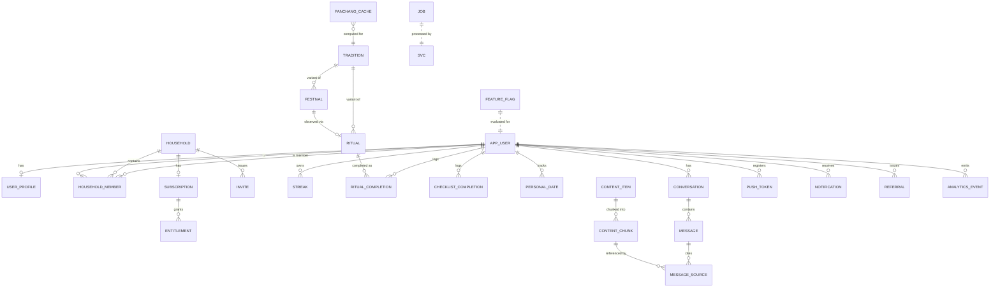

# PanchangPal — Technical Design Document (TDD)
# Part 2 — Data Model, Database Schema, RLS Policies & API Contracts

**Version:** 1.0 (Working Draft)
**Status:** TDD Part 2 of N — for Architecture Review Board sign-off
**Date:** 2026-07-11
**Owner:** Backend (per PDD §3.0A.5) · **Reviewers:** Architecture, Mobile, AI, Security, QA
**Depends on:** TDD Part 1 (Architecture) · PDD Parts 1–5 · PRD v2 · MRD v2
**Source-of-truth hierarchy:** MRD → PRD → PDD → **TDD**. Never contradicts the above. `[TECHNICAL IMPROVEMENT]` = improvement over an implied approach; `[PRD FOLLOW-UP Fn]` = needs a product owner; `[ASSUMPTION Tn]` = decision where sources are silent.

---

## How to read this document

This is the definitive **data + contract** reference. It specifies every table (`TBL_*`), its columns/keys/indexes and **Row-Level Security (RLS)** policy, the authorization model, and every **API contract** (`API_*`) with request/response schemas, error codes, and idempotency. It realizes the PDD Part 2 screen dependencies and the Part 1 architecture (`SVC_*` Edge Functions, deterministic panchang, anon-auth-first, offline sync).

**Conventions.** `[MANDATORY]` binding; `[RECOMMENDATION]` strong default (ADR to override). IDs reference PDD registries: `SCR_*` screens, `API_*` endpoints, `EVT_*` analytics, `ERR_*` errors, `FLOW_*`/Annex letters, and Part-1 `SVC_*`/`TBL_*`. Schemas are expressed in **PostgreSQL DDL-style** for tables and **zod/TypeScript-style** for API contracts (both live in `packages/database` and `packages/api`, §Part-1 §4). This document resolves the Part-1 prerequisites: entity list, `API_*` inventory, and the schema-gating business rules (`F-1`…`F-4`).

**Scope of Part 2:** Sections 1–8 (Data Model, Conventions, Table Specs, RLS/Authz, API Contracts, Data Lifecycle, Indexing/Perf, Readiness). **Parts 3–5 (AI/RAG subsystem, mobile app internals, platform/DevOps/security) are NOT written here.** Part 2 ends with the Part 3 prerequisites checklist.

---

# SECTION 1 — Data Model Overview

## 1.1 Design goals
The schema is **household-centric, RLS-guarded, and traceable**. It supports: deferred/anonymous identity with merge (`F-1`), one-active-household membership (`F-2`), grief-aware personal dates via a deterministic tithi engine, RAG content with pgvector, entitlements reconciled from RevenueCat (`F-4`), offline sync with idempotency, and the analytics taxonomy (PDD §11). Every user-owned table carries a clear ownership column so RLS is simple and total (`[MANDATORY]` — no table without RLS).

## 1.2 Entity-Relationship Diagram



**Explanation.** `APP_USER` (mirrors `auth.users`) is the identity root; `HOUSEHOLD` is the collaboration + billing unit (North Star grain). A user belongs to **one active** `HOUSEHOLD` via `HOUSEHOLD_MEMBER` (`F-2`). Habit data (`STREAK`, `RITUAL_COMPLETION`, `CHECKLIST_COMPLETION`, `PERSONAL_DATE`) is user-owned but household-visible per policy. `CONTENT_ITEM`→`CONTENT_CHUNK` (with pgvector embeddings) powers RAG; `MESSAGE_SOURCE` records the citations shown by `CMP_SOURCE_CHIP` (`EVT_031`). `TRADITION` drives regional `FESTIVAL`/`RITUAL` variants. `PANCHANG_CACHE` stores deterministic compute keyed by (date, location, tradition, engine_version). `SUBSCRIPTION`/`ENTITLEMENT` are reconciled from RevenueCat webhooks.

## 1.3 Table catalog (`TBL_*`)

| TBL_* | Purpose | Owner column | Key PDD refs |
|---|---|---|---|
| TBL_APP_USER | app-level user profile row (1:1 auth.users) | `id` (=auth.uid) | SCR_AUTH_*, FLOW E1 |
| TBL_USER_PROFILE | prefs: tradition, ritual_time, depth, location, tz, appearance | `user_id` | SCR_ONBOARDING_*, SCR_SETTINGS_001 |
| TBL_HOUSEHOLD | household unit (name, owner) | `owner_id` + members | SCR_HOUSEHOLD_001, P0#6 |
| TBL_HOUSEHOLD_MEMBER | membership (role, depth) | via household | A3, EVT_006/007/055 |
| TBL_INVITE | household invite tokens | via household | SCR_HOUSEHOLD_INVITE_001, D2 |
| TBL_REFERRAL | referral codes/attribution | `referrer_id` | D3 |
| TBL_TRADITION | regional traditions (enum-like, seedable) | public read | SCR_ONBOARDING_TRADITION_001, F-9 |
| TBL_FESTIVAL | festivals/vrats per tradition | public read | SCR_FESTIVAL_DETAIL_001, C1 |
| TBL_RITUAL | guided rituals (steps, audio refs) per tradition | public read | SCR_RITUAL_001, B1 |
| TBL_RITUAL_COMPLETION | per-user daily completion | `user_id` | EVT_017, B1 |
| TBL_STREAK | per-user streak state (grace-aware) | `user_id` | EVT_020/021 |
| TBL_CHECKLIST_ITEM | curated daily checklist items | public/derived | SCR_HOME_001 checklist |
| TBL_CHECKLIST_COMPLETION | per-user checklist ticks | `user_id` | EVT_019 |
| TBL_PERSONAL_DATE | shraddha/anniversary (tithi/gregorian) | `user_id` | SCR_PERSONAL_DATE_EDIT_001, C2 |
| TBL_PANCHANG_CACHE | deterministic panchang compute cache | public read (derived) | SCR_HOME_001, ADR-010 |
| TBL_CONTENT_ITEM | reviewed content library items | public read | Ask Guru RAG, §9 |
| TBL_CONTENT_CHUNK | chunked content + embedding (pgvector) | public read | RAG retrieval |
| TBL_CONVERSATION | Ask Guru conversations | `user_id` | SCR_GURU_*, D1 |
| TBL_MESSAGE | messages in a conversation | via conversation | EVT_029/030 |
| TBL_MESSAGE_SOURCE | citations per assistant message | via message | EVT_031 |
| TBL_SUBSCRIPTION | RevenueCat-mirrored subscription | `household_id` | SCR_SUBSCRIPTION_001, F1 |
| TBL_ENTITLEMENT | active entitlements (per household) | `household_id` | F-4 |
| TBL_PUSH_TOKEN | device push tokens | `user_id` | §8 notifications |
| TBL_NOTIFICATION | scheduled/sent notification log | `user_id` | EVT_040/041 |
| TBL_FEATURE_FLAG | feature flags (FF_*) | public read | §7.3 |
| TBL_ANALYTICS_EVENT | analytics events (envelope §11.1) | `user_pseudo_id` | PDD §11 |
| TBL_JOB | background job queue | service-only | §7.10 |
| TBL_ACCOUNT_DELETION | deletion requests + grace window | `user_id` | SCR_DELETE_ACCOUNT_001, F-3 |
| TBL_SUPPORT_TICKET | support/feedback | `user_id` | E2, Help |

---

# SECTION 2 — Conventions, Types & Enums `[MANDATORY]`

## 2.1 Common column conventions
Every table includes: `id uuid primary key default gen_random_uuid()` (except identity-mirroring tables keyed by `auth.uid`), `created_at timestamptz not null default now()`, `updated_at timestamptz not null default now()` (via trigger). Soft-delete via `deleted_at timestamptz null` where retention matters (personal dates, conversations). Ownership columns are `not null` and indexed. All times stored **UTC**; tz-local derivation happens in `SVC_*`/client (Part 1 §7.12).

## 2.2 Standard triggers & functions
- `set_updated_at()` BEFORE UPDATE on every table.
- `current_household_id()` — SQL helper returning the caller's active household (used by RLS).
- `is_household_member(hid uuid)` / `is_household_owner(hid uuid)` — RLS predicates.
- `gen_random_uuid()` (pgcrypto). pgvector extension enabled for embeddings.

## 2.3 Enumerated types (Postgres `enum` or check-constrained text)
```
member_role      : {anchor, parent, elder, youth, other}         -- PDD A3
content_depth    : {quick, deep}                                  -- PDD A3
tradition_code   : {generic, north_indian, south_indian_tamil, bengali}  -- F-9 (seeded, extensible)
date_basis       : {tithi, gregorian}                             -- PERSONAL_DATE (C2)
reminder_lead    : {same_day, one_day, custom}                    -- reminder lead
message_role     : {user, assistant}
message_outcome  : {grounded, declined, refused, error}           -- EVT_030/033/034/054
notif_type       : {morning, festival, evening, streak, household, personal, household_invite, subscription, winback}
notif_channel    : {daily, festival, personal, household, growth, lifecycle}  -- PDD §8.0
entitlement_kind : {individual, family}                           -- SCR_SUBSCRIPTION_001
sub_status       : {active, in_grace, expired, cancelled, paused}
appearance_mode  : {system, light, dark}
job_type         : {notify_schedule, winback_segment, content_ingest, analytics_rollup, entitlement_reconcile}
job_status       : {pending, running, done, failed}
error_code       : ERR_* (mirrors PDD §3.0.2)                      -- packages/shared enum
event_id         : EVT_* (mirrors PDD §3.0.1)                      -- packages/shared enum
```
`[MANDATORY]` `error_code`/`event_id` enums are generated from `packages/shared` so DB, API, and client never diverge (PDD §3.0A.3).

## 2.4 ID & key strategy
UUID v4 PKs everywhere (offline-generatable → supports optimistic client IDs for `SVC_sync`). Natural keys (e.g., `tradition_code`, `festival slug`) are unique-constrained for content tables. Foreign keys `on delete` behavior is explicit per relationship (cascade for owned children, restrict for referenced content).

---

# SECTION 3 — Table Specifications

Each table: purpose, DDL sketch (columns/keys/indexes), and **RLS policy** summary (full authz model in §4). Only representative/critical DDL is shown in full; all follow §2 conventions.

## 3.1 TBL_APP_USER
Mirrors `auth.users`; holds app-level, non-auth fields.
```
app_user(
  id uuid pk references auth.users(id) on delete cascade,
  is_anonymous boolean not null default true,
  created_at, updated_at
)
```
**RLS:** user can select/update only `id = auth.uid()`. Insert via trigger on auth signup.

## 3.2 TBL_USER_PROFILE
```
user_profile(
  user_id uuid pk references app_user(id) on delete cascade,
  tradition_code tradition_code not null default 'generic',
  ritual_time time null,                 -- local wall time; tz below
  content_depth content_depth not null default 'quick',
  city text null, lat double precision null, lng double precision null,
  timezone text null,                    -- IANA tz
  appearance appearance_mode not null default 'system',
  locale text not null default 'en-US',
  notif_prefs jsonb not null default '{}',   -- per-channel toggles + quiet hours
  created_at, updated_at
)
index: (user_id)
```
**RLS:** owner-only (`user_id = auth.uid()`). Powers `SCR_ONBOARDING_*`, `SCR_SETTINGS_001`. `API_GET/PATCH_PREFERENCES`, `API_POST_PROFILE`.

## 3.3 TBL_HOUSEHOLD
```
household(
  id uuid pk,
  name text not null check (char_length(name) between 1 and 40),
  owner_id uuid not null references app_user(id),
  tradition_code tradition_code not null default 'generic',
  created_at, updated_at
)
index: (owner_id)
```
**RLS:** members can `select`; owner can `update`/`delete`. Insert: any authenticated (incl. anonymous) user creating their household. **Business rule (`F-2`):** a user is an active member of exactly one household (enforced in `HOUSEHOLD_MEMBER`, §3.4).

## 3.4 TBL_HOUSEHOLD_MEMBER
```
household_member(
  id uuid pk,
  household_id uuid not null references household(id) on delete cascade,
  user_id uuid null references app_user(id) on delete set null,  -- null = local (uninvited) member
  display_name text not null,
  role member_role not null default 'other',
  depth content_depth not null default 'quick',
  is_active boolean not null default true,
  created_at, updated_at,
  unique (household_id, user_id)
)
partial unique index one_active_household: (user_id) where is_active and user_id is not null  -- F-2
index: (household_id)
```
**RLS:** members of the same household can `select`; owner (and self for own row) can `update`/`delete`. Emits `EVT_007`/`EVT_055`. Note the **partial unique index** enforces one active household per authenticated user (`F-2`); joining a new one requires deactivating the old membership (explicit switch, PDD AC-HHINV-04).

## 3.5 TBL_INVITE
```
invite(
  id uuid pk,
  household_id uuid not null references household(id) on delete cascade,
  token text not null unique,            -- opaque, random
  inviter_id uuid not null references app_user(id),
  expires_at timestamptz not null,
  accepted_by uuid null references app_user(id),
  accepted_at timestamptz null,
  created_at
)
index: (token), (household_id)
```
**RLS:** household members read their household's invites; **accept path validated in `SVC_account`/`SVC_household`** (service role) because the invitee is not yet a member. `ERR_INVITE_EXPIRED` when `now() > expires_at`.

## 3.6 TBL_TRADITION / TBL_FESTIVAL / TBL_RITUAL (content, public-read)
```
tradition(code tradition_code pk, name text, description text, is_active boolean)
festival(
  id uuid pk, slug text unique, tradition_code tradition_code references tradition(code),
  name text, significance text, how_to text, depth_quick text, depth_deep text,
  ritual_id uuid null references ritual(id),
  created_at, updated_at
)
ritual(
  id uuid pk, slug text unique, tradition_code tradition_code references tradition(code),
  title text, intro text, steps jsonb,        -- ordered steps (text + audio_key + duration)
  audio_bucket_path text null, depth content_depth default 'quick',
  created_at, updated_at
)
index: festival(tradition_code), ritual(tradition_code)
```
**RLS:** `select` for all authenticated (incl. anonymous) users; writes service-role only (content pipeline). Festival date resolution per tradition is computed via the panchang engine (not stored as fixed Gregorian) to honor `ERR_FESTIVAL_CONFLICT` handling.

## 3.7 TBL_RITUAL_COMPLETION / TBL_STREAK
```
ritual_completion(
  id uuid pk,
  user_id uuid not null references app_user(id) on delete cascade,
  ritual_id uuid not null references ritual(id),
  local_date date not null,               -- user-tz date (client-authoritative for the day, PDD A4)
  completed_at timestamptz not null,
  source text,                            -- home | festival | resume
  client_id uuid not null,                -- offline optimistic id (idempotency)
  created_at,
  unique (user_id, local_date)            -- one completion/day
)
index: (user_id, local_date)

streak(
  user_id uuid pk references app_user(id) on delete cascade,
  current_len int not null default 0,
  best_len int not null default 0,
  grace_remaining int not null default 1,     -- 1 per rolling 7-day window (PDD P0#5)
  last_completed_date date null,
  updated_at
)
```
**RLS:** owner-only for writes; **household members may `select`** completions/streak for the North Star + positive social proof (PDD §8.5) — read-only, no per-member shaming data exposed beyond completion counts. Streak advancement (grace-aware) is computed in `SVC_panchang`/`SVC_sync`; `unique(user_id, local_date)` + `client_id` guarantee idempotent, single daily completion (`ERR_SYNC_CONFLICT` handled by upsert-on-conflict-do-nothing).

## 3.8 TBL_CHECKLIST_ITEM / TBL_CHECKLIST_COMPLETION
```
checklist_item(id uuid pk, tradition_code, festival_id null, label text, order int, type text) -- curated 3–5/day
checklist_completion(
  id uuid pk, user_id uuid not null, item_id uuid not null references checklist_item(id),
  local_date date not null, client_id uuid not null, completed_at timestamptz,
  unique (user_id, item_id, local_date)
)
index: (user_id, local_date)
```
**RLS:** items public-read; completions owner-write, household-read. `EVT_019`.

## 3.9 TBL_PERSONAL_DATE
```
personal_date(
  id uuid pk,
  user_id uuid not null references app_user(id) on delete cascade,
  name text not null,                     -- relation/name e.g. "Dadaji"
  basis date_basis not null,
  gregorian_date date null,               -- when basis=gregorian
  tithi jsonb null,                       -- {paksha, month, tithi} when basis=tithi
  reminder_lead reminder_lead not null default 'one_day',
  reminder_time time null,                -- custom lead
  next_occurrence date null,              -- computed by tithi engine (cache)
  is_active boolean not null default true,
  client_id uuid not null,
  created_at, updated_at, deleted_at
)
index: (user_id, is_active), (next_occurrence)
```
**RLS:** owner-only (private/grief-sensitive — not household-visible by default). Next-occurrence computed by `SVC_panchang` tithi engine; ambiguity yields dual candidates surfaced to the user (`ERR_TITHI_AMBIGUOUS`, AC-PDATE-EDIT-02). `[ASSUMPTION T7]` personal dates are per-user private in v1 (household-sharing is a future consideration).

## 3.10 TBL_PANCHANG_CACHE
```
panchang_cache(
  id uuid pk,
  cache_key text unique,                  -- hash(local_date, geo_bucket, tradition_code, engine_version)
  local_date date not null, geo_bucket text not null, tradition_code tradition_code,
  engine_version text not null,
  payload jsonb not null,                 -- tithi, nakshatra, yoga, karana, sunrise/sunset, muhurta, rahu kaal
  computed_at timestamptz not null, expires_at timestamptz null,
  created_at
)
index: (cache_key), (local_date, geo_bucket, tradition_code)
```
**RLS:** `select` for authenticated; writes service-role only. `geo_bucket` groups nearby coordinates to maximize cache hits (deterministic, ADR-010). CDN `Cache-Control` layered on top (Part 1 §7.8). Invalidated on `engine_version` bump.

## 3.11 TBL_CONTENT_ITEM / TBL_CONTENT_CHUNK (RAG, pgvector)
```
content_item(
  id uuid pk, slug text unique, title text, source_ref text,   -- reviewed provenance
  tradition_code null, topic text, content_version text not null,
  reviewed_by text null, reviewed_at timestamptz null, is_active boolean default true,
  created_at, updated_at
)
content_chunk(
  id uuid pk, content_item_id uuid not null references content_item(id) on delete cascade,
  chunk_index int not null, text text not null,
  embedding vector(1536),                 -- OpenAI text-embedding-3-small (DECIDED, TDD Part1 ADR-011)
  token_count int, content_version text not null,
  created_at
)
index: content_chunk USING hnsw (embedding vector_cosine_ops)   -- ANN retrieval
index: content_chunk(content_item_id)
```
**RLS:** `select` for authenticated (retrieval); writes service-role only (ingestion `SVC_content_ingest`). The **HNSW index** powers `SVC_ask_guru` similarity search; retrieval scoped to `is_active` + latest `content_version`. Detailed chunking/embedding/eval spec is **TDD Part 3**.

## 3.12 TBL_CONVERSATION / TBL_MESSAGE / TBL_MESSAGE_SOURCE
```
conversation(id uuid pk, user_id uuid not null, title text, created_at, updated_at, deleted_at)
message(
  id uuid pk, conversation_id uuid not null references conversation(id) on delete cascade,
  role message_role not null, content text, outcome message_outcome null,
  first_token_ms int null, error_code error_code null, created_at
)
message_source(
  id uuid pk, message_id uuid not null references message(id) on delete cascade,
  content_chunk_id uuid references content_chunk(id), title text, score real
)
index: conversation(user_id, updated_at desc), message(conversation_id, created_at)
```
**RLS:** owner-only (private). No cross-session memory means retrieval never reads other conversations (AI Non-Goal). `outcome`/`error_code`/`first_token_ms` feed AI analytics (§9.9) and the refusal-accuracy metric.

## 3.13 TBL_SUBSCRIPTION / TBL_ENTITLEMENT
```
subscription(
  id uuid pk, household_id uuid not null references household(id) on delete cascade,
  rc_app_user_id text, rc_original_txn_id text unique,
  kind entitlement_kind not null, status sub_status not null,
  current_period_end timestamptz null, store text,   -- app_store | play
  updated_at, created_at
)
entitlement(
  id uuid pk, household_id uuid not null references household(id) on delete cascade,
  kind entitlement_kind not null, is_active boolean not null,
  granted_at timestamptz, expires_at timestamptz null, source text default 'revenuecat'
)
index: subscription(household_id), entitlement(household_id, is_active)
```
**RLS:** household members `select`; **writes service-role only** (`SVC_revenuecat_webhook`) — clients never write entitlements (Part 1 §1.5). Family-plan entitlement is at the **household** grain and thus propagates to all members automatically (`F-4`).

## 3.14 TBL_PUSH_TOKEN / TBL_NOTIFICATION
```
push_token(id uuid pk, user_id uuid not null, expo_token text unique, platform text, last_seen_at, created_at)
notification(
  id uuid pk, user_id uuid not null, notif_type notif_type, channel notif_channel,
  scheduled_for timestamptz, sent_at timestamptz null, opened_at timestamptz null,
  deep_link text, payload jsonb, dedupe_key text, created_at,
  unique (user_id, dedupe_key)            -- idempotent scheduling
)
index: notification(user_id, scheduled_for), (sent_at)
```
**RLS:** owner-only. Scheduling/sending by `SVC_notify_scheduler` (service role); `dedupe_key` guarantees idempotent sends. `EVT_040/041`.

## 3.15 TBL_REFERRAL / TBL_FEATURE_FLAG / TBL_ANALYTICS_EVENT / TBL_JOB / TBL_ACCOUNT_DELETION / TBL_SUPPORT_TICKET
```
referral(id uuid pk, referrer_id uuid not null, code text unique, referred_user_id uuid null, activated_at timestamptz null, created_at)
feature_flag(key text pk, enabled boolean not null default false, rollout jsonb null, updated_at)   -- FF_*
analytics_event(
  id uuid pk, event_id event_id not null, user_pseudo_id text not null, household_id uuid null,
  session_id text, ts timestamptz not null, props jsonb not null,   -- envelope §11.1, NO PII
  created_at
)  index: (event_id, ts), (household_id, ts)
job(id uuid pk, type job_type, status job_status default 'pending', run_at timestamptz, payload jsonb, attempts int default 0, last_error text, created_at, updated_at)
account_deletion(user_id uuid pk, requested_at timestamptz not null, execute_after timestamptz not null, executed_at timestamptz null)  -- grace window F-3
support_ticket(id uuid pk, user_id uuid null, email text, subject text, body text, created_at)
```
**RLS:** `referral` owner-read; `feature_flag` public-read; `analytics_event` insert-only by owner (no read from client); `job` service-only; `account_deletion` owner-read; `support_ticket` owner-insert.

---

# SECTION 4 — RLS & Authorization Model `[MANDATORY]`

RLS is the **primary authorization boundary** (Part 1 §1.5). Every table has RLS enabled; the mobile client uses the anon/authenticated key and can only touch rows its policies allow. Privileged writes run in Edge Functions with the service role (which bypasses RLS by design) and enforce business rules in code.

## 4.1 Authorization tiers
| Tier | Who | Access pattern |
|---|---|---|
| **Self** | `auth.uid()` | own `user_profile`, `personal_date`, `conversation`, `referral`, `push_token`, `notification`, own habit rows write |
| **Household** | `is_household_member(hid)` | `select` on household, members, subscription/entitlement, and household members' completion/streak *counts* (for North Star + positive social proof) |
| **Owner** | `is_household_owner(hid)` | `update`/`delete` household; manage members; initiate ownership transfer/deletion |
| **Public content** | any authenticated (incl. anonymous) | `select` on tradition, festival, ritual, checklist_item, content_item/chunk, panchang_cache, feature_flag |
| **Service** | Edge Functions (service role) | entitlement writes, invite accept, sync reconcile, notifications, content ingest, deletion execution, merge |

## 4.2 Canonical policy patterns (illustrative)
```sql
-- Self-owned table (e.g., personal_date)
create policy sel_own on personal_date for select using (user_id = auth.uid());
create policy ins_own on personal_date for insert with check (user_id = auth.uid());
create policy upd_own on personal_date for update using (user_id = auth.uid());

-- Household-visible read (e.g., ritual_completion counts)
create policy sel_household on ritual_completion for select
  using (user_id = auth.uid() OR is_household_member(current_household_id()) AND
         user_id in (select user_id from household_member where household_id = current_household_id()));

-- Owner-managed (e.g., household update)
create policy upd_owner on household for update using (owner_id = auth.uid());

-- Public content
create policy sel_public on festival for select using (true);

-- Service-only writes (RLS denies client; Edge Function uses service role)
create policy no_client_write on entitlement for all using (false) with check (false);
```

## 4.3 Business-rule enforcement (schema + service)
- **`F-2` one active household/user:** enforced by the partial unique index (§3.4) **and** validated in `SVC_household` on join (deactivate prior membership on explicit switch, AC-HHINV-04).
- **`F-1` anon→auth merge:** `SVC_account.merge` reassigns anon-owned rows to the auth uid inside a transaction; conflict = union / longer-streak; emits `EVT_045`; `ERR_AUTH_MERGE_CONFLICT` surfaced if user-meaningful (AC-AUTH-02).
- **`F-3` deletion:** `account_deletion` row with `execute_after` grace window; owner-with-members must transfer ownership first (`SVC_account`), else deletion blocked (AC-DEL-01); executed by a scheduled `SVC_account` job; hard-deletes user-owned rows, anonymizes analytics (already PII-free).
- **`F-4` family entitlement:** entitlement stored at household grain → all members inherit; no per-member entitlement rows.
- **Idempotency:** unique constraints (`ritual_completion(user_id, local_date)`, `notification(user_id, dedupe_key)`, `subscription(rc_original_txn_id)`) + `client_id`/`idempotency_key` guarantee retries/redeliveries never double-apply.

## 4.4 Security tests (release gate, Part 1 NFR-18)
`[MANDATORY]` a policy test-suite asserts, per table: cross-user reads denied, cross-household reads denied, client entitlement writes denied, anonymous users can read public content and write their own rows, and service-only tables reject client writes. This is a CI gate (Security review).

---

# SECTION 5 — API Contracts (`API_*`)

## 5.0 Contract conventions
- **Transport:** direct Postgres via `supabase-js` (RLS-guarded reads/simple writes) **or** Edge Function (`SVC_*`) for computed/privileged/multi-step operations. Each `API_*` below notes its implementation.
- **Auth:** every call carries the Supabase JWT (anonymous or authenticated). Service operations validate the JWT then act with service role.
- **Validation:** request/response validated with **zod** schemas in `packages/api` (shared client+server). `[MANDATORY]` no untyped payloads.
- **Errors:** uniform envelope `{ code: ERR_*, message, correlation_id, recoverable }` (Part 1 §7.4); client maps to PDD §13.5 copy + `EVT_054`.
- **Idempotency:** all mutations accept `idempotency_key`; offline-origin writes carry `client_id`.
- **Versioning:** contracts are versioned in `packages/api`; breaking changes bump the contract + support N-1 (Part 1 §7.14).

## 5.1 Identity, Onboarding & Profile
| API_* | Impl | Method/Path | Request → Response | Errors | Refs |
|---|---|---|---|---|---|
| API_GET_SESSION_VALIDATE | supabase-js | GET session | — → `{valid, user, is_anonymous}` | ERR_AUTH_EXPIRED | SCR_SPLASH_001, A2 |
| API_POST_AUTH_APPLE/GOOGLE | Supabase Auth | OAuth | provider token → session | ERR_AUTH_FAILED | SCR_AUTH_001, E1 |
| API_POST_AUTH_EMAIL_START/VERIFY | Supabase Auth | OTP/magic-link | `{email}`/`{token}` → session | ERR_AUTH_FAILED | SCR_AUTH_EMAIL_001 |
| **API_POST_AUTH_MERGE** | `SVC_account` | POST /account/merge | `{anon_uid}` → `{merged, kept:{streak,household}}` | ERR_AUTH_MERGE_CONFLICT | E1, F-1, EVT_045 |
| API_GET_ONBOARDING_CONFIG | supabase-js | GET | — → `{slides, defaults}` (bundled fallback) | — | SCR_ONBOARDING_WELCOME_001 |
| API_GET_GEO_REVERSE | `SVC_panchang` | GET /geo/reverse | `{lat,lng}` → `{city, timezone}` | ERR_NETWORK_TIMEOUT | A5 |
| API_GET_CITY_SEARCH | supabase-js (FTS) | GET /geo/city-search | `{q}` → `[{city, region, tz}]` | ERR_OFFLINE | SCR_ONBOARDING_LOCATION_001 |
| API_GET_TRADITIONS | supabase-js | GET | — → `[tradition]` (bundled fallback) | — | SCR_ONBOARDING_TRADITION_001, F-9 |
| API_POST_PROFILE / API_GET/PATCH_PREFERENCES | supabase-js | upsert user_profile | profile fields → profile | ERR_NETWORK_TIMEOUT | SCR_SETTINGS_001, EVT_005/008 |

**Detailed — API_POST_AUTH_MERGE** (`SVC_account`, `[MANDATORY]` transactional):
```ts
Request  = { anon_uid: uuid; idempotency_key: uuid }
Response = { merged: true; kept: { streak_len: int; household_id: uuid | null }; conflicts?: string[] }
// Rules: reassign anon-owned rows → auth.uid(); on divergence keep union/longer-streak; emit EVT_045.
// Errors: ERR_AUTH_MERGE_CONFLICT (surface only if user-meaningful), ERR_UNKNOWN.
```

## 5.2 Today, Panchang, Ritual, Streak, Checklist
| API_* | Impl | Method/Path | Request → Response | Errors | Refs |
|---|---|---|---|---|---|
| **API_GET_TODAY** | `SVC_panchang` (cache) | GET /today | `{lat,lng,tz,tradition,local_date}` → `{panchang, ritual, festival?, rotating, streak}` | ERR_PANCHANG_UNAVAILABLE, ERR_OFFLINE | SCR_HOME_001, B1, EVT_012 |
| API_GET_PANCHANG_DETAIL | `SVC_panchang` (cache) | GET /panchang/{date} | `{date,geo,tradition}` → full panchang | ERR_PANCHANG_UNAVAILABLE, ERR_CALENDAR_ERROR | SCR_PANCHANG_DETAIL_001, B3 |
| API_GET_GLOSSARY | supabase-js | GET /glossary/{term} | → `{term, explainer}` | — | tooltips §13.8 |
| API_GET_RITUAL | supabase-js | GET /ritual/today | `{tradition,depth}` → ritual(steps, audio_key) | — | SCR_RITUAL_001 |
| API_GET_RITUAL_AUDIO | Storage signed URL | GET | `{audio_key}` → signed URL | ERR_AUDIO_UNAVAILABLE | CMP_AUDIO_CONTROLS |
| **API_POST_RITUAL_COMPLETE** | `SVC_panchang`/sync | POST /ritual/complete | `{ritual_id, local_date, client_id, idempotency_key}` → `{streak}` | ERR_SYNC_CONFLICT, ERR_OFFLINE | EVT_017/020/021 |
| API_GET_STREAK / API_GET_STREAK_HISTORY | supabase-js | GET | → streak / heatmap | — | SCR_ACHIEVEMENTS_001 |
| API_GET_CHECKLIST / API_POST_CHECKLIST_COMPLETE | supabase-js | GET/POST | items / `{item_id, local_date, client_id}` | ERR_SYNC_CONFLICT | EVT_019 |
| API_GET_CONTENT_ROTATING | supabase-js (cache) | GET | `{local_date}` → `{quote|fact}` | — | CMP_ROTATING_ELEMENT |

**Detailed — API_GET_TODAY** (cacheable, ADR-010):
```ts
Request  = { lat:number; lng:number; tz:string; tradition:tradition_code; local_date:string /*YYYY-MM-DD*/ }
Response = {
  panchang: { tithi; nakshatra; yoga; karana; sunrise; sunset; muhurta:{name,state,label}[]; rahu_kaal },
  ritual:   { id; title; intro; steps; audio_key?; depth },
  festival: { id; name; significance } | null,
  rotating: { type:'quote'|'fact'|'on_this_day'; text },
  streak:   { current_len; grace_remaining },
  meta:     { engine_version; computed_at; cache:'hit'|'miss' }
}
// Cache-Control public, keyed by (local_date, geo_bucket, tradition, engine_version). Offline → client cache.
```

**Detailed — API_POST_RITUAL_COMPLETE** (idempotent, client-authoritative day, PDD A4):
```ts
Request  = { ritual_id:uuid; local_date:string; client_id:uuid; idempotency_key:uuid; source?:string }
Response = { streak:{ current_len:int; best_len:int; grace_remaining:int; grace_used:boolean } }
// upsert ritual_completion ON CONFLICT (user_id, local_date) DO NOTHING (idempotent);
// advance streak with grace logic; emit EVT_017, EVT_020, and EVT_021 if grace_used.
```

## 5.3 Calendar, Festivals, Personal Dates
| API_* | Impl | Method/Path | Request → Response | Errors | Refs |
|---|---|---|---|---|---|
| API_GET_CALENDAR | `SVC_panchang` (cache) | GET /calendar/{yyyy-mm} | `{tradition,geo}` → `{days:[{markers}]}` | ERR_CALENDAR_ERROR, ERR_OFFLINE | SCR_CALENDAR_001, C3 |
| API_GET_CALENDAR_DAY | `SVC_panchang` | GET /calendar/day | `{date}` → `{panchang, events}` | ERR_CALENDAR_ERROR | SCR_CALENDAR_DAY_001 |
| API_GET_FESTIVAL | supabase-js | GET /festival/{id} | `{tradition,depth}` → festival | ERR_FESTIVAL_CONFLICT | SCR_FESTIVAL_DETAIL_001, C1 |
| API_GET_RITUAL_BY_FESTIVAL | supabase-js | GET | `{festival_id}` → ritual? | — | "Observe now" |
| API_POST_REMINDER | supabase-js/`SVC_notify` | POST /reminders | `{festival_id, lead}` → `{scheduled}` | — | festival "remind me" |
| API_GET_PERSONAL_DATES | supabase-js | GET | → `[personal_date + next_occurrence]` | — | SCR_PERSONAL_DATES_001, C2 |
| **API_POST/PATCH/DELETE_PERSONAL_DATE** | supabase-js + `SVC_panchang` | POST/PATCH/DELETE | personal_date fields → `{id, next_occurrence, candidates?}` | ERR_TITHI_AMBIGUOUS | SCR_PERSONAL_DATE_EDIT_001 |
| API_GET_TITHI_NEXT | `SVC_panchang` | GET /tithi/next | `{basis, tithi|gregorian, tz}` → `{next_occurrence, candidates?}` | ERR_TITHI_AMBIGUOUS | C2, AC-PDATE-EDIT-01/02 |

**Detailed — API_POST_PERSONAL_DATE** (tithi engine, grief-aware):
```ts
Request  = { name:string; basis:'tithi'|'gregorian'; gregorian_date?:string; tithi?:{paksha,month,tithi};
             reminder_lead:reminder_lead; reminder_time?:string; client_id:uuid; idempotency_key:uuid }
Response = { id:uuid; next_occurrence:string; candidates?:string[] /* when ERR_TITHI_AMBIGUOUS */ }
// Server computes next_occurrence via tithi engine; on skip/repeat year → return both candidates (no silent guess).
// Schedules the personal reminder (calm channel, never streak/promo). EVT_025.
```

## 5.4 Ask Guru (RAG) — see TDD Part 3 for the full subsystem
| API_* | Impl | Method/Path | Request → Response | Errors | Refs |
|---|---|---|---|---|---|
| **API_POST_ASK_GURU** | `SVC_ask_guru` | POST /ask (SSE stream) | `{question, conversation_id?}` → stream + `{message_id, outcome, sources}` | ERR_AI_TIMEOUT, ERR_AI_ERROR, ERR_RAG_EMPTY, ERR_RAG_LOW_CONFIDENCE | SCR_GURU_CHAT_001, D1 |
| API_GET_GURU_SUGGESTIONS | `SVC_ask_guru`/cache | GET /ask/suggestions | `{context}` → `[question]` (evergreen fallback) | — | SCR_GURU_HOME_001, EVT_028 |
| API_GET_GURU_HISTORY / API_GET_GURU_CONVERSATION | supabase-js | GET | → conversations / messages | — | SCR_GURU_HISTORY_001 |
| API_POST_GURU_FEEDBACK | supabase-js | POST | `{message_id, rating, reason?}` | — | EVT_032 |

**Detailed — API_POST_ASK_GURU** (streamed, grounded-or-silent):
```ts
Request  = { question:string /*≤500*/; conversation_id?:uuid; idempotency_key:uuid }
Stream   = SSE: {type:'token', text} | {type:'sources', sources:[{title,chunk_id,score}]} |
                {type:'done', message_id, outcome:'grounded'|'declined'|'refused'|'error', error_code?}
// Pipeline (Part 1 §2.10): scope classify → embed → pgvector search → threshold(F-6) → stream or decline.
// EVT_029 (asked) → EVT_030 (first token) → EVT_031 (sources) → EVT_033/034 branches. No fabrication on error.
```

## 5.5 Household, Invite, Referral
| API_* | Impl | Method/Path | Request → Response | Errors | Refs |
|---|---|---|---|---|---|
| API_POST_HOUSEHOLD | supabase-js | insert household | `{name}` → household | — | SCR_ONBOARDING_HOUSEHOLD_001, EVT_006 |
| API_POST/PATCH/DELETE_HOUSEHOLD_MEMBER | supabase-js/`SVC_household` | member CRUD | member fields → member | — | EVT_007/055 |
| API_GET_HOUSEHOLD | supabase-js | GET | → household + members | — | SCR_HOUSEHOLD_001 |
| API_POST_HOUSEHOLD_INVITE | `SVC_household` | POST /invite | `{household_id}` → `{token, url, expires_at}` | — | EVT_036 |
| API_GET_INVITE | `SVC_household` | GET /invite/{token} | → `{household_name, inviter}` | ERR_INVITE_EXPIRED | accept card |
| **API_POST_INVITE_ACCEPT** | `SVC_household` | POST /invite/accept | `{token, role?, depth?}` → `{household_id}` | ERR_INVITE_EXPIRED, ERR_AUTH_FAILED | EVT_037, F-2 |
| API_POST_HOUSEHOLD_TRANSFER | `SVC_account` | POST /household/transfer | `{household_id, new_owner_id}` → ok | — | SCR_DELETE_ACCOUNT_001, F-3 |
| API_POST_REFERRAL_LINK / ATTRIBUTE | `SVC_household` | POST | `{}`/`{code}` → `{code}`/`{attributed}` | — | D3, EVT_038/039 |

**Detailed — API_POST_INVITE_ACCEPT** (`SVC_household`, enforces `F-2`):
```ts
Request  = { token:string; role?:member_role; depth?:content_depth; idempotency_key:uuid }
Response = { household_id:uuid; switched_from?:uuid }
// Validate token (not expired) → require auth (join needs an account) → if user already active in another household,
// deactivate that membership (explicit switch, AC-HHINV-04) → insert household_member → EVT_037.
```

## 5.6 Subscription & Entitlement
| API_* | Impl | Method/Path | Request → Response | Errors | Refs |
|---|---|---|---|---|---|
| API_GET_SUB_PLANS | RevenueCat SDK | offerings | → plans (individual/family) | — | SCR_SUBSCRIPTION_001, EVT_049 |
| API_POST_SUB_VALIDATE | RevenueCat + webhook | purchase | native IAP → RevenueCat → webhook | ERR_PAYMENT_FAILED, ERR_SUBSCRIPTION_INVALID | EVT_051 |
| **API_POST_RC_WEBHOOK** | `SVC_revenuecat_webhook` | POST /rc/webhook | RC event (signed) → upsert subscription+entitlement | — | F-4 |
| API_GET_SUB_ENTITLEMENT | supabase-js | GET | → `{entitlements}` | — | gating |
| API_POST_SUB_RESTORE | RevenueCat SDK | restore | → restored entitlements | ERR_SUBSCRIPTION_INVALID | EVT_052 |

**Detailed — API_POST_RC_WEBHOOK** (`[MANDATORY]` signature-verified, idempotent):
```ts
Headers  = { 'X-RevenueCat-Signature': hmac }         // verify REVENUECAT_WEBHOOK_SECRET
Request  = RevenueCat event { app_user_id, entitlement, product_id, event_type, ... }
Effect   = upsert subscription (by rc_original_txn_id) + entitlement at HOUSEHOLD grain (F-4);
           idempotent by RC event id. Client NEVER writes entitlements (§4.1 service-only).
```

## 5.7 Notifications, Sync, Account, Support
| API_* | Impl | Method/Path | Request → Response | Errors | Refs |
|---|---|---|---|---|---|
| API_POST_NOTIF_TOKEN | supabase-js | upsert push_token | `{expo_token, platform}` → ok | — | §8 |
| API_POST_NOTIF_SCHEDULE | `SVC_notify_scheduler` | POST /notify/schedule | prefs → scheduled set | — | A4, §8 |
| **API_POST_SYNC** | `SVC_sync` | POST /sync | `{mutations:[...], client_ts}` → `{applied, conflicts, server_state}` | ERR_SYNC_CONFLICT | E5 |
| API_POST_ACCOUNT_DELETE | `SVC_account` | POST /account/delete | `{reauth_token}` → `{execute_after}` | ERR_AUTH_EXPIRED | SCR_DELETE_ACCOUNT_001, F-3 |
| API_POST_REAUTH | Supabase Auth | reauth | → reauth token | ERR_AUTH_EXPIRED | CMP_REAUTH_PROMPT |
| API_POST_SUPPORT_TICKET | supabase-js | insert | `{email, subject, body}` → ok | — | E2, Help |

**Detailed — API_POST_SYNC** (`SVC_sync`, idempotent, conflict rules):
```ts
Request  = { mutations: Array<{ kind:'ritual_complete'|'checklist'|'personal_date'|...; payload; client_id; local_ts }>,
             idempotency_key:uuid }
Response = { applied:uuid[]; conflicts:Array<{client_id, resolution, error_code?}>; server_state:{...} }
// Apply in order with per-kind conflict rules (Part 1 §2.11): daily completion client-authoritative for the day;
// union household/history; longer streak wins. Idempotent via client_id + unique constraints.
```

## 5.8 API → Screen/Flow traceability (coverage)
Every `API_*` maps to ≥1 consuming `SCR_*` and a `SVC_*`/direct impl (PDD §3.0A.2 / §3.0A.6). The tables in §5.1–5.7 carry those refs; the Part 1 §2 flow diagrams show the runtime paths. No orphan endpoints: each exists because a screen or a scheduled job needs it, and each reads/writes a defined `TBL_*` (Part 1 §3.0A.6 "no API without a screen + entity").

---

# SECTION 6 — Data Lifecycle & Operations `[MANDATORY]`

## 6.1 Migrations
SQL migrations in `apps/backend/migrations` (timestamped, forward-only), applied by GitHub Actions before Edge Function deploy (Part 1 §2.4). **Expand-then-contract** for breaking changes: add new column/table → backfill → dual-write → switch reads → drop old, keeping N-1 app compatible (Part 1 §7.14). Every migration is reviewed (Backend owner) and reversible-in-practice via a follow-up migration. RLS policies ship in the same migration as the table (`[MANDATORY]` no table merges without its policy).

## 6.2 Seed data
`apps/backend/seed`: `tradition` set (`F-9` bundled: generic/north_indian/south_indian_tamil/bengali), `festival`/`ritual` content per tradition (reviewer-approved), `checklist_item` sets, `feature_flag` defaults (all post-v1 `FF_*` off). The RAG `content_item`/`content_chunk` corpus is loaded by `SVC_content_ingest` (TDD Part 3), not raw seed.

## 6.3 Content & engine versioning
- `content_version` on `content_item`/`content_chunk` → RAG retrieval scoped to the latest active version; answer caches keyed by version (invalidate on publish).
- `engine_version` on `panchang_cache` → bump invalidates cache; regression suite validates against Drik/mPanchang + reviewers before a bump ships (MRD Risk §1, ADR-010).

## 6.4 Retention & privacy (CCPA, `F-3/F-10`)
- **Minimize:** no PII in `analytics_event` (pseudonymous only), logs, or AI prompts (Part 1 §1.5).
- **Export:** `SVC_account.export` returns the user's owned rows (profile, personal dates, conversations, streak, completions) as JSON (`F-10` format to ratify).
- **Delete:** `account_deletion` grace window → `SVC_account` hard-deletes owned rows (cascade), reassigns/removes household per ownership rules (`F-3`), and leaves already-anonymized analytics intact. Deletion requested offline is queued (AC-DEL-03).

## 6.5 Anonymous → authenticated merge (`F-1`)
Transactional in `SVC_account.merge` (§4.3, §5.1): reassign `user_id`/`owner_id` from anon uid → auth uid across owned tables; resolve household/streak/history conflicts by union / longer-streak; single active household preserved (`F-2`); emit `EVT_045`.

## 6.6 Offline sync & conflict resolution (`ERR_SYNC_CONFLICT`)
Per-kind rules (Part 1 §2.11 / §5.7): **daily completion** client-authoritative for its `local_date` (upsert-do-nothing); **checklist** union; **personal_date** last-writer-wins on `updated_at` with tombstones (`deleted_at`); **streak** derived server-side from completions (never client-set directly) so it can't be gamed. Idempotency via `client_id` + unique constraints.

## 6.7 Backups & DR
Supabase PITR (daily) → RPO ≤ 24 h, RTO ≤ 4 h (Part 1 NFR-15); migration + restore runbook in TDD Part 5. Content corpus and seed are reproducible from the repo.

---

# SECTION 7 — Indexing & Performance

- **Hot read path (Today/Calendar):** served from `panchang_cache` (unique `cache_key`) + CDN; near-zero DB load at scale (ADR-010). Indexes on `(local_date, geo_bucket, tradition_code)`.
- **RAG retrieval:** HNSW index on `content_chunk.embedding` (cosine); filter by `is_active` + `content_version`; `top-k` bounded; target retrieval within the AI first-token budget (Part 1 NFR-05). Index params tuned to corpus size (Part 1 open question §10.2).
- **Habit writes:** `ritual_completion (user_id, local_date)` unique + index; streak is a single-row-per-user update (cheap).
- **Household reads:** `household_member (household_id)` and `(user_id) where is_active` partial index (also enforces `F-2`).
- **Analytics:** `analytics_event (event_id, ts)` + `(household_id, ts)` for the North Star rollup; consider monthly partitioning as volume grows (documented trigger, Part 1 §9 TRISK-07).
- **Notifications:** `(user_id, scheduled_for)` for the scheduler sweep; `dedupe_key` unique for idempotency.
- **Search:** `pg_trgm`/FTS index for `city-search` and conversation history search.
- **General:** every FK indexed; `[MANDATORY]` no unbounded table scan on a hot path; `EXPLAIN ANALYZE` review for the Today, Calendar-month, Ask-Guru-retrieval, and scheduler-sweep queries before launch.

---

# SECTION 8 — Readiness Review & Part 3 Prerequisites

## 8.1 Maturity assessment
**Ready to implement the data + contract layer.** The schema is household-centric, RLS-total, idempotent, offline-reconcilable, and traceable to PDD screens/flows/events. The four schema-gating business rules (`F-1`…`F-4`) are resolved in schema + service. Highest-attention areas: the **RLS policy test-suite** (security gate), the **pgvector index tuning** (deferred to Part 3 with the corpus), and **entitlement webhook idempotency** (billing correctness).

## 8.2 New follow-ups raised in Part 2
- `[PRD FOLLOW-UP F-21]` Confirm household-read visibility of members' completion **counts** for social proof (PDD §8.5) vs. stricter privacy — the RLS §3.7 default assumes counts are visible to household; ratify.
- `[ASSUMPTION T7]` Personal dates are per-user private in v1 (no household sharing).
- **Resolved 2026-07-11 (TDD Part 1 ADR-011/012/013):** `F-20` embedding model+dimension → **`text-embedding-3-small`, `vector(1536)`** (schema §3.11 updated); `F-18` region → **single US region** (no table-placement change); `F-19` analytics → **Postgres `analytics_event` behind an adapter** (schema §3.15 stands, tooling swappable). `F-6/F-16` (confidence threshold / groundedness) remain for **TDD Part 3**.

## 8.3 Compatibility statement
Consistent with MRD v2, PRD v2, PDD Parts 1–5, and TDD Part 1. Realizes: deferred/anonymous identity + merge (E1/F-1), one-household rule (F-2), grief-aware private personal dates (C2/UX-7), grounded-or-silent RAG storage (§9), household-grain entitlements (F-4), notification framework tables (§8), analytics envelope (§11), and full `ERR_*` coverage (§12). No product requirement was modified; improvements are marked `[TECHNICAL IMPROVEMENT]`; open items are `[PRD FOLLOW-UP]`.

## 8.4 Prerequisites checklist before starting TDD Part 3 (AI/RAG subsystem)
☑ **Embedding model + dimension** fixed (`F-20`) — **`text-embedding-3-small`, `vector(1536)`** (ADR-011); HNSW index final.
☐ **Content corpus scope + `content_version` model** agreed (feeds ingestion `SVC_content_ingest`).
☐ **Confidence threshold + groundedness post-check** approach set (`F-6/F-16`) for the retrieval→decline boundary.
☐ **RLS policy test-suite** implemented and green (security gate, §4.4).
☐ **`packages/api` zod contracts** generated for all §5 `API_*` and consumed by client + functions.
☐ **`packages/shared` `EVT_*`/`ERR_*` enums** generated and imported by DB/API/client.
☐ **Migrations + seed** for identity/household/content/panchang tables applied to `dev`/`staging`.
☐ **Idempotency + sync conflict rules** unit-tested (§6.6).
☐ **`F-21`** household completion-count visibility ratified.

**On completion, proceed to TDD Part 3 — AI/RAG Subsystem (corpus schema, chunking, embedding & ingestion pipeline, prompt/guardrail spec, streaming, and the evaluation/hallucination-audit harness).**

---

*End of TDD Part 2 — Data Model, Schema, RLS & API Contracts. Awaiting Architecture Review Board sign-off before Part 3.*

