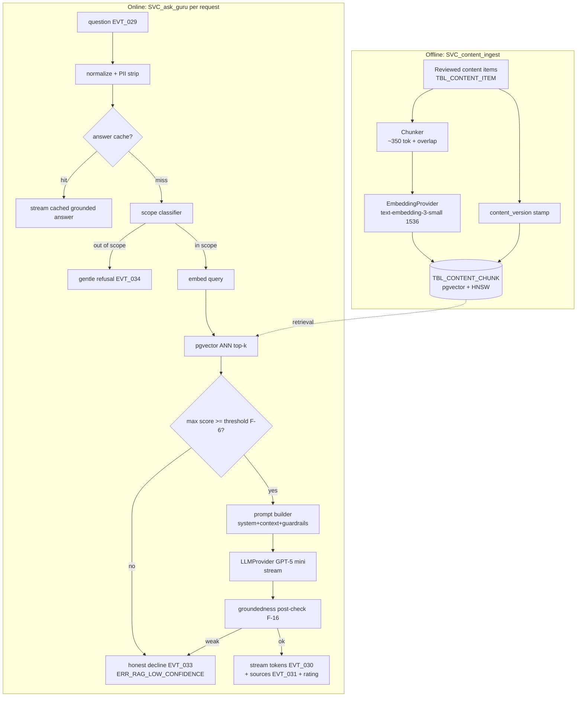
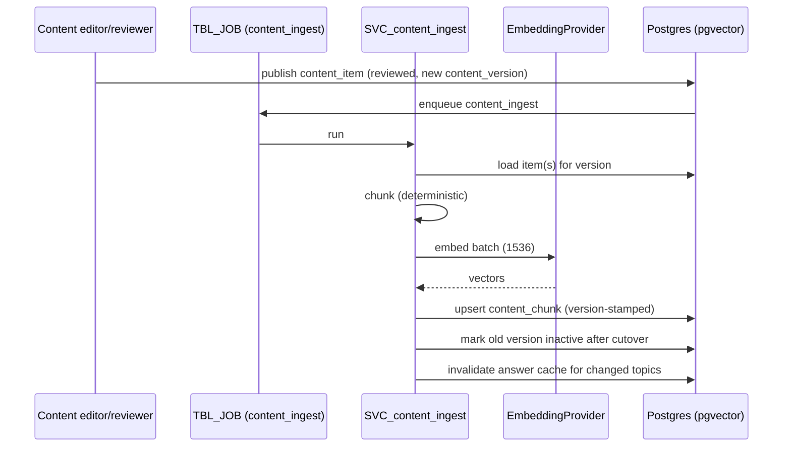

# PanchangPal — Technical Design Document (TDD)
# Part 3 — AI / RAG Subsystem

**Version:** 1.1 (Working Draft — AI Governance added)
**Status:** TDD Part 3 of N — for Architecture Review Board + AI review sign-off
**v1.1 changes (additive → MINOR bump):** Added AI production-governance registries and gates — **§2A AI Model Registry**, **§5A Prompt Registry**, **§8A AI Configuration Registry**, **§10A AI Version Compatibility Matrix**, **§10B AI Release Readiness Review**. No change to the RAG pipeline, retrieval, prompt strategy, confidence thresholds, cost model, streaming, evaluation harness, observability, or product behavior; existing sections and numbering are preserved and only extended.
**Date:** 2026-07-11
**Owner:** AI (per PDD §3.0A.5) · **Reviewers:** Architecture, Backend, Security, QA, Product
**Depends on:** TDD Part 1 (Architecture; ADR-004/011) · TDD Part 2 (`TBL_CONTENT_*`, `TBL_CONVERSATION/MESSAGE/MESSAGE_SOURCE`, `API_POST_ASK_GURU`) · PDD Part 4 §9 (Ask Guru UX) + Annex D1 · MRD Risk §2/§3/§4.
**Source-of-truth hierarchy:** MRD → PRD → PDD → TDD. `[TECHNICAL IMPROVEMENT]` = improvement over an implied approach; `[PRD FOLLOW-UP Fn]` = product decision; `[ASSUMPTION Tn]` = decision where sources are silent.

---

## How to read this document

This is the definitive spec for **Ask Guru** — the RAG-grounded assistant (`SVC_ask_guru`) and its content pipeline (`SVC_content_ingest`). It realizes the PDD's **grounded-or-silent** contract (§9.0), the Annex D1 AI-dependency list, and the resolved model decisions (ADR-011: **GPT‑5 mini** generation + **`text-embedding-3-small`, 1536‑dim** embeddings, behind a provider adapter). It **calibrates the two remaining AI follow-ups** — the retrieval **confidence threshold (`F-6`)** and the **groundedness post-check (`F-16`)** — via an evaluation harness, and models the **AI cost ceiling (`F-11`)**.

**Conventions.** `[MANDATORY]` binding; `[RECOMMENDATION]` strong default. IDs: `API_POST_ASK_GURU`, `SVC_ask_guru`/`SVC_content_ingest`, `TBL_CONTENT_ITEM`/`TBL_CONTENT_CHUNK`, `TBL_CONVERSATION`/`MESSAGE`/`MESSAGE_SOURCE`, `EVT_027`–`EVT_034`/`EVT_054`, `ERR_AI_*`/`ERR_RAG_*`, PDD §9 sections. Model access is always via the `LLMProvider`/`EmbeddingProvider` adapters in `packages/ai` (ADR-011) — no direct SDK calls in feature code.

**Scope of Part 3:** Sections 1–10 (Overview, RAG Architecture, Corpus & Ingestion, Retrieval, Prompt & Guardrails, Generation & Streaming, Conversation Model, Cost & Rate Limiting, Evaluation & Audit, Observability & Readiness). Parts 4–5 (mobile internals; platform/DevOps/security) are not written here. Part 3 ends with the Part 4 prerequisites checklist.

---

# SECTION 1 — AI Subsystem Overview & Principles

## 1.1 What Ask Guru is (and is not)
Ask Guru answers **ritual / festival / panchang** questions from a **reviewed content library**, streams the answer with **visible sources**, and **declines honestly** when it isn't confident. It is **not** an open chatbot, an oracle, or a memory system. It never gives ungrounded specifics (a date, a mantra, a procedure) as fact (PDD §9.0; PRD P0 #4 AC; MRD Risk §3).

## 1.2 Principles `[MANDATORY]`
1. **Grounded or silent.** Generation is constrained to retrieved context; below the confidence threshold Guru returns an honest decline (`EVT_033`, `ERR_RAG_LOW_CONFIDENCE`), never a base-model guess.
2. **Server-side only.** All embedding/generation runs in `SVC_ask_guru`/`SVC_content_ingest`; the OpenAI key never touches the device (TDD Part 1 §1.5/1.9).
3. **Deterministic guardrails around a non-deterministic core.** Scope classifier + prompt guardrails + optional groundedness post-check + a refusal test set bound the model.
4. **Cite always.** Grounded answers attach ≥1 `TBL_MESSAGE_SOURCE` shown as `CMP_SOURCE_CHIP` (`EVT_031`).
5. **No cross-session memory (v1).** Context is the active thread only; retrieval never reads other conversations (AI Non-Goal).
6. **Cost-bounded by construction.** Retrieval caps, token limits, answer/embedding caching, per-user rate limits, and a cost circuit-breaker (MRD Risk §2; `F-11`).
7. **Provider-agnostic.** Everything goes through the `packages/ai` adapters so model/vendor can change without touching callers (ADR-011).
8. **Calm failure.** Timeouts/errors return a retry with **no fabricated content** (`ERR_AI_TIMEOUT`/`ERR_AI_ERROR`).

## 1.3 Quality bar (KPIs, from PDD §9.9)
- **Refusal accuracy ≥ 95%** (correct honest declines vs. false refusals).
- **Answer helpfulness ≥ 75%** (`EVT_032` positive).
- **First streamed token < 2 s**, typical short answer < 6 s (NFR-05).
- **Groundedness ≥ 99%** (near-zero ungrounded specifics) — the trust gate.
- **AI cost ≤ modeled $/WAU ceiling** (§8; `F-11`).

---

# SECTION 2 — RAG Architecture

## 2.1 End-to-end pipeline

**Explanation.** Two paths. **Ingestion** (offline, on content publish) chunks reviewed items, embeds each chunk, and stores it with a `content_version` stamp into `TBL_CONTENT_CHUNK` (HNSW-indexed). **Query** (online, per `API_POST_ASK_GURU`) normalizes + strips PII, checks the answer cache, classifies scope (refuse if out-of-scope), embeds the query, runs pgvector ANN retrieval, gates on the **confidence threshold (`F-6`)** (decline if low), assembles a grounded prompt, streams generation via GPT‑5 mini, runs an optional **groundedness post-check (`F-16`)**, and streams tokens + sources. Every branch maps to a PDD event/error.

## 2.2 Runtime placement
`SVC_ask_guru` runs as a Supabase Edge Function with streaming (SSE) support; it holds the OpenAI key (server secret), enforces rate limits, and reads `TBL_CONTENT_CHUNK` under the service role (content is public-read anyway). `SVC_content_ingest` runs as a background `TBL_JOB` (`job_type=content_ingest`) triggered on content publish (TDD Part 1 §7.10). Both use the `packages/ai` adapters.

---

# SECTION 2A — AI Model Registry

The single source of truth for every AI model in production. All model access is via the `LLMProvider`/`EmbeddingProvider` adapters (ADR-011); this registry governs their lifecycle. `[MANDATORY]` no model reaches production without a registry entry, an owner, and a named rollback version.

## 2A.1 Registered models

| Model ID | Purpose | Provider | Version | Status | Owner | Rollback Version | Last Review |
|---|---|---|---|---|---|---|---|
| `MODEL_GEN_PRIMARY` | Answer generation (RAG) — `PROMPT_RAG_GENERATION` | OpenAI | GPT‑5 mini | Active | AI | (none — launch baseline) | 2026-07-11 |
| `MODEL_EMBED_PRIMARY` | Corpus + query embeddings (1536‑dim) | OpenAI | text-embedding-3-small | Active | AI | (none — launch baseline) | 2026-07-11 |
| `MODEL_CLASSIFIER` | Scope classification — `PROMPT_SCOPE_CLASSIFIER` | OpenAI | GPT‑5 mini (low-token) | Active | AI | rule-based fallback | 2026-07-11 |
| `MODEL_JUDGE` | Groundedness post-check — `PROMPT_GROUNDEDNESS_CHECK` (F-16) | OpenAI | GPT‑5 mini | Active | AI | disable post-check (log-only) | 2026-07-11 |

**Notes.** `MODEL_GEN_PRIMARY`/`MODEL_EMBED_PRIMARY` are the ADR-011 launch baselines (no prior version to roll back to; rollback = revert to the last known-good config once a v2 exists). `MODEL_CLASSIFIER` and `MODEL_JUDGE` may share the GPT‑5 mini deployment but are registered separately because their prompts, SLAs, and rollback paths differ. Embedding-model changes require corpus **re-embedding** (see policy 2A.2 and the compatibility matrix §10A).

## 2A.2 Model replacement policy `[MANDATORY]`
- A model change (provider, model, or version) is a **governed change** (TDD Part 1 §6 ADR + §3.0A.13 change record), never an ad-hoc swap.
- **Embedding-model changes are breaking:** they require a full corpus re-embed and an HNSW rebuild, and must not mix dimensions/models across the active `content_version` (dimension parity, §4/§10A). Treated as a MAJOR change with a migration plan.
- **Generation/classifier/judge model changes** are evaluated against the full eval harness (§9) before promotion; they must meet the §1.3 KPI bar and the §10B readiness gate.
- Model tier escalation (e.g., GPT‑5 mini → a larger model) is allowed only when eval data shows a quality gap that config tuning cannot close (ADR-011 review trigger).

## 2A.3 Upgrade approval workflow `[MANDATORY]`
`Propose (change record + ADR) → eval on staging (§9 CI + full golden/regional) → cost + latency check (§8/§1.3) → AI owner approval + Architecture Review → canary/beta (§10B) → production`. No promotion without a green eval and a verified rollback.

## 2A.4 Rollback process `[MANDATORY]`
Rollback is a **config change via the adapter** (no app release): set the provider/model back to the registry `Rollback Version` and, for embeddings, re-point retrieval to the prior `content_version`'s vectors (kept until the new version is proven). Rollback must be executable within the incident RTO; the runbook (§10.2) names the exact steps. A release is not "Production" until its rollback is verified (§10B).

## 2A.5 Deprecation policy
When a provider deprecates a model (or we retire one), it moves `Active → Deprecated → Retired`. Deprecated models remain callable for the rollback window only; retired model IDs are never reused. Deprecation triggers a scheduled migration (evaluated + released via §2A.3/§10B), tracked as a technical follow-up.

---

# SECTION 3 — Content Corpus & Ingestion Pipeline

## 3.1 Corpus scope & provenance `[MANDATORY]`
The corpus is the **reviewed content library** — the same dataset cross-referenced against Drik Panchang/mPanchang and passed through paid pandit/Jain reviewers (MRD Risk §1/§10; PDD §9.8). v1 covers: ritual how/why, festival significance + observance (per tradition), panchang concepts (tithi/nakshatra/muhurta/Rahu Kaal), and kid-friendly explanations. **RAG must not launch until the corpus is substantively complete** (PRD dependency — not built in parallel). Each `TBL_CONTENT_ITEM` records `reviewed_by`/`reviewed_at` provenance, surfaced as a trust signal (PDD §9.3.3).

## 3.2 Content model (recap, TDD Part 2 §3.11)
`TBL_CONTENT_ITEM` (slug, title, tradition, topic, `content_version`, provenance) → `TBL_CONTENT_CHUNK` (chunk_index, text, `embedding vector(1536)`, token_count, `content_version`). Chunks are the retrieval unit; items are the citation/provenance unit.

## 3.3 Chunking strategy `[RECOMMENDATION]`
- **Semantic-aware, size-bounded chunks:** target **~350 tokens** per chunk with **~15% overlap** (≈50 tokens), split on natural boundaries (headings, paragraphs, ritual steps) rather than mid-sentence. `[ASSUMPTION T8]` — validated against retrieval recall in the eval harness (§9); tune if recall/precision suffers.
- **One concept per chunk where possible** so a citation maps to a coherent idea (better `CMP_SOURCE_CHIP` UX).
- **Metadata carried per chunk:** `tradition_code`, `topic`, `content_item_id`, `content_version` — used as retrieval filters (§4.3).
- **Deterministic chunking** (pure function of item text + config) so re-ingestion is reproducible and diffable.

## 3.4 Embedding `[MANDATORY]`
- Model: **OpenAI `text-embedding-3-small`, 1536 dimensions** via `EmbeddingProvider` (ADR-011). Same model for corpus chunks and query embedding (dimension parity is required for cosine search).
- **Batch** embedding during ingestion (cost/throughput); store the model + `content_version` alongside each vector so a model change forces a controlled re-embed.
- **Normalization:** store raw vectors; use cosine distance (`vector_cosine_ops`) — magnitude-invariant, robust to length.

## 3.5 Ingestion pipeline (`SVC_content_ingest`)

**Explanation.** Publishing a reviewed item (with a new `content_version`) enqueues an ingest job. The pipeline chunks deterministically, batch-embeds, upserts version-stamped chunks, then **cuts over** retrieval to the new version and **invalidates the answer cache** for affected topics. Re-ingestion is idempotent (keyed by `content_item_id` + `chunk_index` + `content_version`). Failures retry with backoff via `TBL_JOB`.

## 3.6 Versioning & cutover `[MANDATORY]`
Retrieval is always scoped to `is_active` + the **latest `content_version`** (TDD Part 2 §6.3). Cutover is atomic per topic; the answer cache key includes `content_version` so stale answers can't survive a content change. An `engine_version`-style bump discipline applies: reviewer sign-off before a version goes active.

---

# SECTION 4 — Retrieval

## 4.1 Index configuration `[MANDATORY]`
- **HNSW** on `content_chunk.embedding` with `vector_cosine_ops`. `[RECOMMENDATION]` launch params **`m = 16`, `ef_construction = 64`**; query-time **`ef_search = 40`** (tuned in §9 against the corpus). HNSW chosen over IVFFlat for better recall at low latency on a small-to-medium corpus with no training step (resolves TDD Part 1 §10.2 item 2).
- Rebuild/adjust params is a documented trigger if recall or p95 retrieval latency regresses as the corpus grows (TRISK-07).

## 4.2 Query flow
1. **Normalize** the question (trim, lowercase for cache key, strip obvious PII); enforce ≤ 500 chars (PDD P2-A4).
2. **Answer-cache lookup** (§8.3) keyed by normalized-question + `content_version` + `tradition_code`.
3. **Embed** the query (`text-embedding-3-small`).
4. **ANN search**: `top-k = 6` (`[ASSUMPTION T9]`, tuned in §9) with cosine similarity, filtered by scope (§4.3).
5. **Confidence gate** (§4.4).

## 4.3 Retrieval filtering
Filter candidates by `is_active`, latest `content_version`, and — when known — the user's `tradition_code` (fall back to `generic` if a regional chunk is absent), plus topic hints from the scope classifier. This keeps regional answers correct (PDD P0 #2) and shrinks the search space.

## 4.4 Confidence threshold (`F-6`) — calibrated, not guessed `[MANDATORY]`
The decision to answer vs. decline is a **thresholded retrieval confidence**, defined as a function of the top-k cosine similarities (e.g., max similarity and the mean of the top-3), plus a minimum count of chunks above a floor. `[RECOMMENDATION]` start with **cosine similarity ≥ 0.78 for the top chunk AND ≥ 2 chunks ≥ 0.72**, then **calibrate against the eval set (§9)** to hit refusal accuracy ≥ 95% with acceptable answer coverage. The threshold is **server-tunable config** (not hard-coded) so it can be adjusted post-launch on real refusal-accuracy/helpfulness data. Below threshold → `EVT_033` honest decline (`ERR_RAG_LOW_CONFIDENCE`); empty retrieval → `ERR_RAG_EMPTY`. This **resolves `F-6`** with a calibration method and a tunable default.

`[TECHNICAL IMPROVEMENT]` optionally add a lightweight **reranker** (cross-encoder or LLM-as-reranker on the top-k) if precision@k proves insufficient in eval — deferred unless the eval shows a gap (cost/latency trade-off).

---

# SECTION 5 — Prompt Engineering & Guardrails

## 5.1 Scope classifier (pre-retrieval) `[MANDATORY]`
A fast **in-scope / out-of-scope** gate before embedding, to refuse cheaply and safely. `[RECOMMENDATION]` a small prompt to GPT‑5 mini (or a cheaper classifier) returning `{in_scope: bool, topic, reason}`. **In scope:** rituals, festivals, vrats, panchang concepts, how/why observance, kid-friendly explanations. **Out of scope → gentle refusal (`EVT_034`):** astrology/kundli/horoscope predictions, medical, legal, financial, political/communal, personal predictions, individualized religious authority. The classifier is part of the refusal test set (§9).

## 5.2 System prompt & context assembly `[MANDATORY]`
The prompt builder (`packages/ai`) assembles: a **system instruction** (identity, scope, grounding rule, tone, safety, "cite sources", "if the context doesn't support an answer, say you don't have verified information"), the **retrieved chunks** (with their `content_item` titles for citation), and the **user question** + minimal in-thread context. **Hard rules encoded in the system prompt:**
- Answer **only** from the provided context; if unsupported, decline with the honest-limits line (PDD §9.5).
- **Never** invent dates, mantras, procedures, or citations.
- Warm, humble, non-sectarian, apolitical, child-appropriate tone (households include youth).
- Do not impersonate a specific named religious authority.
- Keep answers concise; offer to go deeper.

`[MANDATORY]` context is **token-budgeted** (cap retrieved context, e.g., ≤ ~2k tokens) to control cost/latency and avoid dilution.

## 5.3 Guardrails & jailbreak resistance `[MANDATORY]`
- **Instruction hierarchy:** system rules outrank user content; the builder never lets retrieved or user text override scope/grounding (prompt-injection defense — treat retrieved content as data, not instructions).
- **Refusal test set** (Risk §4): adversarial + out-of-scope + jailbreak prompts asserted to refuse; runs in CI (§9.4).
- **PII handling:** strip/avoid persisting PII in prompts/logs (Part 1 §1.5); no user PII sent to the model beyond the question text needed to answer.
- **Output safety:** a light output check for disallowed content (impersonation, medical/financial directives) before final delivery; on trip → refuse.

## 5.4 Refusal taxonomy (deterministic outcomes)
| Outcome | Trigger | Event | Error | Copy (PDD §13.5) |
|---|---|---|---|---|
| `refused` | out-of-scope (classifier/output check) | EVT_034 | — | "That's outside what I can help with…" |
| `declined` | retrieval below threshold / empty | EVT_033 | ERR_RAG_LOW_CONFIDENCE / ERR_RAG_EMPTY | "I don't have verified information on this one…" |
| `error` | LLM/timeout/error | EVT_054 | ERR_AI_TIMEOUT / ERR_AI_ERROR | "I'm having trouble right now — try again." |
| `grounded` | above threshold + generated + post-check ok | EVT_030/031 | — | (the answer + sources) |

---

# SECTION 5A — Prompt Registry

The single source of truth for every production prompt. Prompts are **versioned artifacts** in `packages/ai` (not inline strings, §5.2) and are governed like code (change record + eval before promotion). `[MANDATORY]` no prompt reaches production without a registry entry and an owner. **Full prompt text is intentionally not reproduced here** — this registry is metadata only; the text lives in `packages/ai` under version control.

| Field | Meaning |
|---|---|
| Prompt ID · Owner · Version | stable ID, accountable owner (AI), semver |
| Inputs / Outputs | what it receives / the shape it must return |
| Dependencies | models (§2A), config (§8A), corpus/version |
| Failure Modes | how it can fail + the safe fallback |
| Review Frequency | cadence for re-review |

### PROMPT_SYSTEM_001 — Guru system instruction
- **Purpose:** identity, scope, grounding rule, tone, safety, cite-sources, honest-limits (§5.2). **Owner:** AI. **Version:** 1.0.0.
- **Inputs:** none (static system frame) + injected guardrail directives. **Outputs:** system message consumed by `PROMPT_RAG_GENERATION`.
- **Dependencies:** `MODEL_GEN_PRIMARY`; tone/scope rules (PDD §9.6). **Failure Modes:** scope creep / injected override → mitigated by instruction hierarchy (§5.3); on doubt, decline. **Review Frequency:** each model change + quarterly.

### PROMPT_SCOPE_CLASSIFIER — In/out-of-scope gate
- **Purpose:** pre-retrieval scope classification (§5.1). **Owner:** AI. **Version:** 1.0.0.
- **Inputs:** user question. **Outputs:** `{in_scope: bool, topic, reason}`.
- **Dependencies:** `MODEL_CLASSIFIER`; refusal test set (§9). **Failure Modes:** false-negative (lets out-of-scope through → caught by output check) / false-positive (over-refusal → tracked via refusal accuracy). **Review Frequency:** each refusal-set update + monthly.

### PROMPT_RAG_GENERATION — Grounded answer generation
- **Purpose:** produce a concise, grounded answer strictly from retrieved context (§5.2/§6.1). **Owner:** AI. **Version:** 1.0.0.
- **Inputs:** `PROMPT_SYSTEM_001` frame + retrieved chunks (token-budgeted) + user question + light thread context. **Outputs:** streamed answer tokens (SSE) + the chunks that informed it (for citations).
- **Dependencies:** `MODEL_GEN_PRIMARY`; retrieval config (§8A: Top‑K, Max Context Tokens, Temperature). **Failure Modes:** unsupported claim (caught by `PROMPT_GROUNDEDNESS_CHECK`/F-16) / timeout (`ERR_AI_TIMEOUT`, no fabrication). **Review Frequency:** each model/threshold change + quarterly.

### PROMPT_GROUNDEDNESS_CHECK — Post-generation verification (F-16)
- **Purpose:** verify answer claims are supported by retrieved context; downgrade weak answers to decline (§6.3). **Owner:** AI. **Version:** 1.0.0.
- **Inputs:** (answer, retrieved context). **Outputs:** `{supported: bool, unsupported_spans?}`.
- **Dependencies:** `MODEL_JUDGE`; config (§8A: Groundedness Check Enabled, risk-topic list). **Failure Modes:** judge error/latency → run async-for-logging (non-blocking) except risk topics; on judge failure for risk topics, fail safe (decline). **Review Frequency:** monthly + on calibration change.

### PROMPT_DECLINE_RESPONSE — Honest decline / refusal copy
- **Purpose:** render the honest-limits decline and the safe alternatives (§5.4; PDD §9.5/§13.5). **Owner:** AI + Content. **Version:** 1.0.0.
- **Inputs:** decline reason (`declined`/`refused`) + optional related-topic suggestion. **Outputs:** calm user-facing message + action affordances (rephrase / related topic / ask-a-temple).
- **Dependencies:** UX copy (PDD §13.5), refusal taxonomy (§5.4). **Failure Modes:** tone drift → copy is reviewed content, not free-generated. **Review Frequency:** with any copy/tone review.

**Governance.** A prompt change follows the same gate as code/model: change record → eval (§9 CI, incl. refusal + golden subset) → owner approval → §10B readiness → release. Prompt versions are pinned in the compatibility matrix (§10A) so a prompt never drifts from the model/corpus it was validated against.

---

# SECTION 6 — Generation & Streaming

## 6.1 Generation `[MANDATORY]`
Generation via `LLMProvider` → **GPT‑5 mini** (ADR-011), temperature low (`[RECOMMENDATION]` ~0.2–0.3 for factual consistency), max output tokens bounded (concise answers, PDD §9). The model receives only the assembled grounded prompt (§5.2). Deterministic-ish output aids the groundedness post-check and caching.

## 6.2 Streaming (SSE) `[MANDATORY]`
`SVC_ask_guru` streams via Server-Sent Events to `SCR_GURU_CHAT_001` (TDD Part 2 §5.4 contract): `token` events append to `CMP_AI_CHAT_BUBBLE`; a `sources` event attaches `CMP_SOURCE_CHIP`s on/near completion; a `done` event carries `{message_id, outcome, error_code?}`. **First token < 2 s** (NFR-05); the client announces streamed text via a **polite, batched** screen-reader live region (PDD §9.3.2/§10). On stream error mid-way, deliver a coherent partial only if safe, else discard + retry — **never present a half-sentence as complete** (PDD §9.4).

## 6.3 Groundedness post-check (`F-16`) `[RECOMMENDATION]` — resolves the follow-up
After generation (or on the completed stream), an optional **groundedness verification** checks that the answer's claims are supported by the retrieved chunks. `[RECOMMENDATION]` implement as a cheap **LLM-as-judge** call (GPT‑5 mini) returning `{supported: bool, unsupported_spans?}` over (answer, context); if `supported = false`, **downgrade to an honest decline** rather than show the answer. It runs **asynchronously for logging on every answer** (audit metric) and **synchronously (blocking) only for higher-risk topics** (`[ASSUMPTION T10]` — e.g., specific dates/procedures) to protect the < 2 s perceived latency (the post-check adds latency, so gate it). Calibrated in §9; toggle + risk-topic list are server config. This **resolves `F-16`** with a concrete mechanism and a latency-aware policy.

## 6.4 Source citation `[MANDATORY]`
The grounded answer records `TBL_MESSAGE_SOURCE` rows (title, `content_chunk_id`, score) for the chunks that actually informed the answer (top contributors), surfaced as `CMP_SOURCE_CHIP` (`EVT_031`). Tapping a chip opens the source (`CMP_INFO_SHEET`) so the user can verify (PDD §9.3.3). Reviewed provenance may be shown ("Reviewed content").

---

# SECTION 7 — Conversation Model & History

## 7.1 In-session context, no long-term memory `[MANDATORY]`
A conversation (`TBL_CONVERSATION`) holds an ordered thread of `TBL_MESSAGE`. Within an active thread, prior turns provide **light context** (for follow-ups) but retrieval is **per-question** and **never reads other conversations** — there is **no cross-session/long-term memory** (AI Non-Goal; privacy + trust). History (`SCR_GURU_HISTORY_001`) shows stored transcripts and can continue a thread in-session; a new question doesn't silently draw on old threads (PDD §9.3.4).

## 7.2 Context window policy
Follow-up context is bounded (`[ASSUMPTION T11]` last ~4 turns or a token cap) and is **retrieved-context-first**: even in a thread, the answer is grounded in freshly retrieved chunks, not just conversational memory. This prevents drift and keeps every answer grounded.

## 7.3 Storage & privacy
Conversations/messages are owner-only (RLS, TDD Part 2 §3.12), soft-deletable, and carry `outcome`/`first_token_ms`/`error_code` for analytics (§9.9). No PII beyond what the user typed; deletion removes the thread (`F-3`).

---

# SECTION 8 — Cost Controls & Rate Limiting

## 8.1 AI cost model (`F-11`) `[MANDATORY]`
Model per-answer cost = query embedding + (classifier tokens) + (retrieved-context + generated tokens at GPT‑5 mini rates) + (optional post-check). `[RECOMMENDATION]` compute a **$/WAU ceiling** from: expected Ask-Guru WAU (target ≥ 25% of WAU, PDD Goal 3) × questions/user/week × per-answer cost × (1 − cache-hit-rate). This model + the levers below set the ceiling that governs whether/what free-tier AI limits apply (a monetization decision, `F-11`). **[PRD FOLLOW-UP F-11]** remains product-owned (pricing), but this section gives the cost function and the controls to stay within any ceiling.

## 8.2 Cost levers `[MANDATORY]`
- **Answer cache** for high-frequency evergreen/suggested questions (§8.3) — biggest lever; grounded answers are cacheable by question+version.
- **Embedding cache** for repeated/suggested queries.
- **Token budgets:** cap retrieved context (~2k tok) and output length.
- **Cheap classifier + gate before generation** so out-of-scope/low-confidence questions never reach the expensive generation call.
- **Model tier via adapter:** GPT‑5 mini is the cost-efficient default; escalate only if quality data demands (ADR-011).

## 8.3 Answer & embedding caching `[TECHNICAL IMPROVEMENT]`
Cache grounded answers keyed by `(normalized_question, tradition_code, content_version)` with a TTL and content-version invalidation (§3.6). Suggested/contextual questions (`API_GET_GURU_SUGGESTIONS`) are prime cache candidates. Cache stores the answer + its sources so citations survive a cache hit. Personalization is minimal (tradition only), keeping hit rates high.

## 8.4 Rate limiting & abuse `[MANDATORY]`
Per-user and per-IP limits on `API_POST_ASK_GURU` (strictest AI endpoint), plus a global **cost circuit-breaker**: when spend approaches the budget ceiling, degrade gracefully to "Guru is busy — try again shortly" (a calm `ERR_AI_ERROR`-style state) **before** blowing the budget (MRD Risk §2). Anonymous users may have tighter limits (abuse control, ADR-009). Limits are server config.

---

# SECTION 8A — AI Configuration Registry

Every operational AI parameter is **configuration-driven, versioned, and server-tunable — never hard-coded** (`[MANDATORY]`, reaffirming TDD Part 1 §3.0A.8). Values live in a governed config store (e.g., a `ai_config` table / typed config in `packages/ai`), are read at request time (with a short cache), and are auditable. Changing a value is a change record; the *default* values below are the launch settings established in Sections 3–8 (this registry centralizes them, it does not change them).

| Configuration Key | Description | Default Value | Location | Change Approval |
|---|---|---|---|---|
| `ai.retrieval.top_k` | chunks retrieved per query (§4.2) | 6 (`T9`) | `ai_config` | AI + eval (§9) |
| `ai.chunk.size_tokens` | target chunk size (§3.3) | ~350 (`T8`) | ingestion config | AI + eval; re-ingest |
| `ai.chunk.overlap_pct` | chunk overlap (§3.3) | 15% (~50 tok) | ingestion config | AI + eval; re-ingest |
| `ai.retrieval.confidence_threshold` | answer-vs-decline gate (§4.4, F-6) | top≥0.78 AND ≥2 chunks≥0.72 | `ai_config` | AI + eval (§9.3) |
| `ai.retrieval.ef_search` | HNSW query breadth (§4.1) | 40 | `ai_config`/index | AI + eval |
| `ai.context.max_tokens` | retrieved-context cap (§5.2) | ~2000 | `ai_config` | AI |
| `ai.generation.max_output_tokens` | answer length cap (§6.1) | bounded/concise | `ai_config` | AI |
| `ai.generation.temperature` | generation temperature (§6.1) | ~0.2–0.3 | `ai_config` | AI |
| `ai.streaming.enabled` | SSE streaming (§6.2) | true | `ai_config` | AI + Architecture |
| `ai.groundedness.enabled` | post-check on/off (§6.3, F-16) | true (async all; sync risk-topics) | `ai_config` | AI |
| `ai.groundedness.risk_topics` | topics that force sync post-check | {specific dates, procedures, mantras} (`T10`) | `ai_config` | AI |
| `ai.cache.answer_ttl` | grounded-answer cache TTL (§8.3) | tuned; version-invalidated | `ai_config` | AI |
| `ai.cache.embedding_ttl` | query-embedding cache TTL (§8.3) | tuned | `ai_config` | AI |
| `ai.ratelimit.per_user` | Ask Guru per-user rate limit (§8.4) | server-set (tighter for anon) | `ai_config` | AI + Security |
| `ai.ratelimit.per_ip` | per-IP rate limit (§8.4) | server-set | `ai_config` | AI + Security |
| `ai.cost.ceiling` | $/WAU (or window) budget → circuit-breaker (§8.1, F-11) | modeled; product-owned | `ai_config` | AI + Product |
| `ai.model.generation` | active generation model id (§2A) | `MODEL_GEN_PRIMARY` | model registry | AI + Architecture |
| `ai.model.embedding` | active embedding model id (§2A) | `MODEL_EMBED_PRIMARY` | model registry | AI + Architecture (breaking) |

**Rules.** (1) No AI parameter is compiled into code; all read from config. (2) Changes to threshold/top-k/chunking require an eval pass (§9) before promotion. (3) Model keys are governed by §2A (embedding changes are breaking). (4) Cost ceiling ties to the circuit-breaker (§8.4) and to `F-11` (product-owned). (5) Every change is recorded and reflected in the compatibility matrix (§10A) where it affects validated combinations.

---

# SECTION 9 — Evaluation & Hallucination-Audit Harness

The harness is how we **calibrate `F-6`/`F-16`**, keep quality above the KPIs (§1.3), and prevent regressions. `[MANDATORY]` it is a CI gate and a periodic production audit.

## 9.1 Evaluation datasets
- **Golden Q&A set** (`[RECOMMENDATION]` ~150–300 curated questions) with reviewer-approved expected answers/sources, spanning traditions and topics. Used for answer quality + citation correctness.
- **Should-decline set:** questions the corpus genuinely cannot ground (out-of-corpus specifics) — asserts honest declines fire (refusal accuracy).
- **Out-of-scope / adversarial / jailbreak set** (Risk §4): asserts scope refusals and injection resistance.
- **Regional set:** same question across traditions asserts correct variant grounding (PDD P0 #2).

## 9.2 Metrics
| Metric | Target | How |
|---|---|---|
| Refusal accuracy | ≥ 95% | should-decline + out-of-scope sets vs. actual outcomes |
| Groundedness | ≥ 99% | LLM-judge + human spot-check on golden set (no unsupported specifics) |
| Answer helpfulness | ≥ 75% | reviewer rating on golden set + prod `EVT_032` |
| Citation correctness | high | sources actually support the answer (judge + spot-check) |
| Retrieval recall@k / precision@k | tuned | golden set with known relevant chunks |
| First-token latency | < 2 s | timed eval + prod `first_token_ms` |
| Cost/answer | ≤ model | token accounting |

## 9.3 Threshold & param calibration (resolves F-6/F-16 in practice)
Sweep the **confidence threshold** and **top-k**/`ef_search` across the eval sets to find the operating point maximizing answer coverage subject to **refusal accuracy ≥ 95%** and **groundedness ≥ 99%**; likewise decide when the **groundedness post-check** runs synchronously (risk topics) vs. async (logging) by its measured latency/precision. Record the chosen config; re-run on any model/corpus change.

## 9.4 CI gates & cadence `[MANDATORY]`
- **CI (per change to prompt/pipeline/model/threshold):** run the should-decline + out-of-scope + a golden subset; **block merge** on refusal-accuracy or groundedness regressions.
- **Pre-release:** full golden + regional eval.
- **Production hallucination audit (periodic, MRD §14):** sample real answers, run groundedness judge + human review, track refusal accuracy from `EVT_033/034` and helpfulness from `EVT_032`; feed misses back into corpus/threshold (a closed loop).

## 9.5 Human-in-the-loop
Reviewer feedback on flagged answers updates the corpus (add/fix content) or the threshold; thumbs-down (`EVT_032` + reason) is triaged into the content/RAG backlog (PDD §9.7).

---

# SECTION 10 — Observability, Safety Ops & Readiness

## 10.1 Observability `[MANDATORY]`
Per request, log (structured, no PII, with `correlation_id`): outcome (`grounded/declined/refused/error`), top-k scores, chosen threshold, `first_token_ms`, tokens in/out, model, `content_version`, cost estimate, cache hit/miss. Dashboards: **AI Trust** (refusal accuracy, groundedness, helpfulness), **AI Latency** (first-token, total), **AI Cost** ($/answer, $/WAU vs. ceiling), **Retrieval** (recall/precision, score distributions). Alerts on: refusal-accuracy drop, groundedness drop, latency breach, cost-ceiling approach (circuit-breaker), error-rate spike. Ties to PDD §9.9 + TDD Part 1 §1.10.

## 10.2 Safety operations
Runbook for: a content error found in production (hotfix content → re-ingest → cache invalidate), a jailbreak discovered (add to refusal set → tighten guardrail → redeploy), a cost spike (circuit-breaker + investigate), a model regression (roll back model via adapter config). All are config/content changes — no app release needed (ADR-011/013 adapters).

## 10.3 Maturity assessment
**Ready to build the AI subsystem, conditional on the corpus being substantively complete before launch** (PRD dependency; PDD §9.8). The grounded-or-silent contract, threshold/post-check calibration method, cost controls, and eval harness are specified and testable. `F-6` and `F-16` are **resolved as calibrated, tunable mechanisms**; `F-11` has a cost function + controls (pricing decision stays product-owned).

## 10.4 Assumptions raised in Part 3
`T8` ~350-token chunks + 15% overlap · `T9` top-k = 6 · `T10` synchronous post-check only for risk topics · `T11` follow-up context ~4 turns/token cap. All are eval-tunable (§9).

## 10.5 Compatibility statement
Consistent with MRD v2, PRD v2, PDD (esp. §9 + Annex D1), and TDD Parts 1–2. Realizes grounded-or-silent RAG, honest decline (`EVT_033`), scope refusal (`EVT_034`), streaming + sources (`EVT_030/031`), no cross-session memory, and the `ERR_AI_*/ERR_RAG_*` handling — with the resolved model decisions (ADR-011). No product requirement modified; improvements marked `[TECHNICAL IMPROVEMENT]`; pricing stays `[PRD FOLLOW-UP F-11]`.

## 10A — AI Version Compatibility Matrix

AI subsystems must move together. A change to any one component below can invalidate the others; this matrix prevents **version drift** (e.g., an embedding model that no longer matches the corpus vectors, or a prompt validated against a different model). `[MANDATORY]` a production configuration is a **named, tested bundle** of these versions — not an à-la-carte mix.

### 10A.1 Current validated bundle — `AISET-2026.07` (launch baseline)

| Component | Version / ID | Notes |
|---|---|---|
| Generator model | `MODEL_GEN_PRIMARY` — GPT‑5 mini | §2A |
| Embedding model | `MODEL_EMBED_PRIMARY` — text-embedding-3-small (1536) | dimension-locked to corpus |
| Prompt set | `PROMPT_SYSTEM_001` 1.0.0 · `PROMPT_RAG_GENERATION` 1.0.0 · `PROMPT_SCOPE_CLASSIFIER` 1.0.0 · `PROMPT_GROUNDEDNESS_CHECK` 1.0.0 · `PROMPT_DECLINE_RESPONSE` 1.0.0 | §5A |
| Corpus version | `content_version` = launch | §3.6 |
| Chunking version | chunk cfg v1 (~350 tok / 15% overlap) | §3.3 |
| Retrieval config | top_k=6, ef_search=40, threshold=v1 (§8A) | §4 |
| Groundedness checker | `MODEL_JUDGE` + `PROMPT_GROUNDEDNESS_CHECK` 1.0.0 | §6.3 |
| Evaluation dataset | eval set v1 (golden/should-decline/out-of-scope/regional) | §9.1 |

### 10A.2 Compatibility rules `[MANDATORY]`
| If you change… | You must also… | Change class |
|---|---|---|
| **Embedding model/dimension** | re-embed the **entire corpus**, rebuild HNSW, re-run retrieval calibration + full eval | **Breaking (MAJOR)** — corpus + embedding versions are dimension-locked |
| **Corpus (`content_version`)** | re-ingest/embed changed items, invalidate answer cache, re-run golden/regional eval | Minor–Major (per scope) |
| **Chunking config** | re-ingest affected corpus, re-run retrieval calibration + eval | Breaking for retrieval |
| **Generator model** | re-run full eval (§9), re-validate prompts, cost/latency check | Major |
| **Prompt version** | re-run eval subset (refusal + golden), pin to model/corpus | Minor–Major |
| **Retrieval config / threshold** | re-run calibration (§9.3) + refusal accuracy check | Minor |
| **Groundedness checker/prompt** | re-validate on golden + risk-topic set | Minor |
| **Evaluation dataset** | version it; re-baseline metrics (don't silently move targets) | Minor |

### 10A.3 Upgrade & rollback compatibility
- **Upgrade** = promote a new named bundle (`AISET-YYYY.MM`) only after §10B passes; never upgrade a single component in isolation in production.
- **Rollback** = revert to the last validated bundle as a unit (models via adapter config §2A.4, corpus via retained prior `content_version`, prompts via pinned versions). Because embedding+corpus are dimension-locked, **retain the prior version's vectors until the new bundle is proven** so rollback stays valid. Rollback compatibility is verified as part of §10B.

---

## 10B — AI Release Readiness Review

`[MANDATORY]` No AI change ships to production until this review passes for the target bundle (§10A). It complements the general readiness (§10.3) with AI-specific gates.

### 10B.1 Release checklist
✓ **Golden Dataset Pass** — golden Q&A eval green (§9.1) · ✓ **Refusal Accuracy Target** ≥ 95% (§1.3/§9.2) · ✓ **Groundedness Target** ≥ 99% (§9.2) · ✓ **Latency Target** first token < 2 s (NFR-05) · ✓ **Cost Target** ≤ `ai.cost.ceiling` (§8A/F-11) · ✓ **Prompt Review Complete** (§5A owners) · ✓ **Corpus Review Complete** (reviewer sign-off, §3.1) · ✓ **Security Review Complete** (guardrails/injection/rate limits, §5.3/§8.4) · ✓ **Privacy Review Complete** (no PII in prompts/logs, §5.3/§7.3) · ✓ **Accessibility Review Complete** (streaming SR announcements, §6.2/PDD §10) · ✓ **Rollback Plan Verified** (§2A.4/§10A.3) · ✓ **Monitoring Dashboard Active** (§10.1) · ✓ **Alerts Configured** (§10.1) · ✓ **Documentation Updated** (registries §2A/§5A/§8A + matrix §10A) · ✓ **Architecture Review Approved**.

### 10B.2 Release metadata
- **Release Status:** `Draft → Internal → Beta → Production` — advance only as each stage's gates pass (Internal = team, Beta = limited cohort/canary, Production = general).
- **Rollback Available:** **Yes / No** — a release **may not** be marked `Production` with Rollback Available = No (§10A.3). Launch baseline `AISET-2026.07`: Rollback Available = No *(no prior bundle exists)* → mitigated by conservative launch config + circuit-breaker + fast content/config hotfix path (§10.2); the **first** post-launch bundle establishes a rollback target.
- **Bundle:** the `AISET-YYYY.MM` id being released (§10A.1). **Approver:** AI owner + Architecture. **Date / eval-run ref:** recorded.

---

## 10.6 Prerequisites checklist before starting TDD Part 4 (Mobile App Architecture)
☐ **`packages/ai` adapters** (`LLMProvider`/`EmbeddingProvider`/prompt builder/guardrails) implemented + unit-tested.
☐ **`SVC_content_ingest`** built; **corpus ingested** and version-active (launch dependency).
☐ **HNSW index** created with launch params; retrieval latency measured.
☐ **Threshold + top-k + post-check policy calibrated** on the eval sets (§9.3); config recorded.
☐ **Refusal test set** green in CI (§9.4).
☐ **`SVC_ask_guru`** streaming endpoint conformant to the `API_POST_ASK_GURU` SSE contract (TDD Part 2 §5.4).
☐ **Answer/embedding caches + rate limits + cost circuit-breaker** in place; cost model computed vs. any `F-11` ceiling.
☐ **AI dashboards + alerts** live (§10.1).
☐ **Client streaming/accessibility contract** (polite batched SR announcements, typing indicator, source chips) ready for the mobile build.

**On completion, proceed to TDD Part 4 — Mobile App Architecture (navigation, state, offline queue & sync implementation, caching, feature-slice structure, and the client-side of streaming/notifications/IAP).**

---

*End of TDD Part 3 — AI / RAG Subsystem. Awaiting Architecture Review Board + AI review sign-off before Part 4.*