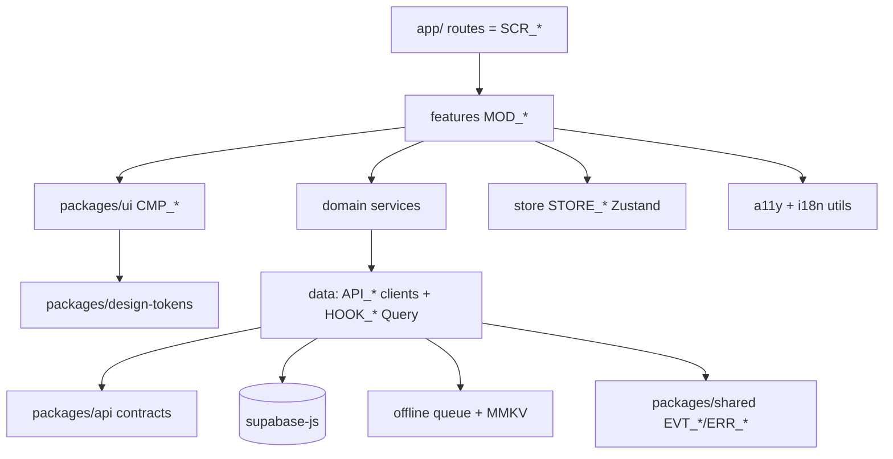

# PanchangPal — Technical Design Document (TDD)
# Part 4 — Mobile App Architecture

**Version:** 1.0 (Working Draft)
**Status:** TDD Part 4 of N — for Architecture Review Board sign-off
**Date:** 2026-07-11
**Owner:** Mobile (per PDD §3.0A.5) · **Reviewers:** Architecture, Backend, AI, Design, QA, Accessibility
**Depends on:** TDD Part 1 (Architecture; ADRs) · TDD Part 2 (`API_*`, `TBL_*`, RLS) · TDD Part 3 (`SVC_ask_guru` SSE contract) · PDD Parts 1–5 (`SCR_*`, `CMP_*`, tokens, flows, `EVT_*`, `ERR_*`).
**Source-of-truth hierarchy:** MRD → PRD → PDD → TDD. `[TECHNICAL IMPROVEMENT]` = improvement over an implied approach; `[PRD FOLLOW-UP Fn]` = product decision; `[ASSUMPTION Tn]` = decision where sources are silent.

---

## How to read this document

This is the definitive **client** architecture for the React Native (Expo) app: navigation, state, the data layer, **offline-first caching/queue/sync**, and the client side of AI streaming, notifications, and IAP. It implements the PDD screens/components/flows on the TDD Part 1–3 backend. It contains no product decisions — it engineers the already-approved UX.

**Conventions.** `[MANDATORY]` binding; `[RECOMMENDATION]` strong default (ADR to override). IDs: PDD `SCR_*`/`CMP_*`/tokens/`FLOW_*`/`EVT_*`/`ERR_*`; TDD `SVC_*`/`TBL_*`/`API_*`. New client identifiers use `STORE_*` (Zustand stores), `HOOK_*` (query hooks), `MOD_*` (feature modules). Baseline libs (TDD Part 1 §3): Expo Router, Zustand, TanStack Query, `supabase-js`, MMKV (persistence), `expo-notifications`, `react-native-purchases` (RevenueCat), Reanimated (native-driver motion), `i18next`.

**Scope of Part 4:** Sections 1–10 (Overview, Structure, Navigation, State, Data Layer, Offline-First, Client Subsystems, Performance, A11y/i18n/Theming, Security/Observability/Testing/Readiness). Part 5 (platform/DevOps/security/release) is not written here. Part 4 ends with the Part 5 prerequisites checklist.

---

# SECTION 1 — Mobile Architecture Overview & Principles

## 1.1 Shape of the app
A **feature-sliced, layered React Native app** with a strict dependency direction, an **offline-first data layer** (TanStack Query + MMKV + a durable mutation queue), and thin **client adapters** to backend subsystems (Supabase, `SVC_ask_guru` SSE, Expo Push, RevenueCat). The UI is composed exclusively from `packages/ui` (`CMP_*`) bound to `packages/design-tokens`.

## 1.2 Principles `[MANDATORY]`
1. **Cached-first, offline-complete.** The daily loop renders from cache and works with no network (TDD Part 1 §1.6/1.7; PDD Flow E5). The network is an enhancement.
2. **Strict layering.** `routes → features → domain → data → packages`; UI never touches the network; domain never imports UI (TDD Part 1 §5). Enforced by lint.
3. **Two state systems, clearly split.** **TanStack Query** owns server state (cache/fetch/sync); **Zustand** owns client/UI/session/queue state. No server data duplicated into Zustand.
4. **Contracts, not shapes.** All I/O goes through typed `API_*` clients from `packages/api` (zod-validated); the app never hand-rolls a request.
5. **Tokens/components only.** No hard-coded colors/spacing/motion; screens compose `CMP_*` (PDD §3.0A.8). Reduced-Motion and Dynamic Type are built in, not retrofitted.
6. **Every error maps to `ERR_*` → copy + `EVT_054`.** No raw errors surfaced.
7. **Optimistic + reconcilable.** Mutations apply optimistically and durably queue; the server reconciles (client-authoritative daily completion, PDD A4).
8. **Testable seams.** Domain services and adapters are injectable for tests (TDD Part 1 §3 #25).

## 1.3 Layer responsibilities
| Layer | Owns | May import |
|---|---|---|
| **routes** (`app/`) | Expo Router files = `SCR_*` mount points, deep-link routing | features |
| **features** (`MOD_*`) | screen composition, view logic per PDD area | domain, data, packages/ui, store |
| **domain** | pure business logic (streak view, ritual progress, tithi display, household rules) | data, packages/shared |
| **data** | `API_*` clients, `HOOK_*` query hooks, supabase-js, offline queue integration | packages/api, packages/shared |
| **store** (`STORE_*`) | session, offline queue, prefs, ephemeral UI state (Zustand) | packages/shared |
| **packages** | ui/tokens/api/shared/ai (cross-cutting) | — |

---

# SECTION 2 — App Structure & Module Boundaries

## 2.1 Feature slices (`MOD_*`)
One slice per PDD tab/area (mirrors TDD Part 1 §2.3 + repo §4):
| Module | Screens | Domain |
|---|---|---|
| `MOD_onboarding` | SCR_SPLASH_001, SCR_ONBOARDING_* | activation, permissions priming |
| `MOD_auth` | SCR_AUTH_*, deferred-auth + merge triggers | session, anon→auth |
| `MOD_today` | SCR_HOME_001, SCR_PANCHANG_DETAIL_001, SCR_RITUAL_001 | daily loop, ritual progress, streak |
| `MOD_calendar` | SCR_CALENDAR_*, SCR_FESTIVAL_DETAIL_001, SCR_PERSONAL_DATE* | calendar, festivals, personal dates |
| `MOD_guru` | SCR_GURU_* | Ask Guru client (SSE) |
| `MOD_you` | SCR_PROFILE_001, SCR_HOUSEHOLD_*, SCR_ACHIEVEMENTS_001, SCR_SUBSCRIPTION_001, SCR_SETTINGS_001, SCR_DELETE_ACCOUNT_001 | household, subscription, settings, account |

## 2.2 Module boundary rules `[MANDATORY]`
- **No cross-feature imports.** Shared UI → `packages/ui`; shared logic → `packages/shared`/`domain`. A feature never imports another feature.
- **Each feature exposes** a route entry + a small public API (screens/hooks); internals are private.
- **Contextual cross-links** (e.g., "Ask about this" from ritual/festival → Guru, UX-6) are done via **navigation intents** (deep-link/route params), not direct feature imports.

## 2.3 Dependency diagram



**Explanation.** Strictly downward dependencies. UI is a leaf that only knows tokens. Features orchestrate domain + data + store. Data is the only layer that touches the network/persistence. `packages/shared` supplies the `EVT_*`/`ERR_*`/domain-type vocabulary to everyone. A lint rule (import boundaries) fails the build on any upward or cross-feature import.

---

# SECTION 3 — Navigation

## 3.1 Router `[MANDATORY]`
**Expo Router** (file-based) with a **4-tab** navigator (`CMP_BOTTOM_TAB_BAR`, UX-1) and per-tab stacks (PDD §2.2/§2.4). Structure:
```
app/
  _layout.tsx            # root: providers, splash gate, deep-link config
  (onboarding)/...       # onboarding + auth stack (no tab bar)
  (tabs)/_layout.tsx     # tab navigator: today | calendar | guru | you
    today/index.tsx      # SCR_HOME_001
    today/panchang.tsx   # SCR_PANCHANG_DETAIL_001
    today/ritual.tsx     # SCR_RITUAL_001 (immersive; tab bar hidden)
    calendar/index.tsx   # SCR_CALENDAR_001 ... day, festival, personal-dates
    guru/index.tsx       # SCR_GURU_HOME_001 ... chat, history
    you/index.tsx        # SCR_PROFILE_001 ... household, settings, subscription, delete
  modal/*                # bottom sheets, dialogs, paywall (CMP_BOTTOM_SHEET/DIALOG)
```

## 3.2 Navigation rules (PDD §2.4)
- **Per-tab stacks preserved**; re-tapping the active tab pops to root/scrolls to top (`CMP_BOTTOM_TAB_BAR`).
- **Tab bar hidden** in splash, onboarding, immersive ritual, and full-screen modals (PDD A1).
- **Android hardware back** inside immersive ritual → "Leave ritual? Progress saved" (`CMP_DIALOG`); modals dismiss on back/scrim unless a required decision.
- **Back always resolves to a valid parent** (no dead ends), including deep-link entries (§3.3).

## 3.3 Deep linking `[MANDATORY]`
Scheme `panchangpal://` mapped to routes with **guaranteed valid back-stacks** (PDD FLOW D4 / §2.4 entry table):
| Deep link | Route | Back-stack |
|---|---|---|
| `panchangpal://today?focus=ritual` | today/index | Today |
| `panchangpal://festival/{id}` | calendar/festival | Calendar → Festival |
| `panchangpal://personal-date/{id}` | calendar/personal-dates | Calendar → Personal dates |
| `panchangpal://ask` | guru/index | Ask Guru |
| `panchangpal://invite/{token}` | you/household/accept | (install→onboarding→auto-join) |
| `panchangpal://ref/{code}` | onboarding (referral ctx) | — |
| `panchangpal://subscription` | you/subscription | You → Subscription |
Deferred deep links (post-install invite/referral) are captured at first launch and applied after onboarding (PDD D2/D3). Params are **zod-validated**; invalid/expired tokens route to a graceful state (`ERR_INVITE_EXPIRED`).

## 3.4 Route guards
- **Onboarding gate:** unonboarded → onboarding stack; onboarded → tabs (splash decides, `API_GET_SESSION_VALIDATE`).
- **Anonymous-OK:** tabs render for anonymous users; only household/cross-device actions trigger auth (deferred-auth, UX-2). A guard on those actions launches `SCR_AUTH_001` and returns to the originating intent.
- **Entitlement:** premium-gated affordances check `HOOK_useEntitlement` (household-grain, F-4); the daily loop is never gated (PDD Principle P4).

---

# SECTION 4 — State Management

## 4.1 The split `[MANDATORY]`
| Concern | System | Notes |
|---|---|---|
| Server data (panchang, ritual, calendar, household, guru history, entitlement) | **TanStack Query** | cache, fetch, retry, offline persist |
| Session/identity (anon/auth, JWT) | **Zustand `STORE_session`** | + supabase auth listener |
| Offline mutation queue | **Zustand `STORE_offlineQueue`** (MMKV-persisted) | §6 |
| Preferences (tradition, depth, appearance, ritual time, notif prefs) | **Query (server) + `STORE_prefs` mirror** | server-authoritative; optimistic UI |
| Ephemeral UI (sheet open, ritual step index, chat input draft) | **Zustand `STORE_ui`** or local component state | not persisted (except ritual resume, §6) |

`[MANDATORY]` **Server data is never copied into Zustand.** Components read server data via `HOOK_*` (Query); Zustand holds only client/session/queue/UI state.

## 4.2 Zustand stores (`STORE_*`)
- `STORE_session` — `{ user, isAnonymous, jwt, status }`; subscribes to supabase `onAuthStateChange`; exposes `signInAnon`, `upgradeAndMerge` (calls `API_POST_AUTH_MERGE`), `signOut`.
- `STORE_offlineQueue` — durable list of pending mutations `{ id, kind, payload, client_id, local_ts, attempts }` (MMKV); drains via `SVC_sync` (§6).
- `STORE_prefs` — optimistic mirror of `user_profile` for instant UI (appearance, depth, tradition); reconciled from server.
- `STORE_ui` — transient UI flags; not persisted except the **ritual-resume** pointer (`{ ritual_id, step, local_date }`) which is persisted so an app-kill resumes today's ritual (PDD AC-RIT-03).

## 4.3 TanStack Query configuration `[MANDATORY]`
- **QueryClient** with `persistQueryClient` → MMKV persister; `staleTime`/`gcTime` per entity (long for deterministic panchang/calendar, short for household/entitlement).
- **Query keys** are typed and derived from `API_*` (e.g., `['today', geoBucket, tradition, localDate]`) so cache invalidation is precise.
- **Retries:** exponential backoff w/ jitter; offline detection pauses queries and resumes on reconnect.
- **Mutations:** optimistic updates + rollback on error; offline mutations enqueue in `STORE_offlineQueue` (§6) rather than firing directly.

---

# SECTION 5 — Data Layer & API Clients

## 5.1 API clients `[MANDATORY]`
`packages/api` exports a typed client per `API_*` (TDD Part 2 §5): request/response **zod-validated**, `idempotency_key`/`client_id` attached to mutations, JWT injected, errors normalized to the `{ code: ERR_*, message, correlation_id, recoverable }` envelope. Two transports (TDD Part 2 §5.0): **direct supabase-js** (RLS-guarded reads/simple writes) and **Edge Function invoke** (computed/privileged/streaming). The feature/domain layers call clients only through `HOOK_*`.

## 5.2 Query hooks (`HOOK_*`) — representative
| Hook | API_* | Screen | Cache policy |
|---|---|---|---|
| `HOOK_useToday` | API_GET_TODAY | SCR_HOME_001 | cached-first < 500ms; bg refresh; long staleTime |
| `HOOK_usePanchangDetail` | API_GET_PANCHANG_DETAIL | SCR_PANCHANG_DETAIL_001 | cache by date+geo+tradition |
| `HOOK_useCalendarMonth` | API_GET_CALENDAR | SCR_CALENDAR_001 | per-month cache; prefetch adjacent months |
| `HOOK_useRitualToday` | API_GET_RITUAL | SCR_RITUAL_001 | cache; audio via signed URL + file cache |
| `HOOK_useCompleteRitual` | API_POST_RITUAL_COMPLETE | SCR_RITUAL_001 | optimistic + queue (§6) |
| `HOOK_usePersonalDates` / `HOOK_useSavePersonalDate` | API_*_PERSONAL_DATE | SCR_PERSONAL_DATE* | optimistic; ambiguity → dual candidates |
| `HOOK_useAskGuru` | API_POST_ASK_GURU | SCR_GURU_CHAT_001 | SSE stream (§7.1) — not a normal query |
| `HOOK_useHousehold` / `HOOK_useInvite` | API_*_HOUSEHOLD* | SCR_HOUSEHOLD_* | cache; realtime for member changes |
| `HOOK_useEntitlement` | API_GET_SUB_ENTITLEMENT | gating | short staleTime; RC listener |

## 5.3 Error handling `[MANDATORY]`
Every client error is an `ERR_*`. Hooks surface `{ data, error: ERR_*, isLoading, isOffline }`; screens render the mapped copy (PDD §13.5), fire `EVT_054` with the code, and follow the §12 edge-case behavior (e.g., panchang card error isolated from the rest of Home, AC-HOME-04). A global error boundary catches `ERR_UNKNOWN`.

## 5.4 Realtime `[RECOMMENDATION]`
Supabase Realtime subscriptions for **household** changes (member joins/completions for positive social proof, PDD §8.5) and **entitlement** updates (post-purchase propagation, F-4). Subscriptions are scoped by RLS and torn down on unmount/background to save battery.

---

# SECTION 6 — Offline-First: Caching, Persistence, Queue & Sync

The core of the client. Realizes PDD Flow E5 / TDD Part 1 §2.11. `[MANDATORY]` the daily loop is fully usable offline and never loses a completion.

## 6.1 Cache layers
| Layer | Tech | Contents | Lifetime |
|---|---|---|---|
| In-memory | TanStack Query | active server data | session |
| Persisted query cache | MMKV via persistQueryClient | today/panchang/calendar/ritual/streak/prefs | across launches (per staleTime/gc) |
| Durable mutation queue | MMKV (`STORE_offlineQueue`) | pending writes | until synced |
| Asset cache | `expo-file-system` | ritual audio, illustrations | LRU, size-capped |
| Secure store | `expo-secure-store` | none beyond public keys (secrets are server-only) | — |

## 6.2 What works offline `[MANDATORY]`
Cached **today's panchang, ritual text, checklist, streak, calendar (cached months), personal dates** are fully usable. Ritual **audio** works only if pre-cached (else text-only + `ERR_AUDIO_UNAVAILABLE`, PDD AC-RIT-04). **Network-only** (Ask Guru, invites, auth, uncached months, subscription) show a calm "connect to use" state (`ERR_OFFLINE`) — never a dead end (PDD §12 #1).

## 6.3 Optimistic mutations + durable queue

```mermaid
stateDiagram-v2
    [*] --> Applied: user action (optimistic UI + persist)
    Applied --> Queued: enqueue {kind,payload,client_id,local_ts}
    Queued --> Syncing: online + drain
    Syncing --> Confirmed: SVC_sync ack (server truth)
    Syncing --> Retry: transient error (backoff)
    Retry --> Syncing
    Confirmed --> [*]: reconcile cache (silent)
    Syncing --> Conflict: ERR_SYNC_CONFLICT
    Conflict --> [*]: apply resolution rule; inform only if meaningful
```

**Explanation.** A mutation applies optimistically to the Query cache + UI and is **durably enqueued** (MMKV survives app kill). When online, `STORE_offlineQueue` drains via **`API_POST_SYNC`** (batched). The server returns truth; the client reconciles silently. Per-kind conflict rules (TDD Part 2 §6.6): **daily completion client-authoritative for its `local_date`** (upsert-do-nothing), checklist union, personal-date last-writer-wins with tombstones, **streak derived server-side** (never client-set). Idempotency via `client_id` + unique constraints guarantees retries/redeliveries never double-apply.

## 6.4 Sync orchestration
- **Triggers:** connectivity regained (`expo-network` / NetInfo), app foreground, and a periodic flush while active.
- **Ordering:** FIFO per entity; independent kinds may batch. `idempotency_key` per batch.
- **Backoff:** exponential w/ jitter; capped attempts, then surface a non-blocking "couldn't sync — will retry" state (never blocks the UI).
- **Reconciliation:** server truth overwrites optimistic cache; `EVT_*` for the underlying action fire on confirm (e.g., `EVT_017`), not on optimistic apply, to keep analytics truthful (`[ASSUMPTION T12]`, avoids double-count on retry).

## 6.5 Day-boundary & timezone
Local date is computed via the single tz-aware utility (TDD Part 1 §7.12) from the user's IANA tz; on a new local day, today's ritual/checklist reset and a new rotating element loads (PDD AC-HOME-02). Completions are keyed by `local_date` so they're stable across tz travel.

---

# SECTION 7 — Client Subsystems

## 7.1 AI streaming client (Ask Guru) `[MANDATORY]`
Implements the `API_POST_ASK_GURU` **SSE** contract (TDD Part 2 §5.4 / Part 3 §6.2). `HOOK_useAskGuru` opens a streaming request to `SVC_ask_guru` and drives `CMP_AI_CHAT_BUBBLE` state:
- **Transport:** streaming fetch (Expo/RN fetch with `ReadableStream`, or an SSE polyfill) — `[ASSUMPTION T13]`; buffers partial tokens.
- **Events:** `token` → append (batched to ~animation-frame updates for smoothness, PDD §9.3.2); `sources` → attach `CMP_SOURCE_CHIP` (`EVT_031`); `done` → set outcome `{grounded|declined|refused|error}`.
- **Analytics:** `EVT_029` on send, `EVT_030` on first token, `EVT_031` sources, `EVT_032` on rating, `EVT_033/034` on decline/refuse.
- **Accessibility:** streamed text announced via a **polite, batched** SR live region (sentence/‑1 s cadence), not per token; `CMP_TYPING_INDICATOR` exposes "Guru is thinking"; Reduced-Motion → static (PDD §10.3/10.4).
- **Errors:** `ERR_AI_TIMEOUT`/`ERR_AI_ERROR` → calm retry, **no fabricated/partial-as-complete** text; offline → input disabled, cached history still readable.
- **Cancel:** a stop affordance aborts the stream (releases the request).

## 7.2 Notifications client (Expo) `[MANDATORY]`
- **Registration:** on notification opt-in (`SCR_ONBOARDING_NOTIF_001`, primed before OS dialog — UX-4), obtain the Expo push token and upsert via `API_POST_NOTIF_TOKEN`; store prefs (channels, ritual_time, quiet hours) via `API_GET/PATCH_PREFERENCES`.
- **Foreground handling:** show a slim in-app banner (`CMP_INFO_BANNER`) rather than a system alert (PDD §7.9); background/quit taps route via deep link.
- **Tap routing:** `expo-notifications` response listener → deep-link router (§3.3) with a valid back-stack; fires `EVT_041` with `notification_type`.
- **Permission states:** denied (`ERR_NOTIF_DENIED`) is non-blocking; a soft in-app re-ask appears after 2 completed loops (PDD A4). Scheduling itself is server-side (`SVC_notify_scheduler`); the client only registers token + prefs.
- **Categories/quiet hours:** reflected in Settings → Notifications (per-channel toggles, PDD §8.0).

## 7.3 Payments client (RevenueCat) `[MANDATORY]`
- **SDK:** `react-native-purchases` configured with the public RC key; **no receipt logic on device** (RC + `SVC_revenuecat_webhook` are the source of truth, TDD Part 2 §5.6).
- **Offerings:** `API_GET_SUB_PLANS` → `CMP_PLAN_CARD` (Individual/Family). **Purchase:** native IAP via RC; on success RC webhook updates entitlement server-side (`F-4`), which propagates to the client via `HOOK_useEntitlement` + Realtime (§5.4).
- **Restore:** `API_POST_SUB_RESTORE`. **Gating:** premium affordances check `HOOK_useEntitlement`; **the daily loop is never gated** (PDD Principle P4). The upgrade surface is contextual/dismissible, never an interstitial over the ritual (PDD §Part2 SCR_SUBSCRIPTION_001, UX-9).
- **Errors:** `ERR_PAYMENT_FAILED` → clear retry/alternative; `ERR_SUBSCRIPTION_INVALID` → "we'll restore automatically" + Restore; entitlement never granted client-side without server validation.

## 7.4 Audio & media
Ritual narration streams from Storage via signed URL (`API_GET_RITUAL_AUDIO`) with **file caching** (`expo-file-system`, LRU) so a completed ritual's audio is available offline next time. **Audio-focus management** pauses narration when the screen reader speaks (`CMP_AUDIO_CONTROLS`, PDD §10.3). Playback respects the mute preference.

---

# SECTION 8 — Performance & Rendering

## 8.1 Budgets (client-enforced, PDD §3.0.4 / TDD Part 1 NFR)
Cached Today < 500 ms (NFR-02); network refresh < 2 s; screen transitions < 300 ms; AI first token < 2 s; list interactions 60fps. Tracked via Sentry Performance + custom marks (`EVT_012` render timing).

## 8.2 Rendering strategy `[MANDATORY]`
- **Cached-first paint:** render persisted Query data before network (no blocking spinner on returning-user surfaces); background-refresh replaces silently.
- **List virtualization:** `FlashList`/`FlatList` for calendar events, Guru history, personal dates, household members (`CMP_LIST`); stable keys; bounded item render.
- **Memoization:** memoize `CMP_*` and derived selectors; avoid re-render storms (Zustand selectors, Query `select`).
- **Native-driver motion:** Reanimated for `motion.*` (transform/opacity) at 60fps; **Reduced-Motion** swaps to `motion.reduced.crossfade` (PDD §7.14).
- **Skeletons over spinners** for structural loads (`CMP_SKELETON`).
- **Prefetch:** adjacent calendar months, ritual audio for today, Guru suggestions.

## 8.3 Startup
Splash gates on a fast session/onboarding check (`API_GET_SESSION_VALIDATE`, cached flags allow offline route) → route < 500 ms (NFR-01/splash < 1 s). Defer non-critical init (analytics flush, Realtime subscribe, RC configure) until after first paint. Hermes engine; bundle-size discipline; lazy-load heavy features (Guru) where possible.

## 8.4 Battery & network
No background wakelocks beyond scheduled push; Realtime subscriptions torn down on background; batched analytics; image/audio caching to avoid re-fetch; respect data-saver by deferring prefetch on metered/poor networks (`ERR_POOR_NETWORK` handling).

---

# SECTION 9 — Accessibility, Localization & Theming (client implementation)

## 9.1 Accessibility `[MANDATORY]` (release-blocking, PDD §10)
Every `CMP_*` ships role/label/value/state; focus order = visual order; ≥44/48 targets (hit-slop where visual < target); Dynamic Type reflow (no fixed-height text); **Reduced-Motion** honored via token fallback; color-independence (icons/text with color); SR live regions for streaming/snackbars (polite, batched); audio-focus mgmt (§7.4). A11y is asserted in component tests (Part 3 `Required Test Coverage`) and the QA gate (PDD §15.4). VoiceOver + TalkBack parity verified per flow.

## 9.2 Localization (i18n) `[MANDATORY]`
`i18next` + `expo-localization`; all strings are externalized keys (v1 `en-US`); `{placeholders}` for names/dates/counts; ICU pluralization; locale date/number formatting; **RTL-ready** layouts (logical start/end, mirrorable) even though v1 is LTR (PDD §10.10). Regional tradition/festival naming is content-driven (server), not client strings.

## 9.3 Theming
`packages/design-tokens` → a themed provider exposing light/dark token values (PDD §6.2); **Appearance = System/Light/Dark** (Settings) reads `useColorScheme`; Reduced-Motion mirrors the OS setting. No hard-coded values — a lint rule blocks literal hex/px/durations (TDD Part 1 §5). Immersive ritual surface is dark in both modes by design (PDD §6.10).

---

# SECTION 10 — Security, Observability, Testing & Readiness

## 10.1 Client security `[MANDATORY]`
- **No secrets on device:** only public keys (`EXPO_PUBLIC_*`); OpenAI/service-role/webhook secrets are server-only (TDD Part 1 §7.2).
- **RLS is the boundary:** the client uses the anon/authenticated key; it cannot read/write outside its policies (TDD Part 2 §4). Never trusts client-side authz for privileged actions.
- **Input validation:** zod on all `API_*` I/O and deep-link params; escape/encode user content in UI.
- **Transport:** HTTPS only; certificate handling per platform defaults; JWT in memory/secure store, refreshed silently.
- **Privacy:** no PII in analytics/logs (`EVT_*` envelope pseudonymous, PDD §11.1); minimal permissions; clear rationale before OS prompts (UX-4).

## 10.2 Observability
Sentry (crashes + Performance) with `correlation_id`; breadcrumb the `SCR_*`/`EVT_*` trail; every `ERR_*` → `EVT_054`; custom performance marks for budgets (§8.1). Offline/queue depth and sync failures are surfaced as metrics (NFR-10). No PII in telemetry.

## 10.3 Testing (maps to Part 3 `Required Test Coverage` + PDD §15.4)
- **Unit:** domain services, hooks, stores, reducers, tz/date utils, offline queue logic.
- **Component:** `CMP_*` render/interaction/snapshot + **accessibility assertions** (role/label/target/contrast) + visual-regression incl. color-blind sims.
- **Integration:** data-layer against a Supabase test project (RLS behavior), offline→sync reconciliation, entitlement propagation.
- **E2E (Maestro):** `FLOW_*` journeys — onboarding→activation (A1), morning ritual (B1), Ask Guru (D1), household invite (D2), offline loop + sync (E5), payment (F1).
- **Gates:** a11y + performance budgets + offline-loop are **release-blocking** (PDD §15.4). CI runs on every PR (TDD Part 1 §2.4).

## 10.4 Maturity assessment
**Ready to build the client.** The layering, offline-first data model, and subsystem adapters are specified and testable; the highest-attention areas are the **offline queue/sync reconciliation** (correctness of the habit loop) and the **AI streaming + SR-announcement** integration (trust + accessibility). Both have concrete designs and E2E coverage.

## 10.5 Assumptions raised in Part 4
`T12` analytics fire on sync-confirm (not optimistic apply) to avoid double-count · `T13` SSE via streaming fetch/polyfill · plus the persistence/lib choices (MMKV, FlashList, Reanimated) as `[RECOMMENDATION]`s overridable by ADR.

## 10.6 Compatibility statement
Consistent with MRD v2, PRD v2, PDD Parts 1–5, and TDD Parts 1–3. Implements the 4-tab IA + deferred auth (UX-1/2), cached-first offline loop (E5), grounded-streaming Ask Guru client (Part 3), grief-aware personal dates, notification/IAP clients, the `EVT_*`/`ERR_*` handling, and the accessibility gate — with tokens/components only. No product requirement modified; improvements marked `[TECHNICAL IMPROVEMENT]`.

## 10.7 Prerequisites checklist before starting TDD Part 5 (Platform, DevOps, Security & Release)
☐ **Monorepo + feature slices** scaffolded (`MOD_*`, `STORE_*`, `HOOK_*`) with import-boundary lint.
☐ **`packages/api`/`packages/shared`** contracts + `EVT_*`/`ERR_*` enums generated (from Part 2).
☐ **Offline queue + `API_POST_SYNC`** implemented with conflict rules + idempotency, unit + E2E tested (§6).
☐ **AI streaming client** conformant to the SSE contract with polite SR announcements (§7.1).
☐ **Notifications + RevenueCat clients** wired (token registration, entitlement propagation) (§7.2/7.3).
☐ **Accessibility + performance budgets** enforced in component/E2E tests (release gates) (§9.1/8.1).
☐ **Deep-link router** with zod-validated params + valid back-stacks (§3.3).
☐ **Theming/i18n** (tokens, dark mode, Dynamic Type, RTL-ready) in place (§9).
☐ **Sentry + analytics adapter** initialized (deferred post-first-paint) (§10.2).

**On completion, proceed to TDD Part 5 — Platform, DevOps, Security & Release (environments, CI/CD pipelines, EAS/OTA, secrets, threat model, monitoring/alerting, DR runbooks, and the launch/rollback plan).**

---

*End of TDD Part 4 — Mobile App Architecture. Awaiting Architecture Review Board sign-off before Part 5.*
