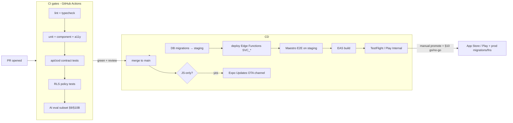
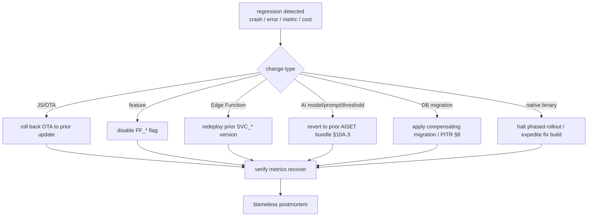

# PanchangPal — Technical Design Document (TDD)
# Part 5 — Platform, DevOps, Security & Release

**Version:** 1.0 (Working Draft)
**Status:** TDD Part 5 of 5 — for Architecture Review Board + Security sign-off
**Date:** 2026-07-11
**Owner:** Platform (per PDD §3.0A.5) · **Reviewers:** Architecture, Backend, Mobile, AI, Security, QA, Product
**Depends on:** TDD Parts 1–4 · PDD Parts 1–5 · PRD v2 · MRD v2.
**Source-of-truth hierarchy:** MRD → PRD → PDD → TDD. `[TECHNICAL IMPROVEMENT]` = improvement over an implied approach; `[PRD FOLLOW-UP Fn]` = product decision; `[ASSUMPTION Tn]` = decision where sources are silent.

---

## How to read this document

This is the definitive **operations** reference: environments, CI/CD, release management, secrets, security/DevSecOps, privacy/compliance, observability, reliability/DR, cost/capacity, and the **launch + rollback plan**. It closes the TDD and, with it, the full PanchangPal specification set (PDD Parts 1–5 + TDD Parts 1–5). It is scoped for a **solo founder on managed platforms** (TDD Part 1 §1.1) — every control is chosen to be operable by one person while remaining audit-ready.

**Conventions.** `[MANDATORY]` binding; `[RECOMMENDATION]` strong default (ADR to override). References: `NFR-*` (Part 1 §8), `TRISK-*` (Part 1 §9), `ADR-*` (Part 1 §6), `SVC_*`/`TBL_*` (Parts 1–2), AI `§10B` release gate (Part 3), `EVT_*`/`ERR_*`, and open follow-ups `F-*`. Baseline ops stack (Part 1 §3): GitHub + GitHub Actions + Turborepo, Supabase Cloud (single US region, ADR-012), EAS Build/Submit + Expo Updates (OTA), Sentry, RevenueCat.

**Scope:** Sections 1–10. This is the last TDD part; it ends with the whole-specification completion statement and the pre-launch go/no-go.

---

# SECTION 1 — Platform & Environments

## 1.1 Environments `[MANDATORY]`
Three isolated environments, each a **separate Supabase project** + Expo profile + RevenueCat environment:
| Env | Purpose | Supabase | App distribution | Data |
|---|---|---|---|---|
| `dev` | local + integration | dev project | Expo Go / dev client | synthetic seed |
| `staging` | pre-prod, eval, UAT | staging project (prod-like) | TestFlight / Play Internal | anonymized/synthetic |
| `prod` | live | prod project (single US region, ADR-012) | App Store / Play | real (RLS-guarded, PII-min) |

`[MANDATORY]` no shared databases across environments; migrations promote dev→staging→prod; secrets are per-environment (§4). RevenueCat uses sandbox for dev/staging, production entitlements for prod.

## 1.2 Region & residency
Single US Supabase region for launch (ADR-012, resolving F-18); Storage CDN fronts AU/NZ latency. A replica/region split is a documented trigger (TRISK-07/12) if AU/NZ latency NFRs (NFR-03/04) are missed or a residency requirement emerges.

## 1.3 Infrastructure-as-config
`[RECOMMENDATION]` capture Supabase config (RLS policies, functions, cron, buckets) as **versioned SQL migrations + function code in the monorepo** (Part 1 §2.4) — the repo is the source of truth; no manual dashboard changes in prod (`[MANDATORY]` prod changes go through CI). Environment differences live in typed config, not code (Part 1 §7.1).

---

# SECTION 2 — CI/CD Pipelines

## 2.1 Pipeline overview

**Explanation.** Every PR runs the **CI gates** (lint/type → unit/component/**accessibility** → API contract → **RLS policy** → **AI eval subset**); merge requires green + CODEOWNERS review (PDD §3.0A.5). On merge, **CD** applies migrations and deploys `SVC_*` to staging, runs **Maestro E2E** (`FLOW_*`), builds with EAS, and distributes to internal testers. **OTA** ships JS-only fixes to an Expo Updates channel. **Production** is a **manual promotion** gated by the §10 go/no-go (and, for AI changes, §10B). Prod migrations/functions deploy on promotion.

## 2.2 CI gates `[MANDATORY]` (release-blocking)
lint + strict typecheck · unit/domain · component + **accessibility assertions** (roles/labels/targets/contrast) + visual-regression (incl. color-blind sims) · API/zod contract tests · **RLS policy test-suite** (cross-user/household denial, service-only writes) · **AI eval subset** (refusal + golden, Part 3 §9.4) · secret scanning · dependency vulnerability scan. A red gate blocks merge.

## 2.3 Build & distribution (EAS)
EAS Build (iOS + Android) with signing managed by EAS; EAS Submit to App Store Connect / Play Console. Build profiles per env (`dev`/`staging`/`prod`). Hermes enabled; source maps uploaded to Sentry per build.

## 2.4 OTA (Expo Updates) `[MANDATORY]` policy
JS-only, store-policy-compliant changes ship via OTA channels (`staging`, `prod`) for fast fixes — **no** native-module or config-plugin changes, **no** changes that alter advertised functionality in ways stores disallow (TRISK-10). Every OTA is tied to a runtime version; a minimum-supported-version flag can force a store upgrade for breaking changes (Part 1 §7.14). OTA rollouts are staged and monitored (Sentry crash-free), auto-rollback on a crash spike.

## 2.5 Migrations in CI
Forward-only, timestamped SQL; **expand-then-contract** for breaking changes (TDD Part 2 §6.1); applied to staging on merge, to prod on promotion; RLS ships with its table. A migration that fails on staging blocks promotion.

---

# SECTION 3 — Release Management

## 3.1 Versioning & trains
Semantic versioning per the governance policy (PDD §3.0A.4). `[RECOMMENDATION]` a lightweight **weekly-or-on-demand release train** for a solo founder: `main` always releasable; cut a build when a shippable increment is ready; hotfix via OTA where JS-only. App version + build number tracked; each release tagged with the change log.

## 3.2 Feature flags & staged rollout `[MANDATORY]`
Post-v1 scope ships behind `FF_*` (`FF_GREETING_CARD`, `FF_JAIN_MODE`, `FF_FAMILY_PLAN`, `FF_LIFECYCLE_EMAIL`) so scope can be cut without branching (MRD Risk §14). Rollouts are **staged**: internal → beta cohort/canary → phased store rollout (e.g., 10%→50%→100%) with crash-free + error-rate + key-funnel monitoring between stages. Flags allow instant disable of a misbehaving feature without a release.

## 3.3 AI releases
Any change to models/prompts/thresholds/corpus follows the **§10B AI Release Readiness Review** and the **§10A version-compatibility bundle** discipline (Part 3): promote a named `AISET-YYYY.MM` bundle only after the eval gates pass, with a verified rollback. AI changes are largely config/content (adapters, ADR-011/013) → shippable without an app release.

## 3.4 Rollback strategy

**Explanation.** Rollback path depends on the change surface — most regressions (JS, feature, function, AI) roll back **without a store release** (OTA revert, flag disable, function redeploy, AI-bundle revert). DB issues use a compensating migration or PITR (§8). Native-binary issues halt the phased store rollout and expedite a fix. Every rollback ends in a blameless postmortem (Part 1 §1.10 / PDD engineering skills).

## 3.5 Store compliance
App Store / Play review readiness: privacy nutrition labels / Data Safety form (§6), IAP configured via RevenueCat, deep-link/universal-link association files, required disclosures for AI-generated content, and content-rating appropriate for all ages (households include youth). Religious/cultural content reviewed for sensitivity (MRD Risk §10).

---

# SECTION 4 — Secrets & Configuration Management

## 4.1 Secret inventory & placement `[MANDATORY]`
| Secret | Where | Never |
|---|---|---|
| `OPENAI_API_KEY` | Supabase Edge secrets | on device / in repo |
| `SUPABASE_SERVICE_ROLE_KEY` | Edge secrets / CI | on device / client |
| `REVENUECAT_WEBHOOK_SECRET` | Edge secrets | on device |
| `EXPO_ACCESS_TOKEN`, store signing | GitHub Actions / EAS secrets | in repo |
| Public: `EXPO_PUBLIC_SUPABASE_URL/ANON_KEY`, `EXPO_PUBLIC_REVENUECAT_KEY`, `EXPO_PUBLIC_SENTRY_DSN` | app config (public by design) | — |

`[MANDATORY]` server secrets are per-environment, rotated on a schedule and on suspected exposure; **secret scanning** in CI blocks commits containing secrets (§2.2/§5). Anon key + RLS is the client's only data credential (TDD Part 2 §4).

## 4.2 Configuration
Typed config per env (Part 1 §7.1) validated at startup; feature flags and AI config in governed tables (`TBL_FEATURE_FLAG`, `ai_config` §8A) read at runtime. No environment-specific values compiled into the app.

---

# SECTION 5 — Security & DevSecOps

## 5.1 Threat model (STRIDE-lite) `[MANDATORY]`
| Threat | Vector | Mitigation |
|---|---|---|
| **Spoofing** | forged identity/JWT | Supabase Auth JWT; RLS on every table; anon abuse limits (ADR-009) |
| **Tampering** | client tampering with data/authz | server-authoritative for truth; RLS denies cross-owner writes; entitlements service-only |
| **Repudiation** | disputed actions | audit logs w/ correlation IDs; RC webhook records; deletion audit (`TBL_ACCOUNT_DELETION`) |
| **Information disclosure** | PII/secret leak | no secrets on device; PII-min; no PII in logs/analytics/prompts; signed URLs for assets |
| **DoS / cost-DoS** | abusive traffic, AI cost drain | rate limits; AI cost circuit-breaker (Part 3 §8.4); Supabase/edge limits |
| **Elevation of privilege** | bypassing RLS/entitlement | service-role only in Edge Functions; RLS policy test-suite (release gate); no client authz trust |
| **Prompt injection** | malicious content/query | retrieved text treated as data; instruction hierarchy; refusal test set (Part 3 §5.3) |

## 5.2 DevSecOps controls `[MANDATORY]`
- **RLS policy test-suite** — CI gate (TDD Part 2 §4.4).
- **Dependency scanning** (Renovate/Dependabot + audit) + **SBOM**; pinned versions; minimal deps (TRISK-09).
- **Secret scanning** on every commit/PR.
- **SAST/lint security rules**; input validation (zod) everywhere; output encoding in UI.
- **OWASP Mobile Top 10** review checklist before launch (secure storage, transport, auth, platform interaction, code quality).
- `[RECOMMENDATION]` a lightweight **third-party security review / pen test** before public launch (MRD Risk §8) — scope: auth/RLS, IAP fraud, AI guardrails, PII handling.

## 5.3 Incident response (security)
Runbook: detect (Sentry/alerts/report) → assess severity → contain (rotate secret / disable flag / block traffic / revoke tokens) → eradicate/fix → recover → **blameless postmortem** + follow-ups. Secret exposure → immediate rotation (§4.1). Data incident → follow the breach-notification obligations per market (legal, `F-18`-adjacent).

---

# SECTION 6 — Privacy & Compliance

## 6.1 Privacy posture `[MANDATORY]`
Collect the minimum (PDD Trust §1.7): pseudonymous analytics only (no PII in `EVT_*`), no PII in logs/prompts, minimal permissions with value-first rationale (UX-4/5). Deferred/anonymous identity means many users are never asked for PII at all (ADR-009).

## 6.2 CCPA & data rights (`F-3/F-10`)
- **Export:** `SVC_account.export` returns the user's owned rows as JSON (format `F-10`, product-owned).
- **Delete:** `SVC_account` deletion with a grace window (`TBL_ACCOUNT_DELETION`); owner-with-members must transfer ownership first (`F-3`); hard-deletes owned rows; analytics already PII-free (TDD Part 2 §6.4). Offline deletion requests are queued and executed on reconnect (AC-DEL-03).
- **Consent & transparency:** clear privacy policy; store privacy labels/Data Safety accurate to actual collection.

## 6.3 Market compliance
CCPA baseline for US (PRD P0 #9); Australia APP and NZ Privacy Act reviewed for the launch geography; **GDPR remains undated** (UK is a later wave — the founder's explicit call, MRD §4). `[PRD FOLLOW-UP F-18]` confirms any residency obligation that would affect region (§1.2). AI-specific: users are told answers may be wrong and sources are shown (PDD §9.7); no individualized religious/medical/legal authority (Part 3 §5).

## 6.4 Content & cultural safety
Corpus reviewed by paid pandit/Jain reviewers; apolitical, non-sectarian; grief-aware personal-date handling (UX-7). A content-error hotfix path exists (Part 3 §10.2) — content/config change, no app release.

---

# SECTION 7 — Observability & Monitoring

## 7.1 Telemetry `[MANDATORY]`
- **Errors/crashes:** Sentry (client + Edge Functions), correlation IDs, source maps; every `ERR_*` → `EVT_054`.
- **Performance:** Sentry Performance + custom marks vs. `NFR-*` (startup, cached Today, AI first-token, sync).
- **Product analytics:** `EVT_*` via the analytics adapter → Postgres sink + rollups (ADR-013); dashboards per PDD §11 (Activation, Daily Habit/North Star, AI Trust, Retention, Monetization, Notifications).
- **AI:** the Part 3 §10.1 dashboards (refusal accuracy, groundedness, latency, cost).
- **No PII** in any telemetry.

## 7.2 SLOs & alerts
| SLO | Target (NFR) | Alert |
|---|---|---|
| Crash-free sessions | ≥ 99.5% (NFR-06) | page on drop |
| Availability (core reads) | ≥ 99.9% (NFR-14) | uptime monitor |
| AI first-token latency | < 2 s (NFR-05) | warn on p75 breach |
| Push delivery | ≥ 95% (NFR-11) | warn on receipts drop |
| Sync success | ≥ 99.5% (NFR-10) | warn on conflict/failure spike |
| AI cost | ≤ ceiling (NFR-16/F-11) | circuit-breaker + cost alert |
| Refusal accuracy / groundedness | ≥95% / ≥99% | alert on drop (Part 3) |

## 7.3 On-call & error budget
Solo-founder reality: `[RECOMMENDATION]` a minimal alerting setup (critical alerts → phone/email) with runbooks so a single operator can respond; define an **error budget** per SLO to decide when to pause feature work for reliability. Escalation and postmortems per the engineering incident process (PDD skills; Part 1 §1.10).

---

# SECTION 8 — Reliability, DR & Backups

## 8.1 Backups & recovery `[MANDATORY]`
Supabase daily PITR → **RPO ≤ 24 h, RTO ≤ 4 h** (NFR-15). Content corpus + seed reproducible from the repo (TDD Part 2 §6.7). RevenueCat is the entitlement source of truth (recoverable independent of our DB). `[RECOMMENDATION]` periodic **restore drill** on staging to validate the runbook.

## 8.2 Graceful degradation
The client is offline-first (TDD Part 4 §6) → transient backend outages degrade to cached experiences, not failure. AI outage → honest "busy, try later" (never fabricate). Payments outage → free tier fully functional. Notification outage → in-app value still available. Each `ERR_*` has a defined calm behavior (PDD §12).

## 8.3 DR runbooks
Documented for: DB restore (PITR), region incident (single-region caveat, ADR-012 → CDN-served reads survive; writes degrade to queue), Edge Function outage (retry/fallback), secret compromise (rotate), and store outage (queue submissions). Runbooks live in `docs/` and name owners + steps.

## 8.4 Single-founder resilience (TRISK-11)
The biggest reliability risk is the single operator. Mitigations: managed platforms (fewer things to run), this documentation set as knowledge capture, AI-agent-friendly repo, alerting that doesn't require constant attention, and a documented plan to contract specialized help if needed (MRD Risk §12).

---

# SECTION 9 — Cost & Capacity Management

## 9.1 Cost model & dashboards `[MANDATORY]`
Track from day one (MRD §14): Supabase tier, OpenAI (embeddings + generation, the only truly variable cost), EAS, Sentry, RevenueCat fees, store fees, and **LTV:CAC** by channel/country (NZ as the low-CAC test market, MRD §4). AI **$/WAU** vs. the ceiling (Part 3 §8.1/F-11) is a first-class dashboard with a circuit-breaker.

## 9.2 Capacity & scaling triggers (TRISK-07)
Cache-first design means reads scale cheaply (ADR-010). Documented triggers to act on real metrics, not speculation: pgvector index tuning / dedicated vector store (corpus/QPS growth), Postgres read replicas / partitioning (write/analytics volume), a dedicated AI service (cold-start/QPS on `SVC_ask_guru`), and multi-region (AU/NZ latency). None are day-1 work; each has an owner and a metric.

## 9.3 Cost controls
AI: caching + token caps + rate limits + circuit-breaker (Part 3 §8). Infra: managed tiers sized to the 90-day SOM; alerts on tier thresholds. Managed-first keeps ops cost (and headcount) low (Part 1 §1.1/1.11).

---

# SECTION 10 — Launch Plan, Readiness & Sign-off

## 10.1 Pre-launch go/no-go checklist `[MANDATORY]`
**Product/content:** ☐ RAG corpus complete + reviewer-signed (Part 3 launch dependency) · ☐ traditions/festivals/rituals seeded for launch traditions (`F-9`) · ☐ panchang accuracy validated vs. Drik/mPanchang + reviewers (TRISK-04).
**Engineering:** ☐ all CI gates green (§2.2) · ☐ RLS policy suite green · ☐ AI §10B passed for `AISET-2026.07` · ☐ E2E `FLOW_*` pass on staging · ☐ performance + accessibility gates pass (release-blocking) · ☐ offline loop + sync verified.
**Ops/Security:** ☐ secrets provisioned + scanned · ☐ monitoring dashboards + alerts live (§7) · ☐ DR restore drill done (§8.1) · ☐ OWASP Mobile review + (recommended) pen test (§5) · ☐ rollback paths verified (§3.4).
**Compliance/Store:** ☐ privacy policy + store privacy labels accurate (§6) · ☐ CCPA export/delete working · ☐ IAP + RevenueCat prod config · ☐ store review submitted.
**Business:** ☐ NZ paywall/pricing signal test instrumented (MRD §13) · ☐ temple-partnership pilot ready · ☐ activation/retention dashboards live · ☐ runway confirmed (the MRD's still-open Go/No-Go condition — `[PRD FOLLOW-UP]`, business-owned).

## 10.2 Launch sequence
1. **Internal** (team) on TestFlight/Play Internal → smoke `FLOW_*`.
2. **Beta cohort / canary** (limited, incl. a temple-pilot group) → watch activation, crash-free, AI trust, cost.
3. **Phased store rollout** (10%→50%→100%) across **US + Australia + New Zealand** → monitor between stages; hold/rollback on regressions (§3.4).
4. **Post-launch:** run the NZ pricing signal test; watch the activation + North Star (WHRC) + AI dashboards; feed the hallucination-audit loop (Part 3 §9.4).

## 10.3 Post-launch operations
Weekly metrics review (PDD §11 dashboards), periodic AI hallucination audit, content/threshold tuning via config/content (no release), staged enablement of post-v1 flags (`FF_*`) per the roadmap (Jain v1.1, greeting card, family plan, lifecycle email), and the 6/12/24-month horizons (MRD §15) driven by real data.

## 10.4 Maturity assessment
**Ready for launch, conditional on the §10.1 checklist** — chiefly the **corpus completeness**, the **accuracy validation**, the **security/RLS gates**, and the **founder's runway confirmation** (the sole business input still open across the whole plan). The operational model is deliberately minimal and managed so one operator can run it safely, with rollback paths that avoid store releases for most regressions.

## 10.5 Assumptions & follow-ups raised in Part 5
`[ASSUMPTION]` weekly-or-on-demand release train; minimal solo on-call; restore drill on staging. Open items unchanged: `F-11` AI cost ceiling / free-tier limits (product) · `F-18` residency confirmation (legal) · runway (business, MRD Go/No-Go). All are owner-actioned, not blockers to building.

## 10.6 Compatibility statement
Consistent with MRD v2, PRD v2, PDD Parts 1–5, and TDD Parts 1–4. Operationalizes: single US region (ADR-012), analytics adapter (ADR-013), AI release governance (§10A/§10B), offline-first reliability (Part 4 §6), the `NFR-*`/`TRISK-*` targets, and the CCPA/privacy commitments — for a solo-founder, managed-first operation. No product requirement modified.

---

# TDD — Document Set Completion

**TDD Part 5 completes the Technical Design Document**, and with it the full PanchangPal specification:

| Doc | Parts | Contents |
|---|---|---|
| **PDD / UXS** | 1–5 | Philosophy/IA/Flows + Governance · Screen Inventory · Components + Design System · Microinteractions/Notifications/AI · Accessibility/Analytics/Edge/Copy/Usability/Checklist |
| **TDD** | 1–5 | Architecture & System Design · Data Model/Schema/RLS/API · AI/RAG Subsystem (+ AI governance) · Mobile App Architecture · **Platform/DevOps/Security/Release** |

Every layer is traceable end-to-end via stable IDs (`SCR_*`→`CMP_*`→`API_*`→`SVC_*`→`TBL_*`→`EVT_*`/`ERR_*`), grounded in the MRD/PRD, and implementation-ready for Figma, React Native, the Supabase backend, the RAG subsystem, and AI coding agents.

**Open items across the whole set (owner-actioned, not architectural blockers):** the AI cost ceiling / free-tier limits (`F-11`, product), data-residency confirmation (`F-18`, legal), and the founder's **runway** (business — the MRD's standing Go/No-Go condition). Everything else is decided and specified.

---

*End of TDD Part 5 — Platform, DevOps, Security & Release. End of the PanchangPal Technical Design Document. Awaiting final Architecture Review Board + Security sign-off and the §10.1 go/no-go.*